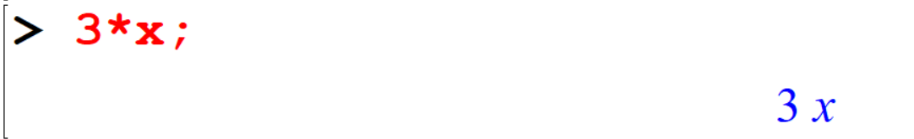
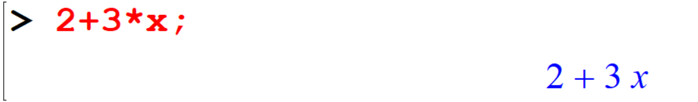
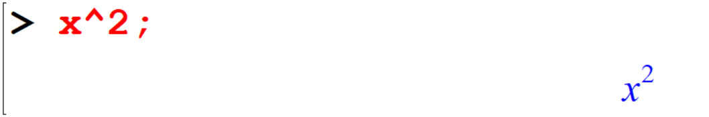
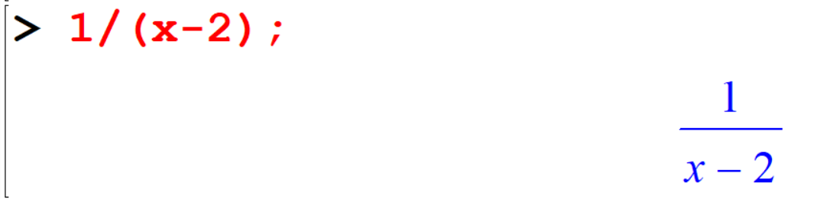
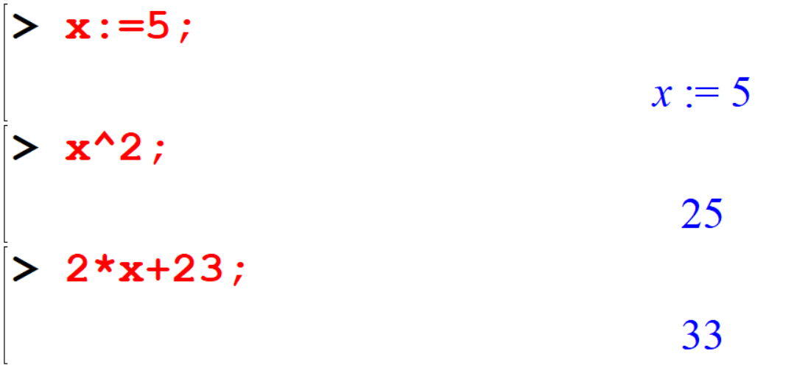
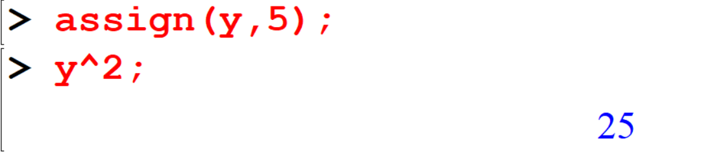
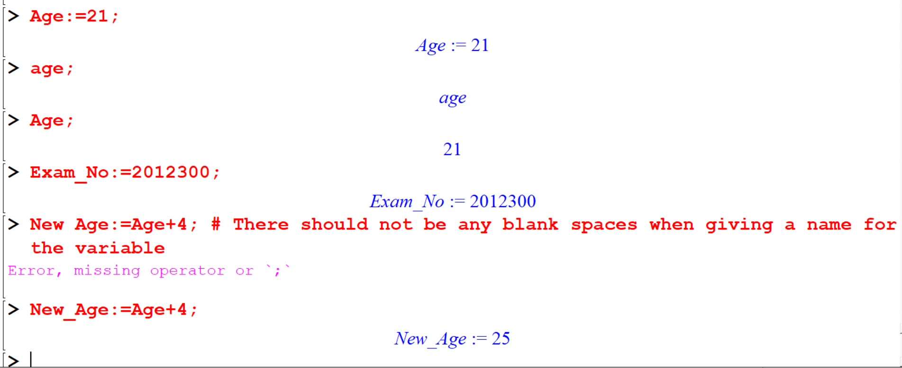
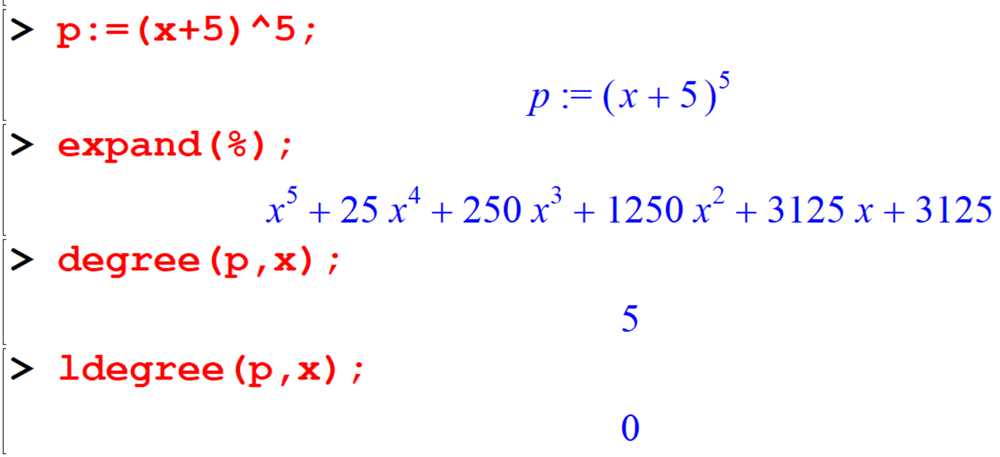
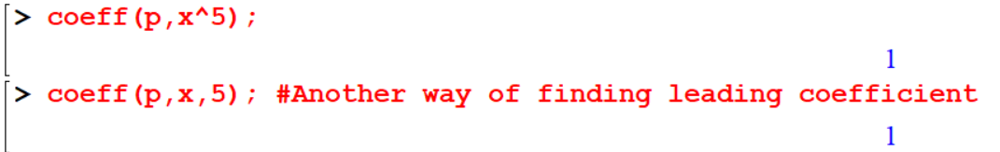

# Basic Algebra


## Variables and Expressions

Study how we write the following expressions in Maple.


```
[> 3*x;
```

```
[> 2+3*x;
```

```
[> x^2;
```

```
[> 1/(x-2);
```


### Exercise

```{exercise}
Generate the following expressions using maple commands.

i)   \((2x + 3)(4x + 5)\)
ii)  \(9x^2 − 4 \)
iii) \(\frac{2x}{5}+\frac{y}{5}\)
iv)  \(\frac{\sqrt{2x+1}}{3+y}\)
```
## Assigning values to variables

Maple will store things (numbers, expressions, functions,…) in ‘containers’ or ‘variables’. 
This process is called assignment, and you can assign values to the variables by using `:=` or using the command `assign`. After assigning a value to a variable it becomes a constant and Maple will remember that value from that point.


- **Method I**
```
[> x:=5;
```

```
[> x^2;
```
```
[> 2*x+23;
```



- **Method II**

```
[> assign(y,5);
```
```
[> y^2;
```



> You can also define variables in a descriptive manner. However they must begin with a character and any blank spaces must not be included. Note that maple is case sensitive.


```
[> Age:=21;
```
```
[> age;
```
```
[> Age;
```
```
[> Exam_No:=2012300;
```
```
[> New Age:=Age+4; # There should not be any blank spaces when giving a name for the variable
```

```
[> New_Age:=Age+4;
```



If you want to reset the predefined value for variables you have to use following methods.

- **Method I**:  `restart` command\
```
[> restart;
[> Age;
```


- **Method II** : `unassign`\
The `unassign` command unassigns all the unevaluated names given as input.
```
[> x:=5;
[> x+20;
[> unassign('x');
[> x+20;
```


## Substituting Values

To substitute numbers (or other expressions) in the place of variables in an algebraic expression without permanently changing the values of the variable, we use the command, 
`subs(variable, expression)`.

Try to use help

```
[> ?subs
```
```
> x;
> subs(x=2,x+5);
> subs(x=2,x^2-5*x+4);
```

It is convenient to make substitution by giving name for an expression.

```
> expr:=(2*x+1)/(5-3*x);
> subs(x=3,expr);
```
You can even substitute other variables or expressions to a variable in an expression.
```
> subs(x=a,expr);
> subs(x=a+1,expr);
```
You can also substitute more than one variable for a expression.


```
[> expr1:=(7*x-3*y)/(x^2-y^2);
```
```
[> subs({x=3,y=2},expr1);
```
```
[> subs({x=a-2,y=a+2},expr1);
```
```
[> expr2:=x^2+2*y^2+z^2;
```
```
[> subs({x=1,y=2,z=3},expr2);
```


## Factoring expressions

Maple can factorize an integer into primes using the command `ifactor`.

```
[> ifactor(18);
```
```
[> ifactor(525);
```
```
[> ifactor(2^8-1);
```


## Expanding expressions

One of the most important things Maple can do is to calculate with expressions as well as numbers and we use the command `expand` to get the expansion of an expression.

## Finding the degree and leading coefficient of polynomials

The highest power of the variable that occurs in the polynomial is called the **degree** of a polynomial. 
The **leading term** is the term with the highest power, and its coefficient is called the **leading coefficient**. 

If \(x\) is a single indeterminate, the `degree` and `ldegree` commands compute the degree and low degree respectively, of the polynomial \(p\) in \(x\).

```
[> p:=(x+5)^5;
[> expand(%);
[> degree(p,x);
[> ldegree(p,x);
```



The `coeff(p, x^n)` command finds the coefficient of \(x^n\) in the polynomial \(p\) where \(p\) is the 
polynomial in \(x\) and \(n\) is the integer corresponds to the power. When finding the leading coefficient, \(n\) corresponds to the highest power in the polynomial.

```
[> coeff(p,x^5);
```

```
[> coeff(p,x,5); #Another way of finding leading coefficient
```



### Exercise

```{exercise}
Generate the expression \(x^3 + \sqrt{x}\) using maple commands and find the value of the expression when \(x = 4\).
```

```{exercise}
\(PQR\) is an isosceles triangle where \(𝑄 = 𝑃𝑅 = 2𝑟 + 3\) and \(𝑄𝑅 = 𝑟 + 3\). Find an expression for the perimeter of the \(𝑃𝑄𝑅\) triangle in terms of \(𝑟\), giving your answer in its simplest form and find the perimeter when \(𝑟 = 8\).
```

```{exercise}
Factorize the following expressions:

i. \(3x^2 + 8x + 5 \)
ii. \(x^4 − 3x^2 + 2\)
iii. \(36^{13}𝑏^{10} − 40𝑎^{11}𝑏^{11}\)
iv. \(24389x^{12} − 2197\)
```

```{exercise}
Expand the following expressions, find the degree, lower degree and the leading coefficients.

i. \((5x − 11)^{13}\)
ii. \((x^2 + x + 1)\)^{10}\)
```


## Simplifying Expressions

2.7 Simplifying Expressions
```
[> 3*(x-1)+7*(x+2)-5*(x+11);
```
Maple will automatically simplify some simple expressions. However, more complicated expressions will not be simplified. So, we need to give a command to simplify such expressions.

```
[> 3*(x-1)^2+7*(x+2)^3-5*(x+11)^4;
[> %=simplify(%);
```

```
[> simplify((x^2-y^2)/(x-y));
```