# Equations and Functions


## Solving Equations

In general we can solve different types of equations to get an exact solution. The solution may be an integer, a fraction, or it may be an expression. Using Maple we can do the same thing using the `solve` command and obtain an exact solutions for equations and inequalities. 


```
[> solve(2*x-5=7);  

[> solve(5*x^2=-6*x); 

[> solve(x^2-2*x-1); 
[> evalf(%); 

[> solve(x^4-4); 
[> evalf(%); 
```


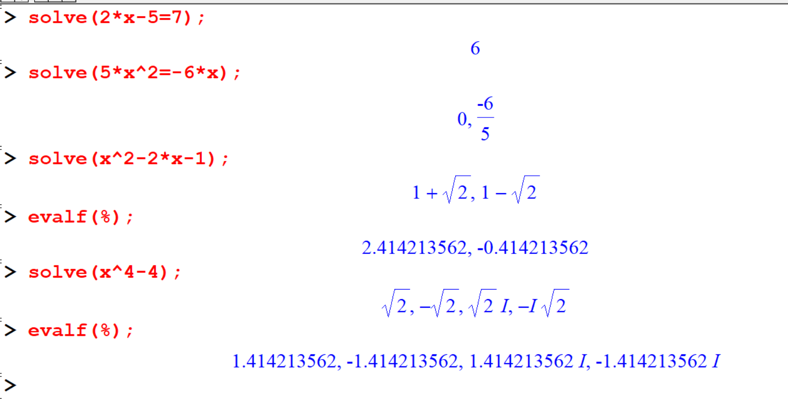

## Equations with multiple unknowns

You can use the solve command to solve equations having several variables. However you have to specify, for which variable that the equation to be solved.

```
[> solve(a*x^2+b*x+c,x); 
```

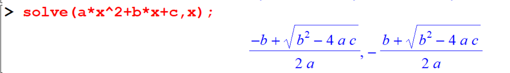

```
[> eq1:=2*x+3*y-5; 
[> solve(eq1,x); 
[> solve(eq1,y); 
```

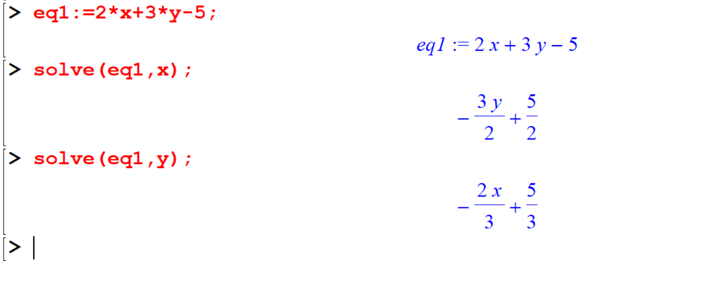

Maple can also solve absolute value equations.

```
[> restart; 
[> eqn1:=abs(3*x+1)=17; 
[> solve(eqn1); 
```
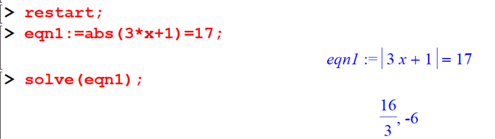

```
[> eqn2:=abs(41*y-139); 
[> solve(eqn2); 
```

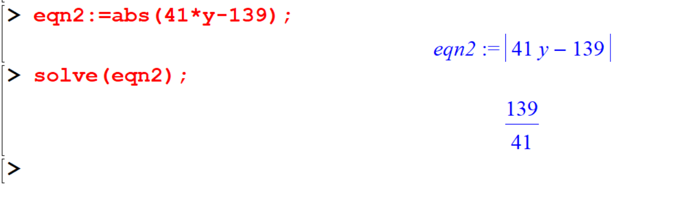


All equations cannot be solved algebraically. It is impossible to find an exact solution. 

```
[> Eq1:=x^5-x+1=0;
[> solve(Eq1); 
```

Using `fsolve` command we can obtain an approximated numerical value for the answer.

```
[> fsolve(Eq1); 
[> subs(x=-1.167303978,x^5-x+1);
```

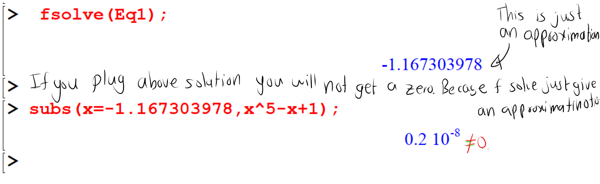

You can see that the solution given is not an exact solution. It’s only an approximation.

```
[> restart;  
[> Eq2:=x^4-4*x=-1;
[> solve(%); 
```

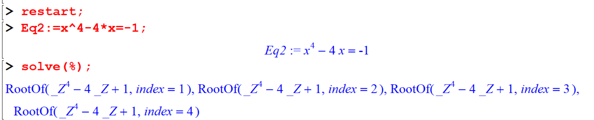
 You have to use `fsolve`
 
```
[> fsolve(Eq2);
[> subs(x=.2509921575,Eq2);
[> subs(x=1.493358557,Eq2);  
```

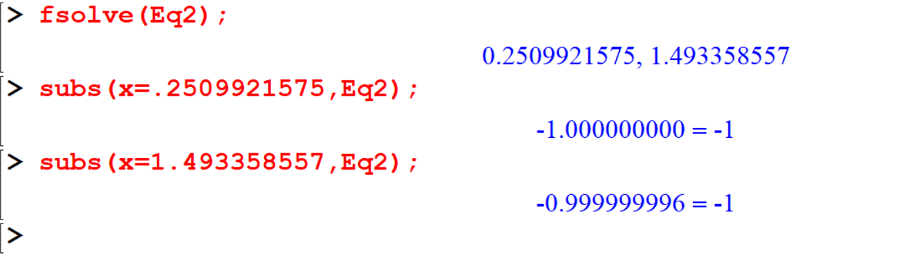

### Solving simultaneous equations 

```
[> eq1:=5*x-7*y=37; 
[> eq2:=3*x-11*y=17; 
[> solution:=solve({eq1,eq2},{x,y});
```

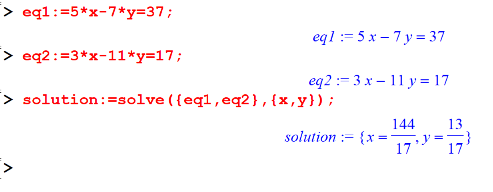

## Functions
Let \(f\) be a function of \(x\). We denote it as \(f(x)\), but in Maple there is a different way to define such functions.

### Defining functions

```
[> restart; 
[> f:=x->3*x+1;  
[> g:=x->1/(x+2); 
[> h:=y->3*y^2+2*y-1;
```

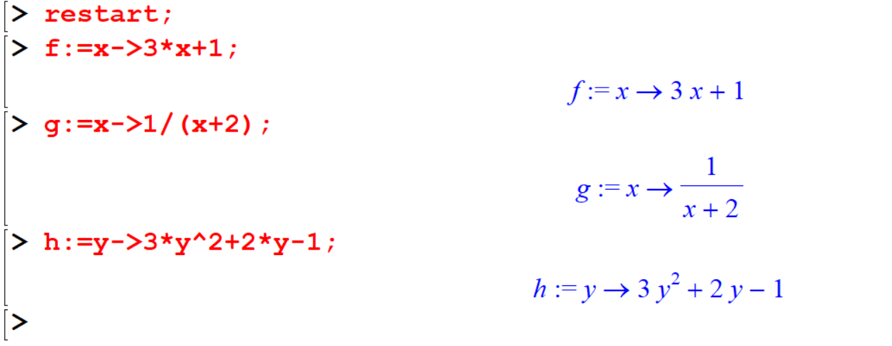
Now you have defined functions, you can evaluate them with numbers, fractions, and irrational numbers. 


```
[> f(-5); 
[> g(1000);g(-7/3); 
[> g(x); 
[> g(t); 
[> h(sqrt(3)); 
[> evalf(h(sqrt(11)+5)); 
```

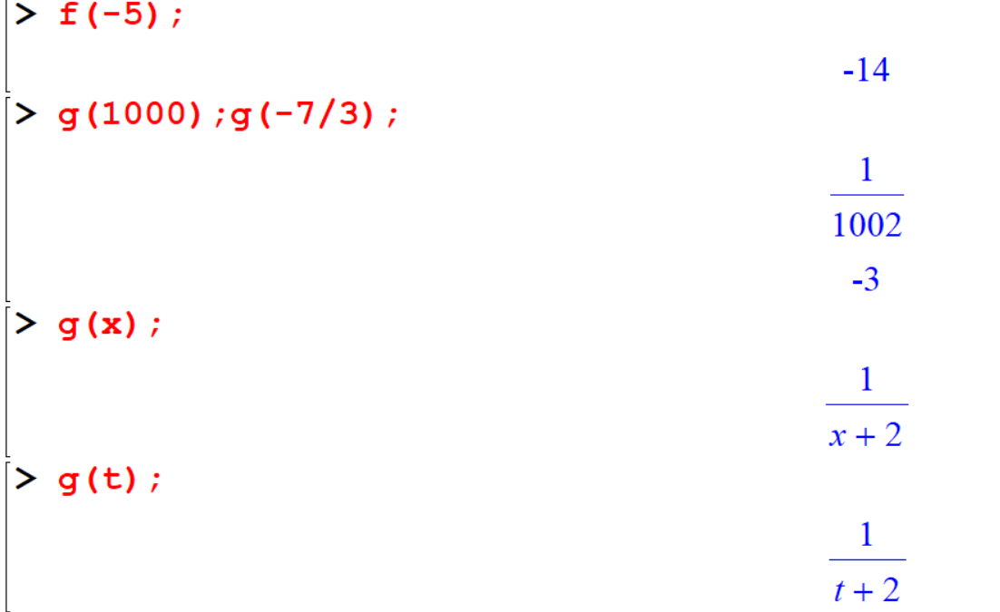
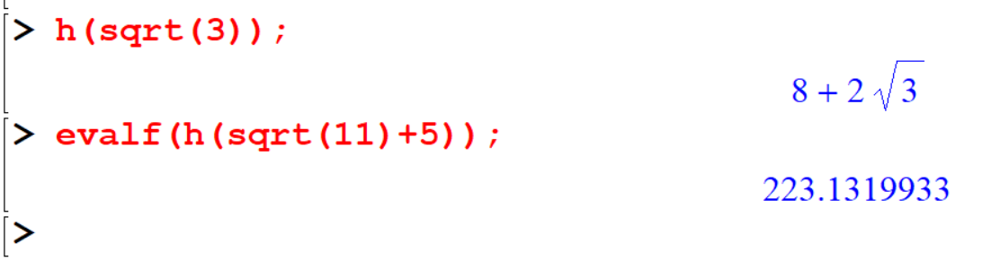

### Function Operations and Compositions

You can do  `+, -, * ,/,\circ`  between two or more functions.  


```
[> f:=x-> 1/(2*x); 
[> g:=x->(3*x+1)/(x-3); 

[> f(x)+g(x); #addition of two functions 
[> simplify(%); 

[> f(x)-g(x); #substraction of two functions 
[> %=simplify(%); 

[> g(x)*f(x); #multiplying   two functions

[> f(x)/g(x); #division of   two functions 

[> 2*f(x)+7*g(x); # linear combination of two functions 
[> %=simplify(%); 
```
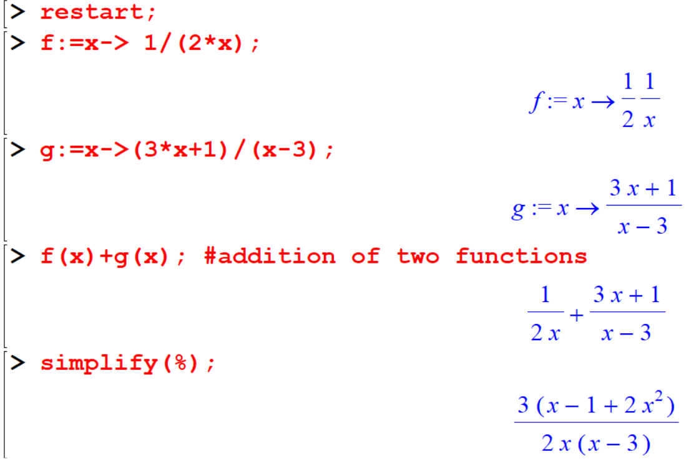
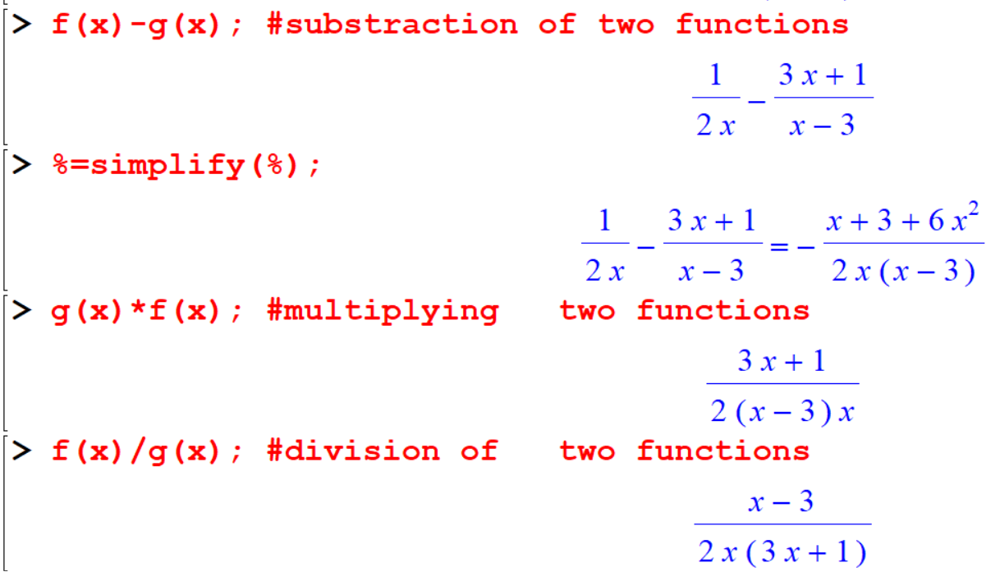
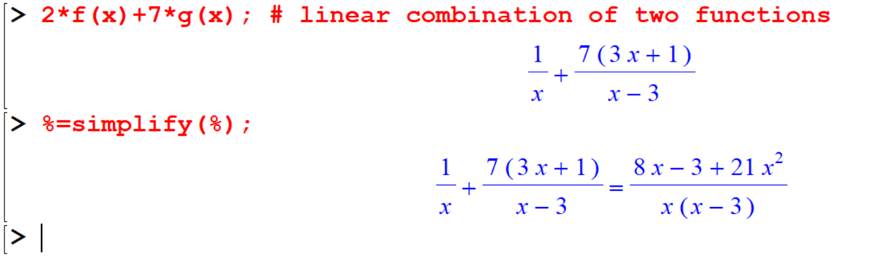


### Composition of functions


```
[> f(g(x)); 
[> g(f(x)); 
[> simplify(%); 
```

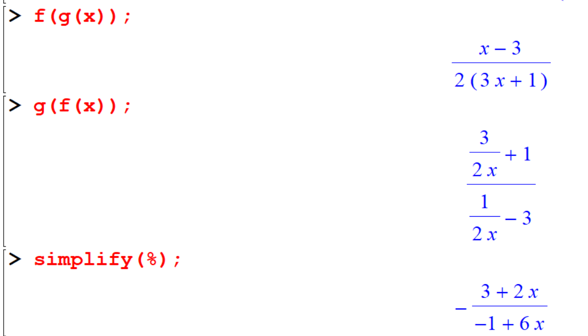

```
[> f(f(x)); 
[> g(g(x));
[> simplify(%); 
```

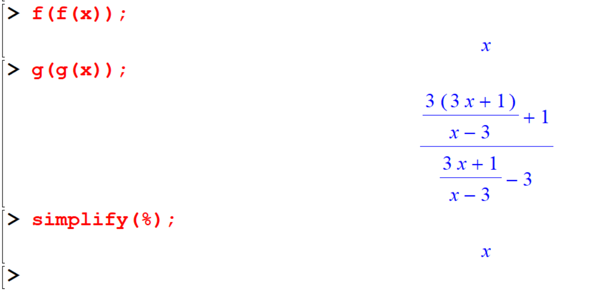

## Trigonometry with Maple


- The Trigonometric functions

\[
\begin{aligned}
 \sin(x) && \cos(x) && \tan(x) \\
 \sec(x) && \csc(x) && \cot(x)
\end{aligned}
\]

- The Hyperbolic functions

\[
\begin{aligned}
 \sinh(x) && \cosh(x) && \tanh(x) \\
 \text{sech}(x) &&  \text{csch}(x) && \text{coth}(x) 
\end{aligned}
\]


```
[> sin(90);
[> evalf(%);
[> sin(Pi/2);
```

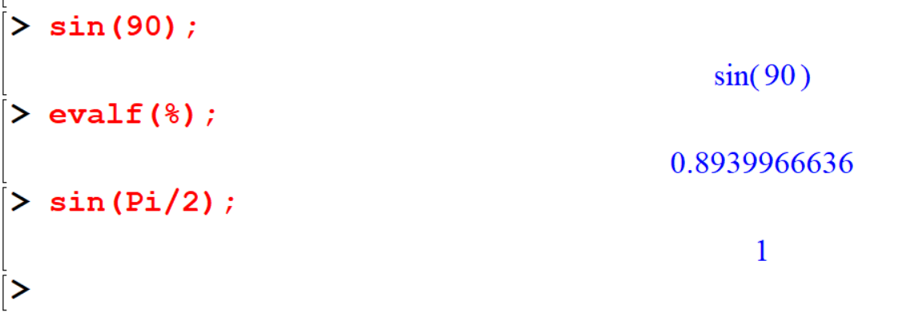

> Arguments for all trigonometric and hyperbolic functions must be given in radians. (\(1 \text{radian} = \frac{180}/{\pi}  \text{degrees}\))


```
[> cos(68*Pi/180);
[> evalf(%);
[> cos(Pi/3);
[> evalf(csc(2*Pi/3)); 
```

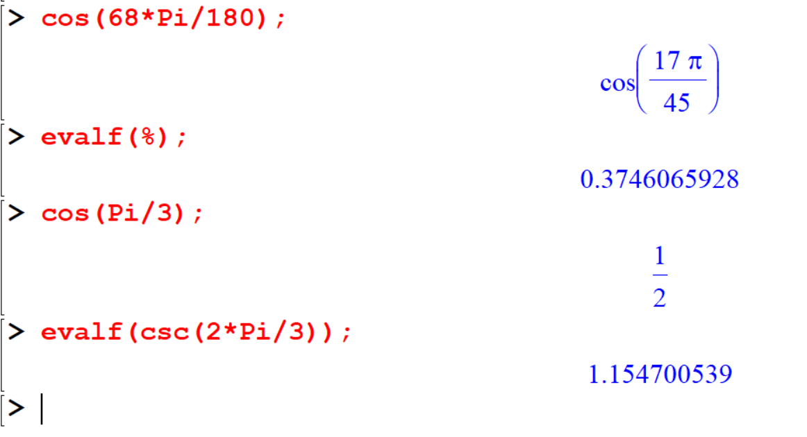

### Hyperbolic Functions

```
[> sinh(2); 
[> evalf(%); 
[> evalf(cosh(Pi/3));
[> evalf(sinh(3+0.17)); 
```

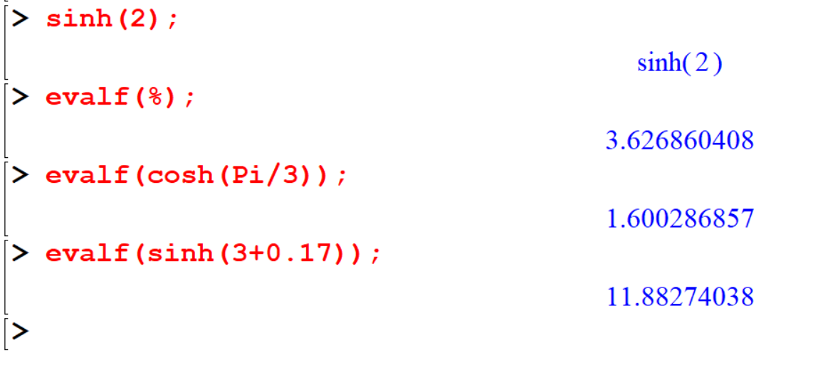

### Exponential expansions

The exponential expansions for the trigonometric functions sine and cosine are derived from Euler's formula:

$$
e^{ix} = \cos(x) + i \sin(x)
$$`

By manipulating this formula, we can obtain the expansions:

$$
\begin{align}
\sin(x) &= \frac{(e^{ix} - e^{-ix})}{2i}\\
\cos(x) &= \frac{(e^{ix} + e^{-ix})}{2}\\
\tan(x) &=  \frac{(e^{ix} - e^{-ix})}{i(e^{ix} + e^{-ix})}
\end{align}
$$
Then, Similarly we can define hyperbolic functions,

$$
\begin{align}
\sinh(x) &= \frac{e^x - e^{-x}}{2}\\
\cosh(x) &= \frac{e^x + e^{-x}}{2} \\
\tanh(x) &= \frac{e^x - e^{-x}}{e^x + e^{-x}}
\end{align}
$$

You can verify these results with maple

```
[> convert(sin(x),exp); 
[> convert(cos(x),exp); 
[> convert(tan(x),exp);
[> convert(sinh(x),exp); 
[> convert(cosh(x),exp); 
[> convert(tanh(x),exp);
```
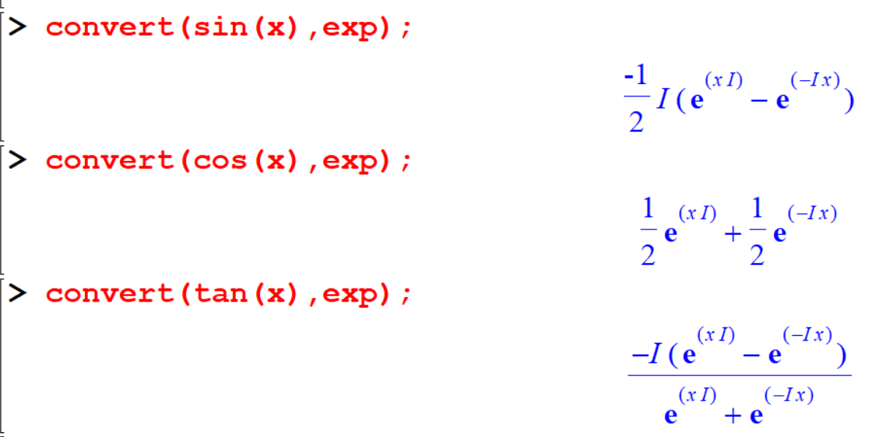
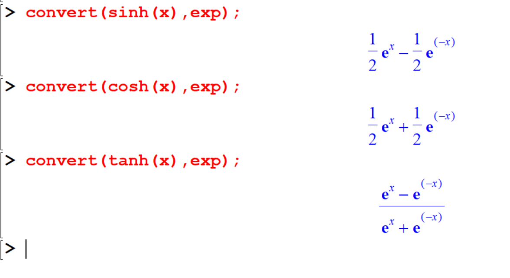

### Expanding and simplifying trigonometric functions. 


```
[> expand(sin(2*x)); 
[> expand(cos(3*x)); 
[> expand(sin(x+y)); 
[> simplify(1-(sin(x)^2+cos(x)^2)); 
[> simplify(1-sin(x)^2+cos(x)^2); 
```


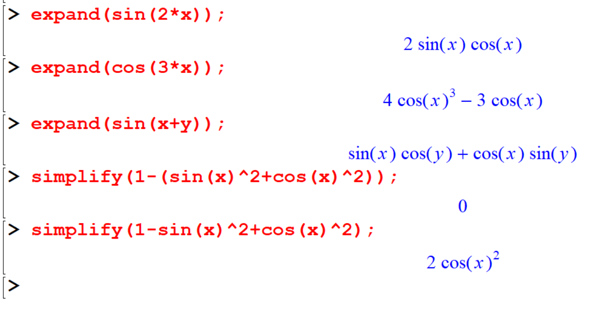


### Converting 

```
[> convert(Pi/2,degrees); 
[> convert(1,degrees);        
[> convert(90*degrees,radians); 
[> convert((180/Pi)*degrees,radians);
```

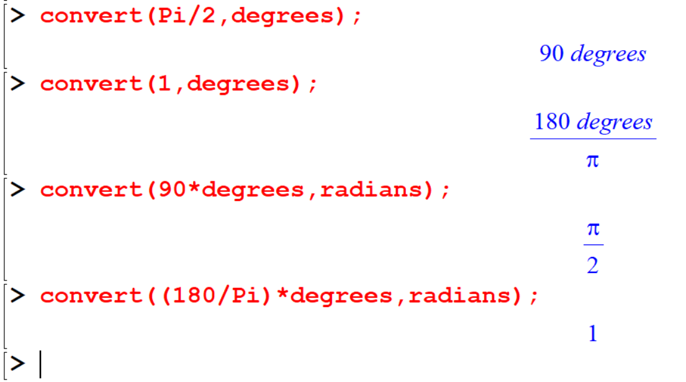

To get an approximate angle, use `evalf`.  


```
[> evalf(convert(1,degrees)); 
[> convert(45*degrees,radians); 
[> convert(57*degrees,radians); 
[> evalf(convert(57*degrees,radians));
```

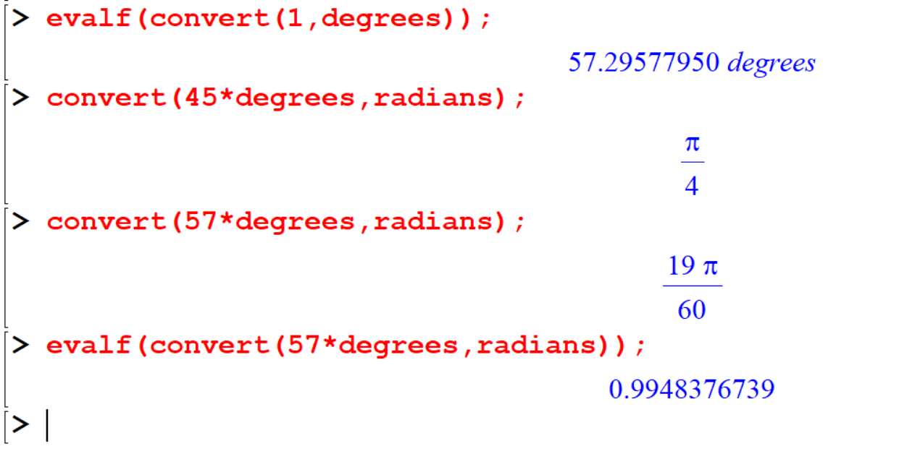

## Inverse trigonometric functions

\[
\begin{aligned}
 &\arcsin(x)        && \arccos(x)  && \arctan(x)\\
 &\text{arcsec}(x)  && \text{arccsc}(x)  && \text{arccot}(x)\\
 &\text{arcsinh}(x) && \text{arccosh}(x) && \text{arctanh}(x)\\
 &\text{arcsech}(x) && \text{arccsch}(x) && \text{arccoth}(x)
\end{aligned}
\]

The inverse trigonometric and hyperbolic functions are calculated in radians.

```
[> arcsin(1); 
```
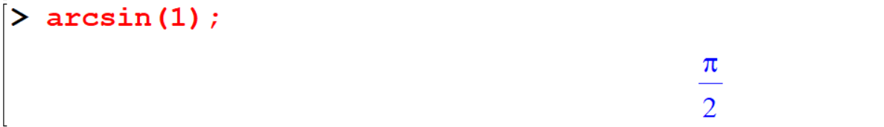
If you need the answer in degrees you have to use `convert` command.

```
[> arccos(-.05); 
[> convert(%,degrees); 
[> evalf(%); 
```

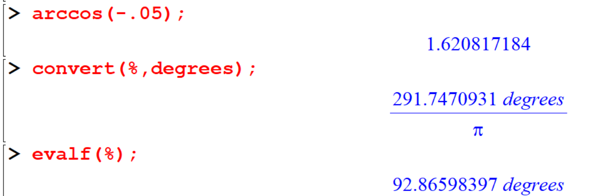

```
[> sin(arccos(x));
```

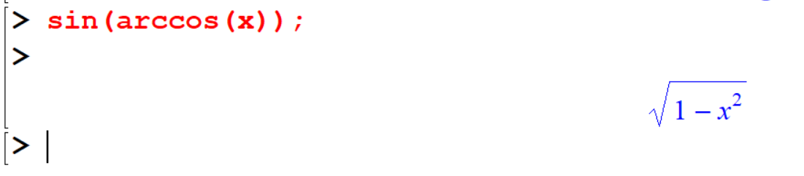

## Exercise

```{exercise}
Find the solutions of the following equations to 5 decimal places.

i. \(2x^3 + 3x + 1 = 0\)
ii. \(2x^3 + 3x + \frac{1}{4} = 0\)
iii. \(x^2 - 13x + 10 = 0\)
iv. \(-3x + \frac{1}{2}x^2 = 25\)
```

```{exercise}
Find the most accurate real solutions to the following equations.

i. \(x^4 - 2x^3 = 7\)
ii. \(\frac{7}{(x-3)^2} + \frac{5}{(x+5)}\)
```

```{exercise}
Express the following in the form of \(y =mx +c\) using the `solve` command.

i. \(3x + 4y = 2\)
ii. \(\frac{3y}{5} - 2x + 7 = 0\)
iii. \(\frac{x}{x-3} + \frac{y}{2x} = -3\)

Use the Maple help to find another way to do the above.\
(Hint: You have to `isolate` y in each equation.)
```

```{exercise}
Consider, \(f(x) = 2x -\frac{x}{3(x+1)}\)

i. Define \(f\) as a function: \(f(x) = 2x - \frac{x^3}{x+1}\)
ii. Evaluate \(f(-\frac{1}{2})\)
iii. Factor \(f(x)\)
iv. Simplify \(f(\frac{1}{t-1})\)
```
```{exercise}
Use Maple help to find out how to find `logarithms`. Then find the value of the following.

i. \(\log_{10} 100\)
ii. \(\ln 100\)
iii. \(\log_3 10\)
iv. \(2\log_3 81 + 5\log_8 256\)
```
```{exercise}
Find the value of the following trigonometric expressions for given \(x\).
  
i. \(\sin(\sec(x^2)) + 3x\cos^3(\frac{2x}{7})\), where \(x = 71^\circ\).
ii. \(\sec^{-1}(\tanh(x+5))\cos(\sec(2x) + \sin(2x))\), where \(x = 43^\circ\).
iii. \(\left(\cot^{-1}(x) + \sec^{-1}(\frac{x-3}{5})\right)^{\frac{1}{3}}\), where \(x = 71^circ\).
```

