# System of Linear Equations and Matrices 
A linear system is a collection of first degree equations. A solution to a system consists of one or more sets of specific values that our common solutions to each of the individual equations. Here is a simple example which we can solve quite easily using the `solve` command.


## Augment of a matrix


```
[> with(linalg):
[> A:=matrix([[1,2],[2,3]]);
```

*Output*:

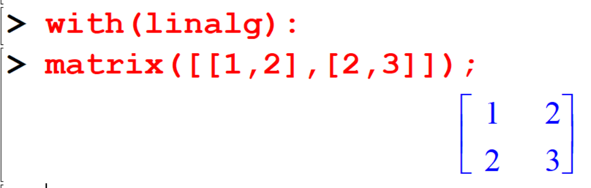{width=60%}


```
[> B:=matrix([[3,4,5],[6,7,8]]);
```

*Output*:

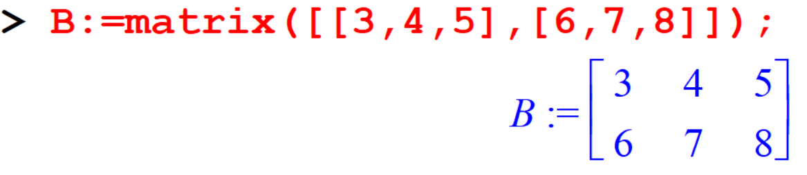{width=60%}


```
augment(A,B);
```

*Output*:

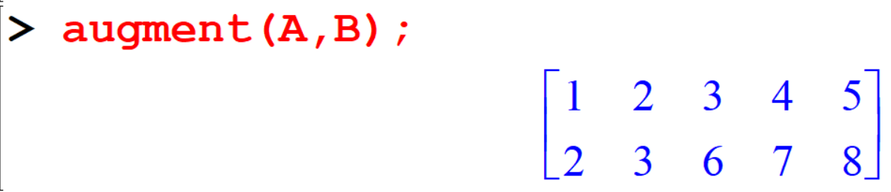{width=60%}


The function augment joins two or more matrices  together horizontally.
The matrices and vectors must have the same number of rows. 

##  Solving Linear Systems

There are three types of systems of linear equations, and three types of solutions.

- An **independent system** has exactly one solution.
- An **inconsistent system** has no solution.
- A **dependent system** has infinitely many solutions. 

---|Type of Linear\ System |Independent\ Systems | Inconsistent\ Systems |Dependent\ Systems|
|:-------------|:-------------------:|:------------:|:---------------:|
|No of Solution|Exactly one solution |No solution |Infinitely many solutions|
|Example 1|\[\begin{aligned}x - 3y &=-3\\2x + y &= 8\end{aligned}\]|\[\begin{aligned}x - 3y &= - 3\\x -y &=3\end{aligned}\]|\[\begin{aligned}x - 3y &= - 3\\2x + 6y &= -6 \end{aligned}\]|
||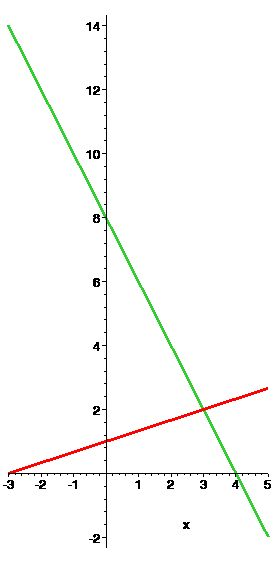|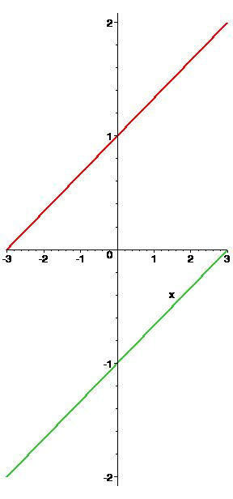|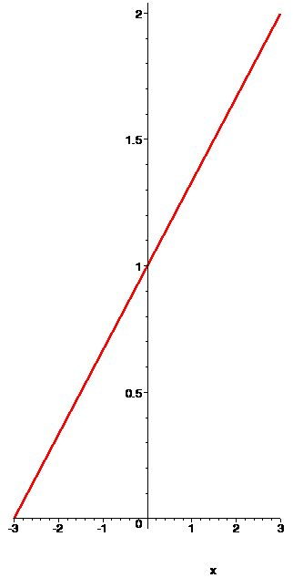|
|Example 2|\[\begin{aligned}x+y+z&=2\\
6x-4y+5z&=1\\
5x+2y+2z&=3\end{aligned}\]|\[\begin{aligned}x-3y+z&=4\\-y-4z&=7\\2y+8z&=24 \end{aligned}\]|\[\begin{aligned}2x+y-3z&=0\\
4x+2y-6z&=0\\
x-y+z&=0\end{aligned}\]|
||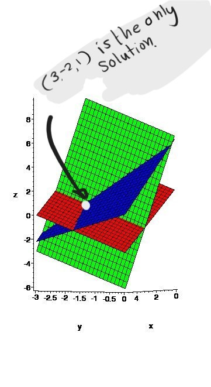|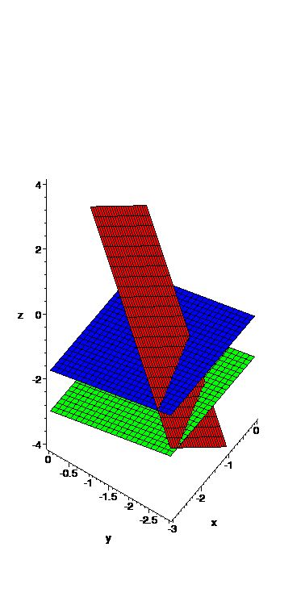|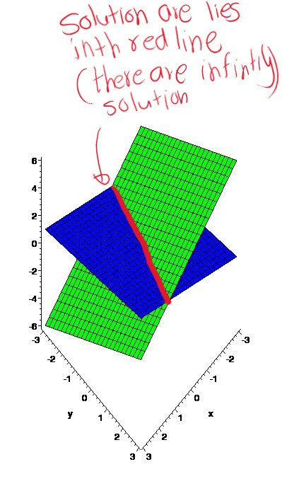|


Let's try to solve linear system.

**Independent Systems**:


\[ \begin{array}{ccccccc} 
2x &+& 5y &-& 4z &=& 9 \\
3x &+& 5y &+& 2z &=& 12 \\
4x &-& y  &+& 5z &=& -3 
\end{array} \]


\[
\underbrace{\begin{bmatrix}
2 & 5 & -4 \\
3 & 5 & 2   \\
4 & -1 & 5  
\end{bmatrix}}_A
\underbrace{\begin{bmatrix}
x \\ y\\z
\end{bmatrix}}_X
=
\underbrace{\begin{bmatrix}
9\\12\\-3
\end{bmatrix}}_B
\]


### Method I
A linear system is a collection of first degree equations.
A solution to a system consists of one or more set of specific values that our common solution to each of the individual equations.
Here is a simple example which we can solve quite easily using the solve command.


```
[> sys:={2*x+5*y-4*z=9,3*x+5*y+2*z=12,4*x-y+5*z=-3};
[> solve(sys,{x,y,z});
```

*Output*:

  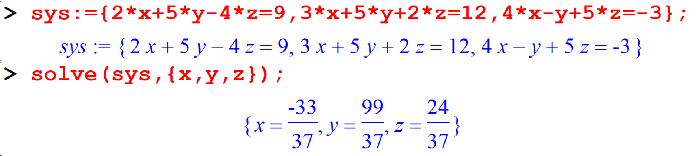


Maple will automatically use fractions, however you can force decimal answers using the ***evalf*** command.

```
[> evalf(%);
```

*Output*:

  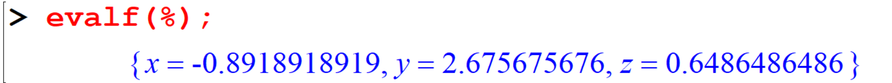


### Method II
We can also convert the above system of equations to a matrix system.

```
[> A:=genmatrix(sys,[x,y,z],b);
[> evalm(b);
```

*Output*:

  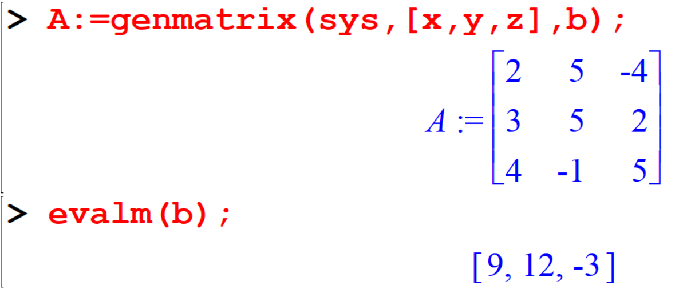{width=70%}


In this case , 

- $A$ is the coefficient matrix, and 
- $b$ is vector representing the constant values.


The command  `evalm(b)` evaluated $b$ as a matrix (a vector is a $n \times 1$ matrix).
In other words, this command simply writes out what the vector $b$ looks like.


```
[> linsolve(A,b);
```


*Output*:

  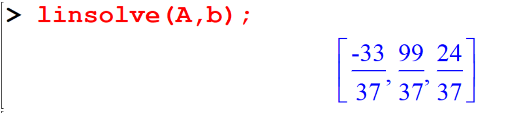{width=70%}


### Method III

Another way to solve a matrix equation \(Ax = b\) is to left multiply both sides by the inverse matrix \(A^{-1}\), if it exists, to get the solution \(x = A^{-1}b\).

```
[>  inverse(A);
[> evalm(inverse(A)&*b);
```


*Output*:

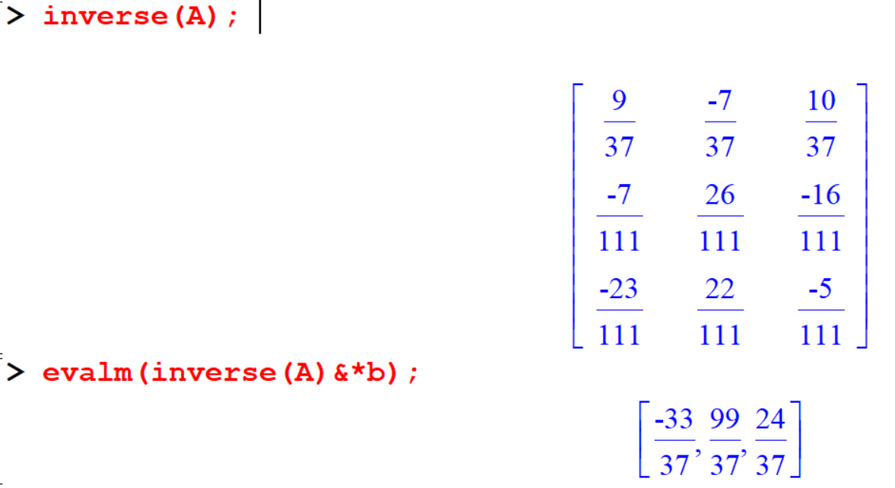


The `evalm` command forces a matrix computation and express the result.

  ---

**Dependent Systems**:

Some systems are dependent which means there are an infinite number of solutions. The form of these solutions will entail the use of parameters. 
Let’s look an example using two different methods; `solve` and `linsolve`.

```{example}
\[
\begin{array}{ccccccccc}
x &-& 2y&+& z &=& &3\\
x &+& y &-& 2z&=&-&4\\
2x&-& y &-& z &=&-&1  
\end{array}
\]
```

```
[> restart;
[> with(linalg):
[> sys:={x-2*y+z=3,x+y-2*z=-4,2*x-y-z=-1};
[> solve(sys,{x,y,z});
```


*output*: 
  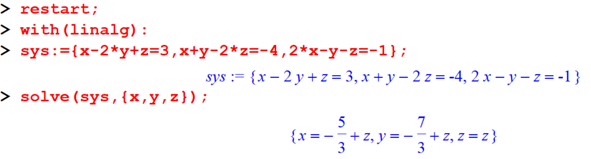


```
[> A:=genmatrix(sys,[x,y,z],b);
[> evalm(b);
[> linsolve(A,b);
```

*output*: 

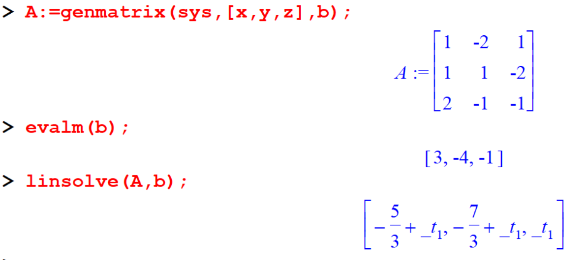


In both cases, the solution contains a parameter. 
The `solve` command express it in terms actual variable used,and the `linsolve` command use the funny t character to distinguish it from a variable you might have defined yourself.

---

**Inconsistent System**

An Inconsistent system has no solution. Maple generally, refers to answer questions which have no answer.

```{example}
\[
\begin{array}{ccccccccc}
x &+& y &-& 3z &= 10\\
x &+& y &-&  z &= 1\\
x &+& y &+&  z &= 8  
\end{array}
\]
```

Let's try to solve this system.

```
[> restart;
[> with(linalg):
[> sys:={x+y-3*z=10,x+y-z=1,x+y+z=8};
[> solve(sys,{x,y,z});
```

*Output*:


  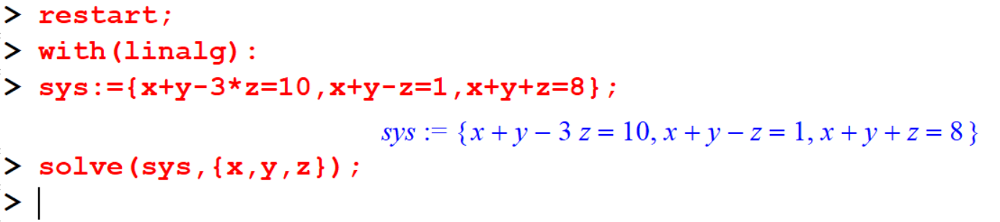

This method does not work. It does not return anything. 

Let's try `linsolve` method.

```
[> A:=genmatrix(sys,[x,y,z],b);
[> linsolve(A,b);

```
*Output*:

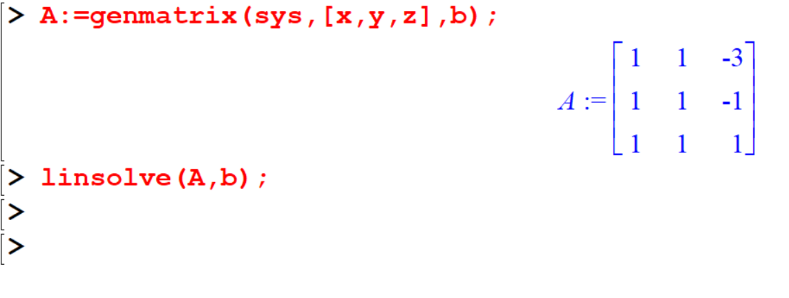

This method also does not works.

```
[> evalm(inverse(A)&*b);
```

*Output*:

  


#### Automatic Reduction

```
[> sys:={3*x+5*y+2*z=12,2*x+5*y-4*z=9,4*x-y+5*z=-3};
[> evalm(b);
[> C:=augment(A,b);
```

*Output*:

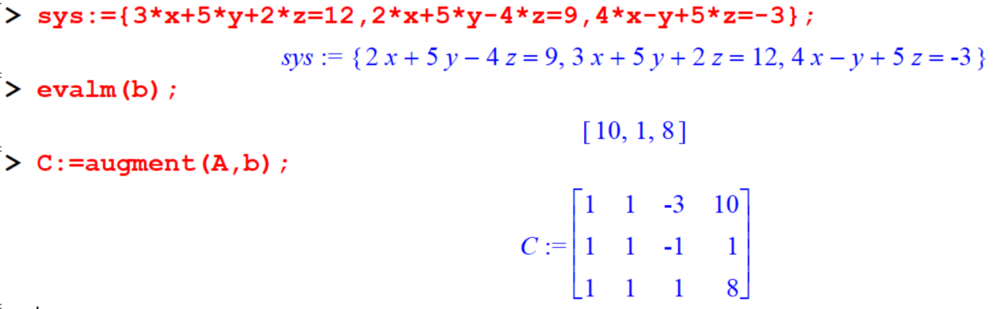


### Method IV
An even faster method is simplifying let maple to do all the work for us. The `gausselim` command will perform all of the steps of Gaussian eliminations and reduce an augmented matrix to **row echelon form**.


```
[> sys:={3*x+5*y-2*z=12,2*x+5*y-4*z=9,4*x-y+5*z=-3};
[> A:=genmatrix(sys,[x,y,z],b);
[> evalm(b);
[> C:=augment(A,b);
[> gausselim(C);
```

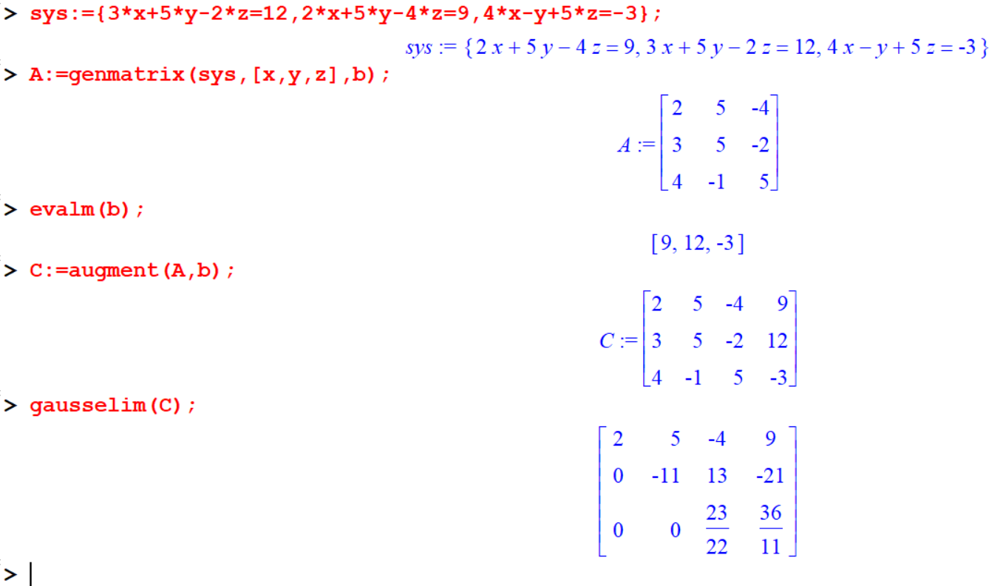


### Method V


The command `gaussjord` does the same thing. 
It performs all the steps of Gauss Jordan elimination and reduces and reduces an augmented matrix into reduced row echelon form.

```
[> gaussjord(C);
```
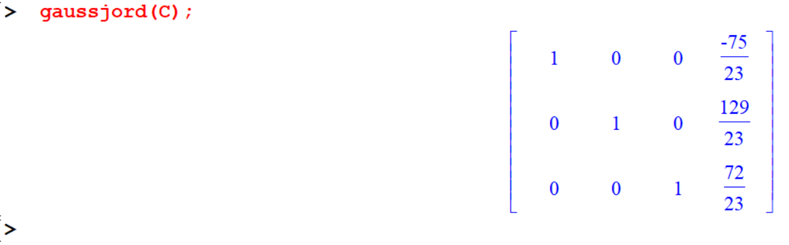


---
## Exercise

```{exercise}
Solve the following system of equations.
\[
\begin{array}{ccccccc}
x_1  &+& 2x_2 &+& 3x_3 &= 9 \\
2x_1 &-& x_2  &+& x_3  &= 8 \\
3x_1 & &      &-& x_3&= 3
\end{array}
\]
```

```{exercise}
A small manufacturing plant makes three types of inflatable boats: one-person, two-person, and four-person models. 
Each boat requires the services of three departments, as listed in the table. 
The cutting, assembly, and packaging departments have available a maximum of 380, 330, and 120 labor hours per week, respectively.

| Department      | One Person Boat | Two-Person Boat | Four-Person Boat |
|:---------------:|:---------------:|:---------------:|:----------------:|
| Cutting         | 0.5 hr          | 1.0 hr          | 1.5 hr           |
| Assembling      | 0.6 hr          | 0.9 hr          | 1.2 hr           |
| Packaging       | 0.2 hr          | 0.3 hr          | 0.5 hr           |


(A) How many boats of each type must be produced each week for the plant to operate at full capacity?
(B) How is the production schedule in part A affected if the packaging department is no longer used?
(C) How is the production schedule in part A affected if the four-person boat is no longer produced?
```
