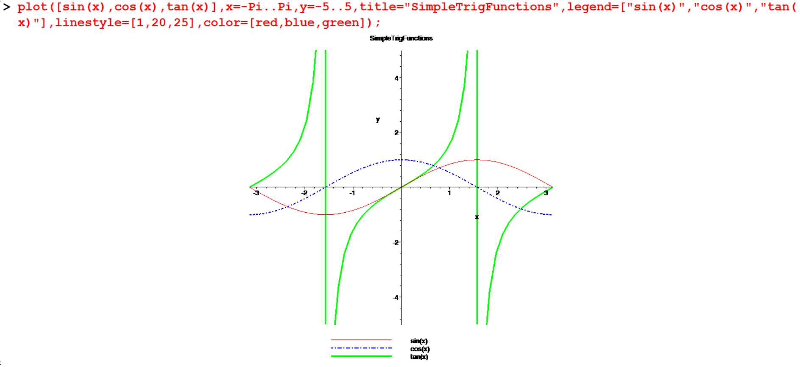

# Plots

**Maple Packages**

In Maple we can use various packages for special applications. In order to use a package, you have to load the package first using the `with` command.

**Example**

- `> with(student):`
- `> with(linalg):`

So, when you are dealing with plots, you have to load the package `plot`.

```
 > with(plots):
```


##  Basic Graphs
Using the plot command you can graph a function. You have to give the range of values for $x$ otherwise Maple will use the default range.

```
[> plot(x^2+1,x=-3..3); 
```


```
[> plot(abs(x),x=-infinity..infinity); 
```


```
[> f:=x->2*x^3+2*x+1; 
[> plot(f(x),x=-3..3); 
```


You can give the vertical range also. 

```
[> plot(4-(x-3)^2,x=-5..5,y=-5..5);

```


You can customize your plots using various formatting options within the `plot` command. Here are some of the key options:

- **Color:**

```
color=n
```

Allows specifying the color of the curves to be plotted

- **Labels:**

```
labels=[x, y]
```

This option specifies labels for the axes.  For information on how to specify `x` and `y`. The default labels are the names of the variables in the original function to be plotted, if these 
are available; otherwise, no labels are used.  

- **Legend:**

```
legend=s
```

Legend entry for a plot.  If the plot command is being used to plot multiple curves, then `s` can be a list containing a legend entry for each curve. 

- **Linestyle:**

```
linestyle=t
```

Controls the line style of curves.  The linestyle value t can be one of the following names: `solid`, `dot`, `dash`, `dashdot`, `longdash`, `spacedash`, or `spacedot`.  The default value of 
`t` is solid.  The value `t` can also be an integer from 1 to 7, where each integer represents a line style, as given in the order above. 

- **Title:**

```
title=t
```
The title for the plot. The value t can be an arbitrary expression.   The value t can also be a list consisting of the title followed by the font option.  The default is no title.

```{example}
.
```
```maple
[> plot(sinh(x), x=-Pi..Pi, title="sinh graph",color=[blue]);
```


```{example}
.
```

```
plot(sin(x),x=-2*Pi..2*Pi,title="sine Graph",color=[green]);
```


## Multiple Graphs

If you want to compare plots, you can have two or more plot windows open at the same time or you can plot more than one curve on the same set of axes. The plot command offers options which control the number of points at which the function is plotted, the number of tick marks on the axes and the placing of titles on the graph. Read the help page on plot to find out about these options.


```{example}
z
```

```
[> plot([x^2,(x-2)^2+2,-x^2-2],x=-5..5,y=-10..10,title="multiple graphs",color=[blue,magenta,green]); 
```


```{example}
.
```

```
[> plot([sin(x),cos(x),tan(x)],x=-Pi..Pi,y=-5..5,title="SimpleTrigFunctions",legend=["sin(x)","cos(x)","tan(x)"],linestyle=[1,20,25],color=[red,blue,green]);
```



```{example}
.
```

```
[> p1:=plot(x^3-2*x^2+1,x=-Pi..Pi,style=point,color=[blue]): 
[> p2:=plot(5*x^2+0.005*cos(x)^2,x=-Pi..Pi,style=line,color=[magenta]): 
[> plots[display]({p1,p2});
```


```{example}
.
```

```
[> f:=x->5*x/(2*x+9): 
[> g:=x->sqrt(x-3): 
[> plot([f(x),g(x)],x=-25..10,y=-5..5,labels=[x,y],title="Plot of Two Functions", legend=["f(x)","g(x)"]); 
```


## Discontinuous Graphs 

The graph $y=\frac{1}{x+1}$  has a flow. There appears to be vertical line at $x=1$ , when really the function is not defined at $x=1$. This happens because Maple assumes graphs are continuous, so it tries to keep the graph connected by drawing that extra line. We can fix this problem by telling maple to expect discontinuities. 

```
[> plot(1/(2-x),x=-5..5,y=-2..2); 
[> plot(1/(2-x),x=-5..5,y=-2..2,discont=true); 
```


```
[> plot(floor(x),x=-5..5,thickness=2,color=gold); 
[> plot(floor(x),x=-5..5,thickness=2,color=gold,discont=true); 
```
`floor(x)` is a function which produce  the greatest integer less than or equal to a given $x$.  


##  Graphing Lines
You can now plot the graphs of the lines of the form $y=mx+c$. So how to plot lines having the form  $ax+by=c$ ? 

```
[> line1:=3*x-7*y=8; 
[> solve(%,y); 
[> plot(%,x=-3..3,y=-2..2,thickness=3); 
```


##  Plotting Piecewise Continuous Functions 


Plotting Piecewise Continuous Functions 
If you wish to plot an expression which is defined in a piecewise way, then use the Maple command `piecewise`.

For example, to plot the expression $f(x)$ which is mathematically,  


$$
f(x)=\begin{cases}
0 & \text{ if } & x<0\\
x^2 & \text{ if } & 0 \leq x < 1\\
2x-1 & \text{ if } & 1 \leq x
\end{cases}
$$
 you can use the command:


```
[> fx:=piecewise(x<0,0,0<=x and x<=1,x^2,x>1,2*x-1); 
```

Now to plot this for $x$ between -5 and 5 , simply type 

```
[> plot(fx,x=-5..5);
```


```
[> gx:=piecewise(x<1,-x+1,1<=x and x<=4,2*x+3,x^2);  
[> plot(gx,x=-5..5,discont=true); 
```


## Finding one to one functions 
Not every function has an inverse function. This is a special property. What is the criteria which determines whether or not a given function has an inverse? Only functions which are one-to-one have inverses.

```{definition}
- A function is one-to-one if every $x$ in domain takes a unique value of $y$. 

This is usually expressed in the following way, which is not always easy to understand. 

- A function is one-to-one if whenever $f(a)=f(b)$, then $a=b$. 

In other words, 

- if it appears that two different $x$ values share the same $y$ value. 
```

```
> f:=x->(x-2)/(x-7); 
> f(a)=f(b); 
> isolate(%,a); 
> display(plot({k/2$k=-4..4},x=-4..4,color=red),plot({f(x)},x=-4..4,thickness=3,color=green)); 
```


This equation $f(a)=f(b)$ can be solved and has a single unique solution. That means the values of $a$ and $b$   are the same. Thus the function is one-to-one. 


When looking at the graph of a function, it is easy to see if its one-to-one. If every horizontal line crosses the function only once, then the function is one-to-one. However, if there is even one horizontal line which crosses in two or more places, it is not one-to-one.
 
```{example}
Determine whether if $f(x)=2x\sqrt{|x|}$ is one to one or not?
```

```
[> f:=x->2*x*sqrt(abs(x)); 
```
If you try to solve $f(a) = f(b)$ as we did above, even Maple has some trouble.


```
[> f(a)=f(b); 
[> isolate(%,a); 
```


Let’s look at the graph.

```
[> display(plot({k/2$k=-9..9},x=-Pi..2*Pi,color=red),plot({f(x)},x=2..2, thickness=3, color= green)); 
```


##  Graphing the inverse

There is an interesting relationship between the graph of $f(x)$ and graph of its inverse. They are mirror images of each other through the line $y=x$ . for every point $(x,y)$ on the graph of $f(x)$, there corresponds a point $(y,x)$   on the graph of the inverse. 

```
> plot({exp(x),ln(x),x},x=-infinity..infinity,color=[green,blue,red]); 
```


```
> plot([sin(x),arcsin(x),x],x=-0.5*Pi..0.5*Pi,y=-0.5*Pi..0.5*Pi,color=[green,blue,red]); 
```


```
> plot([cos(x),arccos(x),x],x=0..0.5*Pi,y=-0.5*Pi..0.5*Pi,color=[green,blue,red]); 
```


##  Solving system of equations graphically 

For example, let us solve the following system of equations both algebraically and graphically. 

$$
\begin{align}
-x&+3y&=10\\
x&+y&=02
\end{align}
$$

```
[> solve({-x+3*y-10,x+y-2},{x,y});
```


Now let us do it graphically: 

- First solve each equation for $y$. 
- Then plot $g$ and $h$ as follows using different line styles.
- The solution is the point of intersection.


```
> g:=solve(-x+3*y=10,y);  
> h:=solve(x+y=2,y); 
> plot([g,h],x=-10..10,color=[red,green],title="system of equations"); 
```


##  Implicit plot

Some graphs cannot be plotted using the plot command, in such cases you have to use the `implicitplot` command. 

```
[> restart;with(plots): 
[> plot(4*x^3-3*y^2+y^3=1,x=-1..1,y=-1..1); 
[> implicitplot(4*x^3-3*y^2+y^3=1,x=-1..1,y=-1..1); 
```


```
[> p1:=implicitplot(x^2+y^2=1,x=-1..1,y=-1..1,color=blue): 
[> p2:=implicitplot(x^2+y^2=1/2,x=-1..1,y=-1..1,color=green): 
[> p3:=implicitplot(x^2+y^2=1/8,x=-1..1,y=-1..1): 
[> display({p1,p2,p3}); 
```


Using the `implicitplot` command you can graph vertical and horizontal lines. 

```
> p1:=implicitplot(y=1,x=-1..1,y=-1..1,color=blue): 
> p2:=implicitplot(x=1,x=-1..1,y=-1..1,color=green): 
> p3:=implicitplot(y=-1,x=-1..1,y=-2..1,color=blue): 
> p4:=implicitplot(x=-1,x=-1..1,y=-1..1,color=green): 
> plots[display]({p1,p2,p3,p4}); 
```


**Note: Some special notes with plots.**\ 
Maple’s plots package contains many useful commands for generating a wide range of plots. 
First let’s look at the simplest command plot, which is contained in the main Maple library.  


- In Maple you can plot ordered pairs. 

```
[> plot(set_of_ordered_pairs,style=POINT); 
```


Example:

```
[> plot([[1, 2], [3, 1], [-2, 1]],style=POINT);
```


- Polar plots

```
> polarplot(2,t=0..Pi);
```


- You can draw different types of polygons with Maple plots. Try out the following: 

```
[> polygonplot([[-1,2],[-3,4],[1,2]]);
```


```
[> polygonplot([[-1,1],[3,1],[5,5],[1,8],[3,5]],color=magenta);
```


## 3D plots 

```
[> restart; 
[> with(plots): 
[> plot3d(sin(x*y),x=-Pi/2..Pi/2,y=-Pi..Pi); 

```

<!--{width=100%}-->

```
[> plot3d((1.3)^x * sin(y), x=-1..2*Pi, y=0..Pi, coords=spherical, style=patch);
```
<!--{width=100%}-->

## Exercise

1. Plot the following functions in a suitable domain:
   - \( x^3 - 12x^2 + 30x - 10 \)
   - \( \sqrt{x} - 1 \)
   - \( 2x^3 + 3x^2 + 1 - \sin(x) \)
   - \( x^4 - 94 \)

2. 
   i. Plot the functions \( x^3 \), \( x^3 - 2x \), \( x^3 + 2x \) on the same axis using the domain \( x = [-2, 2] \).
   
   ii. Plot \( \sin(x) \), \( \sin(2x) \), \( \sin\left(\frac{x}{2}\right) \), \( 2\sin(x) \), \( 2 + \sin(x) \) on the same axis.
   
   iii. Plot the lines \( y = 2x + 1 \), \( y = -2x + 1 \), \( y = 2x - 1 \), \( y = -2x - 1 \) on the same axis.

3. Applying the vertical line test, determine whether the following are functions:
   i. \( 4x^2 + 2y^2 - y^3 = 1 \)
   ii. \( 4x^2 + y^2 - y^3 = 1 \)
   iii. \( x^3 - x + 2y^3 = 1 \)

4. Which of the following functions are one-to-one?
   i. \( f(x) = x \sin(x) \)
   ii. \( f(x) = -2 - x \)

5. 
   i. Graph the functions \( y = x^2 - 5x + 6 \) and \( y = 1 \) together. Use different \( y \) ranges so that complete pictures of both graphs are shown.
   
   ii. Graph \( y = -3x + 5 \) and \( y = 9 - x^2 \) on the same axis using a suitable domain. Use the `solve` command to find the value of \( x \) when the two curves intersect.
   
   iii. Graph \( f(x) = x|x| \) and \( \frac{1}{x+1} (x-2)^2 \) together.


