# Vectors

## Defining a vector 

A vector in Maple is a one-dimensional array. It is part of the `linalg` package. There are two commands for entering a vector in Maple. Those are `array` and `vector`.

```
[> with(linalg): 
[> u:=array([a,b,c]); 
[> v:=vector([a,b,c]); 
[> w:=<a|b|c>; 
```

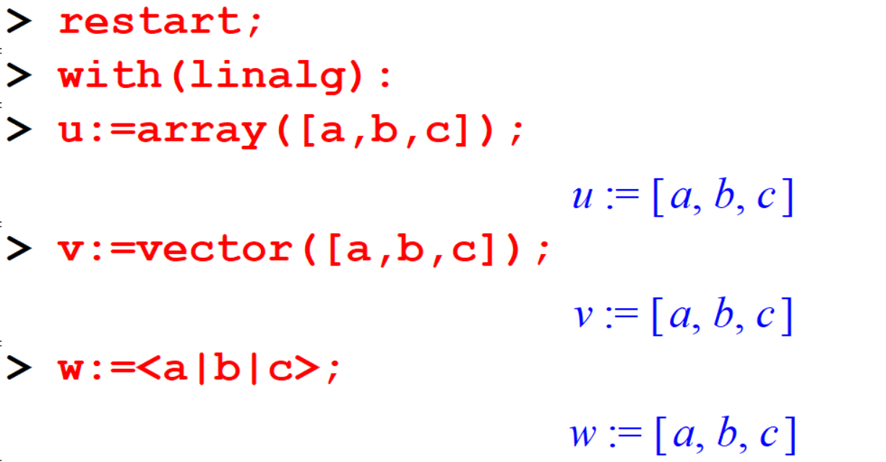

Defining a vector with specified elements: 

```
[> a:=vector([1,2,3]); 
[> b:=vector(3,[-1,2,3]);
```


Defining a vector with 3 unspecified elements will gives you a symbolic vector of dimension three.

```
[> c:=vector(3);
[> evalm(c); 
```
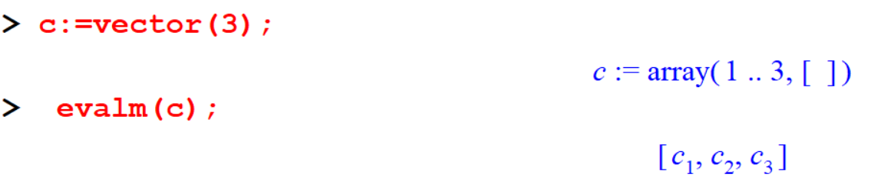


```
[> u:=vector([3,-2,0,2,-3]); 
```

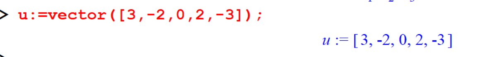


If a vector `u` is defined, we can access the $n$th element of the vector `u` by the command `u[n]`.

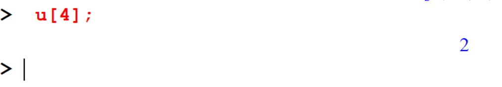

We can insert variables as the entries of vectors: 

```
[> v := vector([x,y,2*x]);  
[> v[1]+v[3]^2;  
```
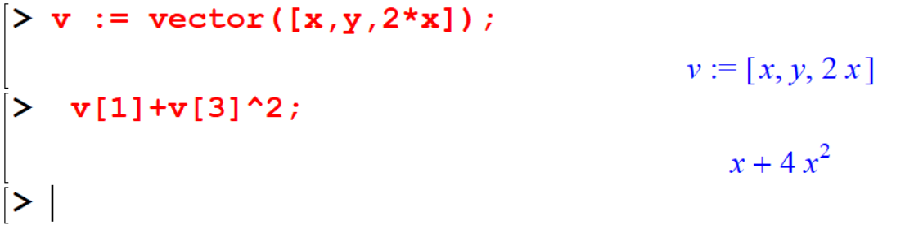


Given below is the function form of the "vector" command.

```
[> w := vector(7, i -> i^2-1);
```

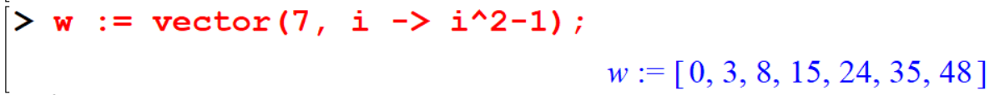

This $w$ vector contains the $n^2-1$ form of the first seven positive integers. $n \in \mathbb{N}$.

## Vector Algebra
Maple can handle most of the common operations with vectors. 
  
### Vector addition 
The commonly used algebra operations on vectors are as follows: 

```
[> u:=vector([2,-1,1]); 
[> v:=vector([0,3,-2]); 
[> u+v; 
```

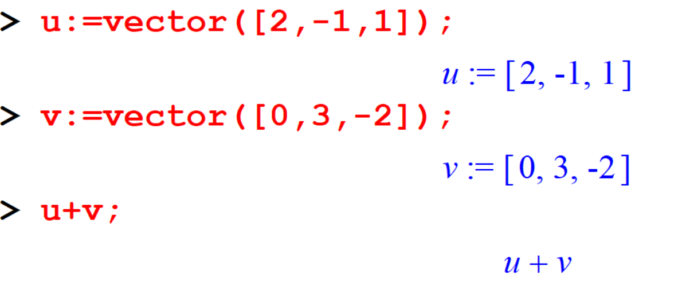

Notice that just typing $u+v$  doesn't work the way you expect. To see the entries you need to use `evalm` which stands for Evaluate as a Matrix. So now:

```
> evalm(u+v); 
> evalm(u-v); 
```

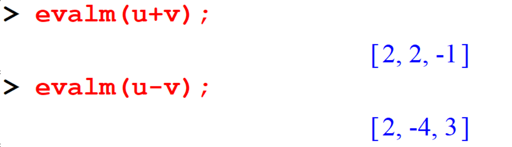


### Multiplication by a scalar

```
[> evalm(2*v); 
[> evalm(3*u+2*v); 
```

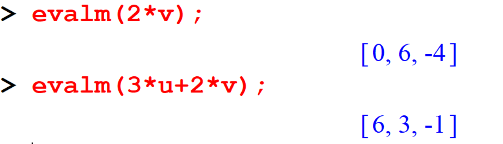

### Dot  product and cross product 

To do the dot and cross products, you have the commands `dotprod` and `crossprod`. But **you must load the** `linalg` **package** before entering those commands. 


But you must load the ‘linalg’ package before entering those commands. 

```
[> with(linalg): 
[> dotprod(u,v); 
[> crossprod(u,v); 
```
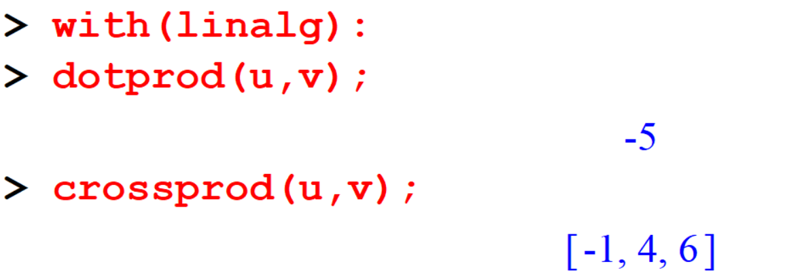

```
[> crossprod([1,2,3],[-2,0,1]); 
```


### Scalar triple product

There are two methods to get the scalar triple product. 

```
[> u:=vector([3,-1,2]); 
[> v:=vector([5,7,1]); 
[> w:=vector([0,1,2]);
```
- *Method I*

```
 dotprod(u,crossprod(v,w)); 
```

- *Method II*
```
 det(augment(u,v,w)); 
```

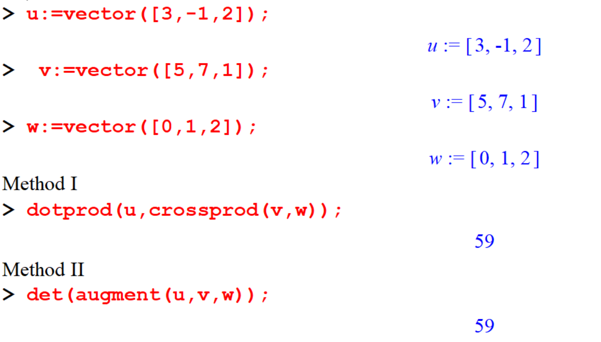

### Magnitude of a vector 

- Method I
```
[> u:=vector([2,-1,1]); 
[> sqrt(dotprod(u,u)); 
[> sqrt(dotprod(v,v));
```
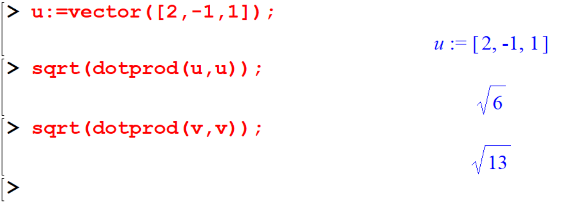

- Method II

```
> norm(v,2); 
> norm(v,2); 
```
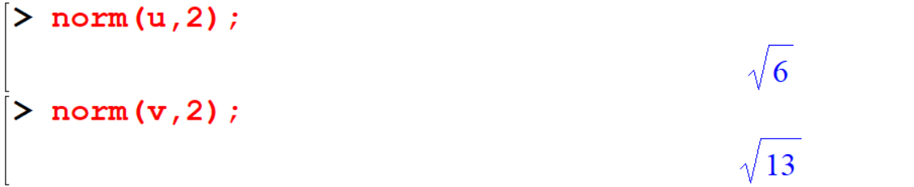

Using the `norm` command you can find the *unit vector* corresponding to a given vector. 

```
[> u/norm(u,2); 
[> evalm(%); 
[> evalm(v/norm(v,2));
```

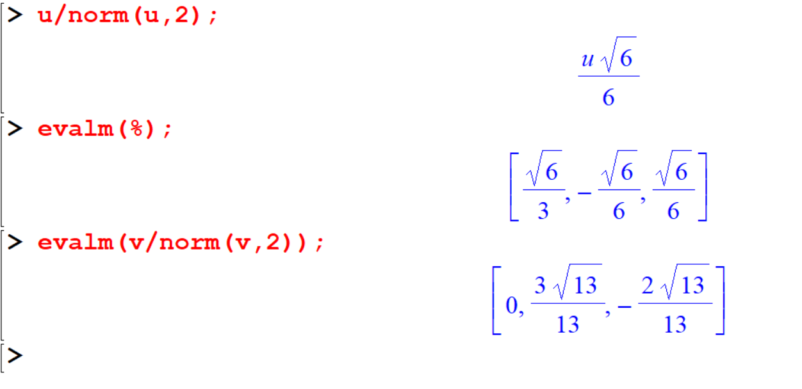


### Angle between two vectors

```
[> angle(u,v);
[> evalf(%);
```
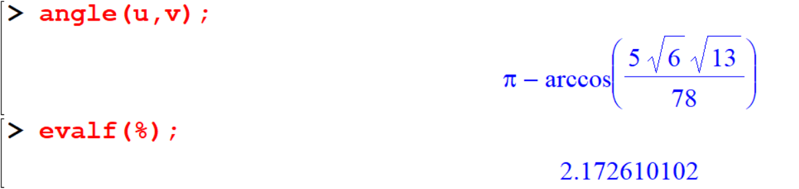

*Note that, in here the angle is given in radians.*

### Line joining two points and mid point of line

Let $p,q$  be two position vectors.  Then you can find the vector representing the line joining these two points by evaluating $q-p$. 

```
[> p:=vector([3,-1,2]); 
[> q:=vector([5,7,1]); 
[> evalm(q-p); 
```

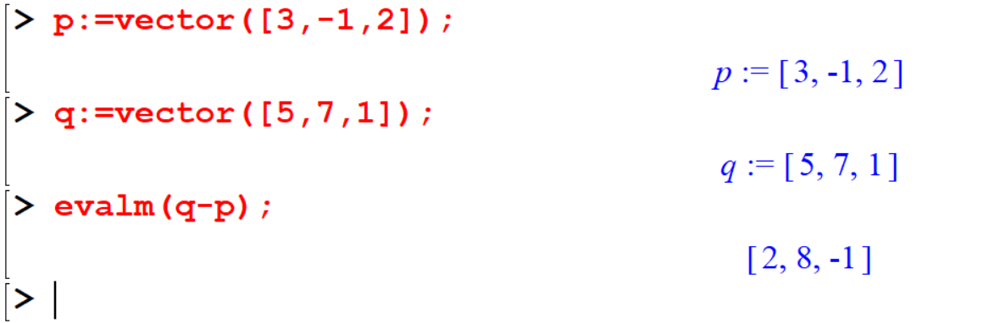

You can find the midpoint of the line as well. 

```
[> evalm((q+p)/2); 
```

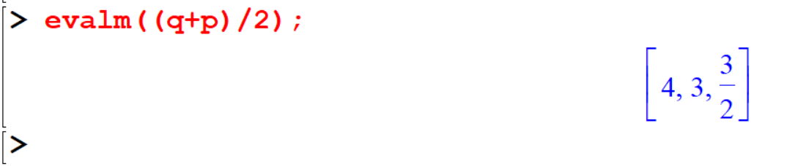

## Geometrical representation of vectors

Vectors are determined by both a magnitude and a direction and they are represented geometrically in 2 or 3 dimensional space as directed line segments or arrows. We can represent vectors graphically using the `arrow` and `display` commands from the plots package. 

```
[> restart;with(plots): 
````

The arrow command has the following format:

`arrow(vector,options)` or `arrow(base,direction,options)` \ 
For the options, you may use a bigger width if the arrow appears to be too small. 


For example, in 2-dimensional plane plot the vector $\vec u=(3,5)$

```
> arrow([3,5],width=0.1,head_length=0.5,axes=normal,color=red); 
```

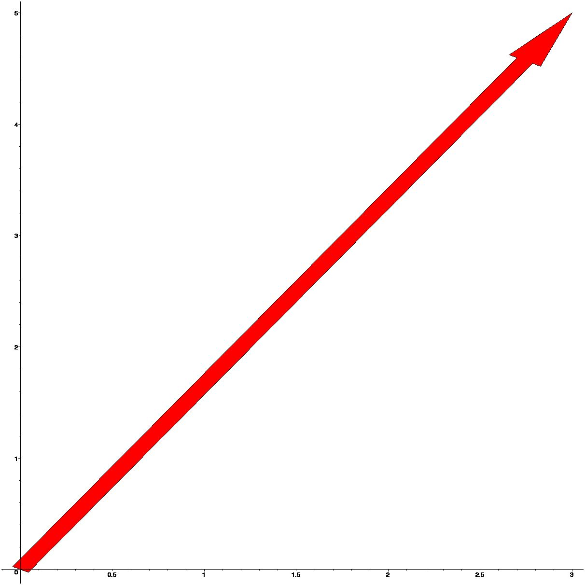

For example, in 3-dimensional plane plot the vector $\vec v = (1,−2,4)$

```
[> v:=vector([1,-2,4]); 
[> V1:=arrow(v):  
[> display(V1,axes=normal,labels=[x,y,z]); 
```
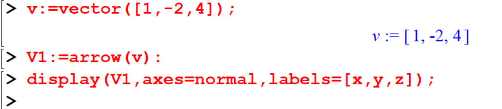
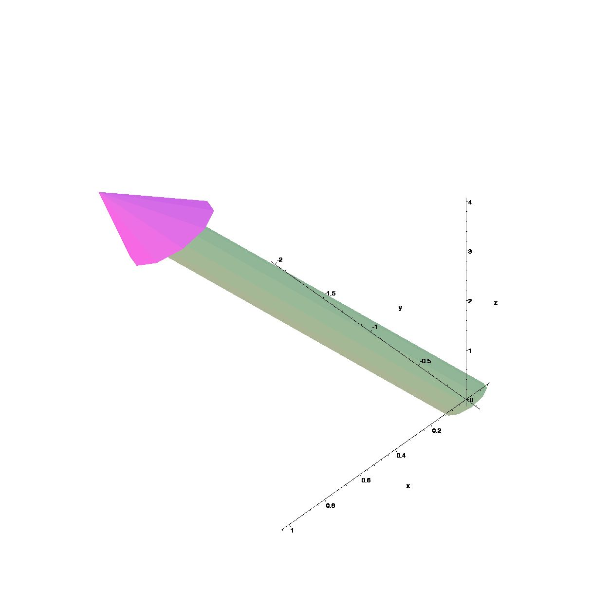


The angle of vision can be moved by clicking on the graph and moving your mouse (with the button still pressed down). 

### Sum of two vectors 

The sum of two vectors $v_1$ and $v_2$, written $v_1+v_2$  is the vector geometrically determined as follows.

```
[> restart;with(plots): 
[> v1:=arrow([3,5],width=0.1,color=blue): 
[> v2:=arrow([-1,2.5],width=0.1,color=red): 
[> sumvectors:=arrow([3,5]+[-1,2.5],width=0.2,color=green): 
[> display({v1,v2,sumvectors}); 
```

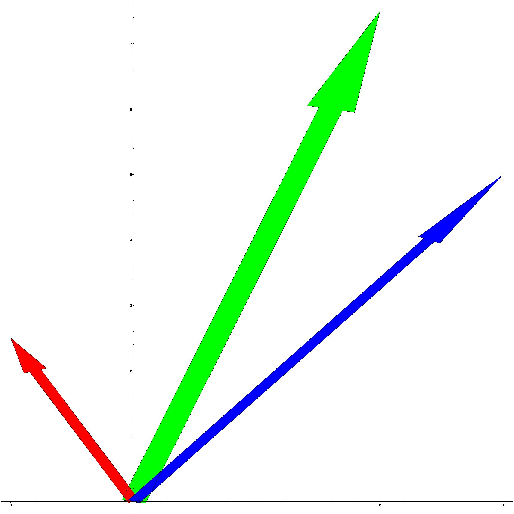


### Difference of two vectors

If $v_1$ and $v_2$ are any two vectors, we define the difference of the vectors to be the vector $v_1-v_2$ and we can construct it by plotting the sum of the vector $v_1$  and the vector $-v_2$.

```
[> restart;with(plots): 
[> v1:=arrow([3,5],width=0.1,color=blue): 
[> v2:=arrow([1,-2.5],width=0.1,color=red): 
[> sumvectors:=arrow([3,5]+[1,-2.5],width=0.2,color=green): 
[> display({v1,v2,sumvectors});
```

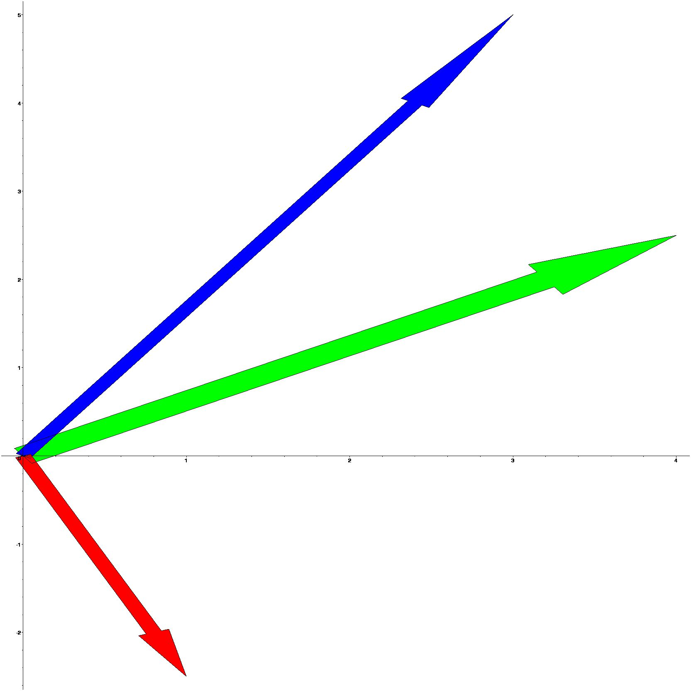


### Multiplying a vector by a scalar 

Multiplying a vector by a scalar If $v$ is a nonzero vector and$c$ is a nonzero scalar, we define the product of $c$ and $v$, denoted $v$, to be the vector whose length is $|c|$ times the length of $v$ and whose direction is the same 
as that of $v$ if $c > 0$ and opposite to that of $v$ if $c < 0$. 
```
[> restart;with(plots): 
[> v:=arrow([3,5],width=0.5,color=blue): 
[> v_times_5:=arrow([3*5,5*5],width=0.6,color=green): 
[> display(v,v_times_5); 
```
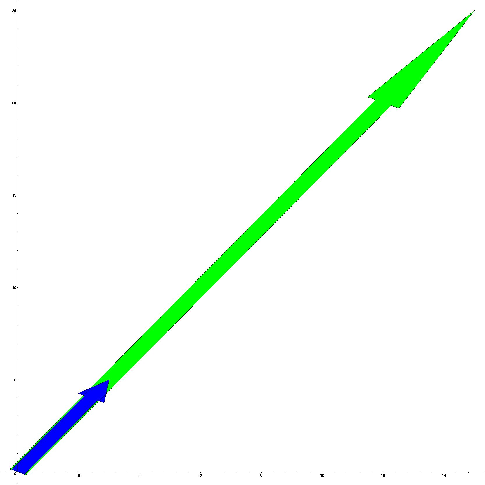


## Exercises

1. Show that the vector \( 9\mathbf{i} + \mathbf{j} - 6\mathbf{k} \) is perpendicular to the vector \( 4\mathbf{i} - 6\mathbf{j} + 5\mathbf{k} \).

2. Find the angle between the vectors \( \mathbf{i} - 2\mathbf{j} - 2\mathbf{k} \) and \( 2\mathbf{i} + \mathbf{j} - 2\mathbf{k} \).

3. Find \( \mathbf{a} \times \mathbf{b} \) and \( \mathbf{b} \times \mathbf{a} \) where \( \mathbf{a} = 3\mathbf{i} + \mathbf{j} + 2\mathbf{k} \) and \( \mathbf{b} = 2\mathbf{i} - 2\mathbf{j} + 4\mathbf{k} \).

4. Find the area of the triangle whose vertices are \( 2\mathbf{i} + 3\mathbf{j} - \mathbf{k} \), \( \mathbf{i} - \mathbf{j} + 2\mathbf{k} \), and \( 2\mathbf{i} + 2\mathbf{j} + \mathbf{k} \).

5. Find the area of the triangle whose vertices are \( \mathbf{i} + \mathbf{j} + \mathbf{k} \), \( \mathbf{i} + 2\mathbf{j} + 3\mathbf{k} \), and \( 2\mathbf{i} + 3\mathbf{j} + \mathbf{k} \).

6. If \( \mathbf{a} = 2\mathbf{i} - 3\mathbf{j} + \mathbf{k} \), \( \mathbf{b} = \mathbf{i} - \mathbf{j} + 2\mathbf{k} \), \( \mathbf{c} = 2\mathbf{i} + \mathbf{j} + \mathbf{k} \), then find:
   * \( (\mathbf{a} \times \mathbf{b}) \cdot \mathbf{c} \)
   * \( (\mathbf{b} \times \mathbf{c}) \cdot \mathbf{a} \)
   * \( (\mathbf{a} \times \mathbf{b}) \times \mathbf{c} \)
   * \( (\mathbf{b} \times \mathbf{c}) \times \mathbf{a} \)
   
7. For any vectors \( \mathbf{a}, \mathbf{b}, \mathbf{c} \) and any scalar \( k \), prove that:
   * \( \mathbf{a} \cdot (\mathbf{b} + \mathbf{c}) = \mathbf{a} \cdot \mathbf{b} + \mathbf{a} \cdot \mathbf{c} \)
   * \( k(\mathbf{a} \cdot \mathbf{b}) = (k\mathbf{a}) \cdot \mathbf{b} = \mathbf{a} \cdot (k\mathbf{b}) \)
   * \( \mathbf{a} \cdot \mathbf{a} = |\mathbf{a}|^2 \)
   * \( \mathbf{a} \times (\mathbf{b} + \mathbf{c}) = \mathbf{a} \times \mathbf{b} + \mathbf{a} \times \mathbf{c} \)
   * \( k(\mathbf{a} \times \mathbf{b}) = (k\mathbf{a}) \times \mathbf{b} = \mathbf{a} \times (k\mathbf{b}) \)


