# Set Theroy

## Set Definition and Cardinity

A _set_ is an unordered collection of objects that we usually denote by capital letters. The objects in a set are called its _elements_, or _members_, which are contained by the set.

```
[> A:={a,b,c,d,e}; 
[> B:={1,2,3,4}; 
[> ES:={}; 
```

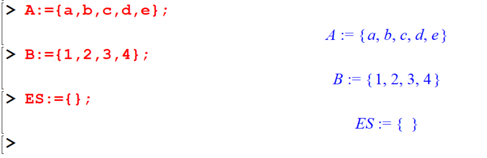

In the following you can see that Maple can generate sets with large number of elements. 

```
[> P:={seq(i*2,i=1..10)};
[> Q:={seq(2*i-1,i=1..10)}; 
```
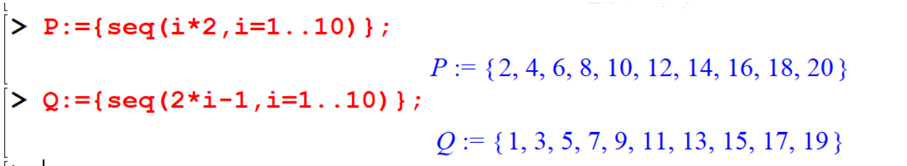

Usually `nops` command is used to count the number of operands in an expression and when applied to a finite set it returns the cardinality of the set.

```
[>nops(A)]
[> nops({red,green,blue});
```

## Checking for the set membership

```
[> a in A; 
[> p in A; 
```
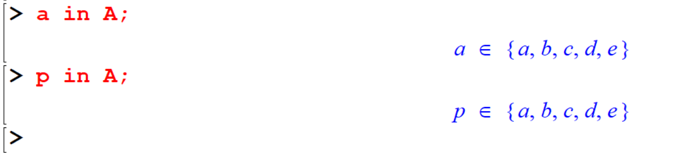


You can see the above command would not give required results. To avoid those, you can use the `evalb` command to check whether a given object is an element of the predefined set or not. 
This function evaluates to Boolean, whose result is printed out as one of either of the two Boolean constants `true` or `false`.

```
> evalb(a in A); 
> evalb(p in A); 
```

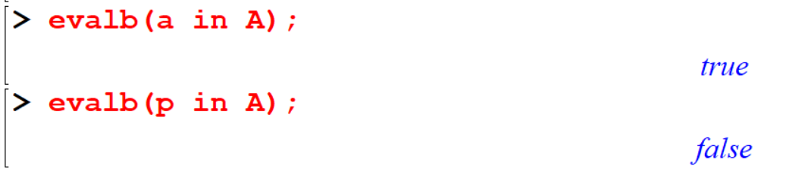


The elements of a set can be extracted via the selection operation. Thus if $A$ is a set then `A[i]` selects the $i$ th element. Alternatively you may use `op(i,A)`. 

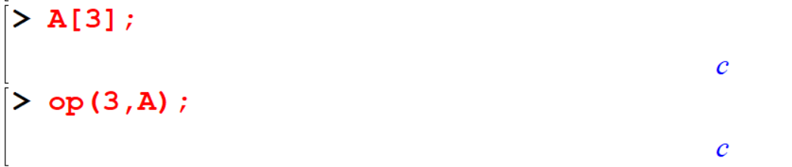

## Set Operations 

### Subsets

```
[> {a,b,c} subset A; 
[> {3,4,5} subset B;              
[> {x,y} subset {x,y,z};
```

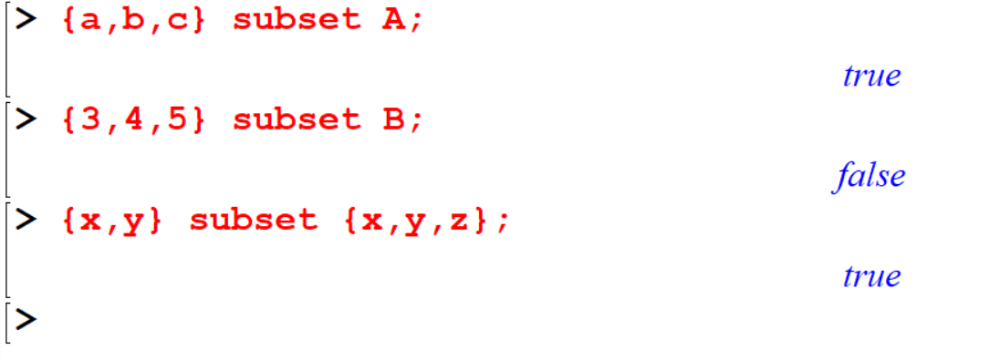
Or

```
> `subset`({x,y},{x,y,z}); 
```

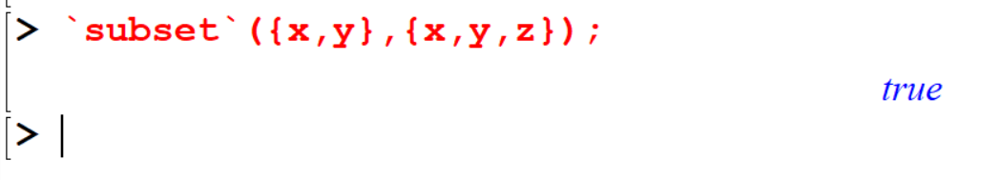

### Union 

```
[> A union B;  
[> {a,b} union {a,c,d}; 
```

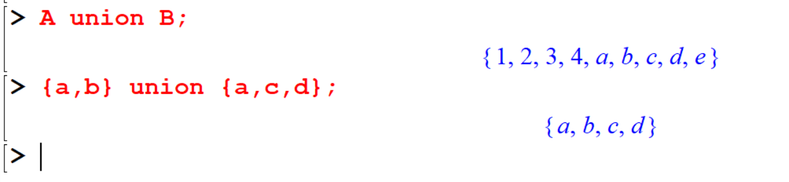

Or

```
[> `union`({a,b},{a,c,d});
```

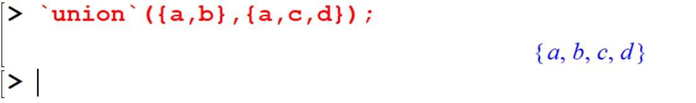

### Intersection 

```
[> {a,b} intersect {a,c,d};
``` 
Or

```
 `intersect`({a,b},{a,c,d});
```

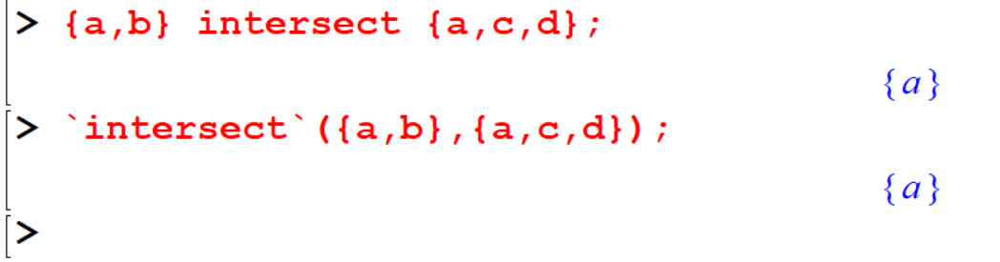


### Minus

```
[> {a,b,c,d} minus {a,c,d}; 
```

Or

```
[> `minus`({a,b,c,d},{a,c,d});
```
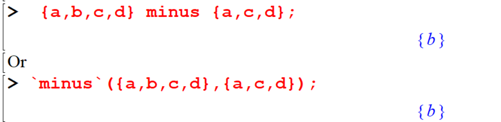
```
[> {a,b} minus {a,b}; 
```
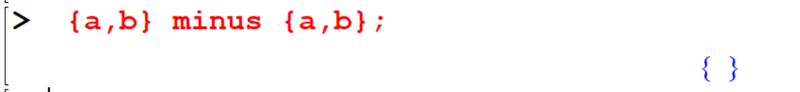


### Power set 
In order to find the power set in maple it will be necessary to import the package that has that command. To import a library we use the `with` command as follows: 


```
[> restart; with(combinat):
[> A:={p,q,r}; 
[> powerset(A); 
```

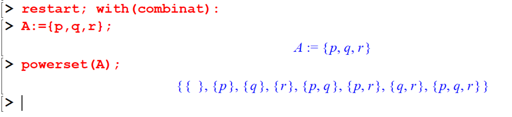


```
[> powerset({2,k}); 
```

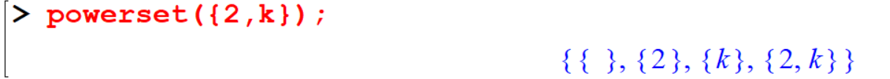

```
[> B:={seq(i^2,i=1..5)}; 
[> powerset(B); 
```

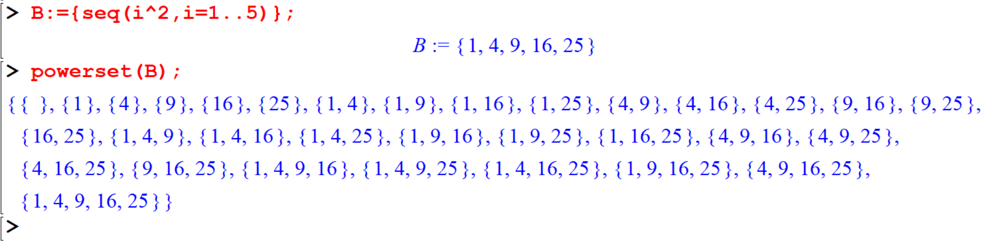


## Defining new functions to set theory operations 

You can define new functions to use in set theory, because Maple doesn’t contain   commands for some set operations.


```
[> restart; 
[> U:={seq(i,i=1..25)}; # Here U is the universal set 
[> A:={6,12,18,24}; 
[> B:={5,10,15,20,25}; 
[> C:={4,8,12,16,24}; 
[> Complement:=X->U minus X; 
[> Complement(A); 
[> Complement(B); 
```

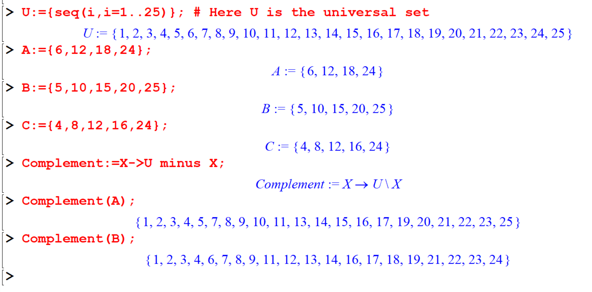


Following are some complex set theory operations.

- $(A \cup B)\setminus C$

```
[> (A union B)minus C;
```

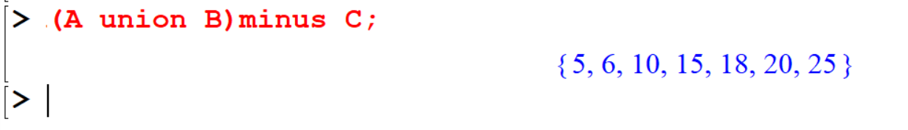

- $(A \cup B)^c\cap (B \cup C)^c$

```
[> A union B; 
[> k1:=Complement(%); 
[> k2:=Complement(B union C); 
[> k1 intersect k2; 
```

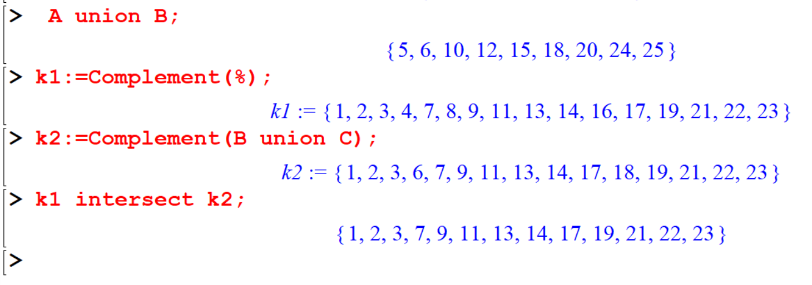

Or else you can use a single command, 

```
[> Complement(A union B)intersect (Complement(B union C)); 
````

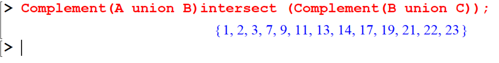


## Exercise


```{exercise}
Given: 
  
   * \(A = \{1, 2, 4, 7, 9, 11\}\)
   * \(B = \{2, 7, 9, 11, 17, 19\}\)
   * \(C = \{0, 2, 5, 7, 19, 24\}\)

   Find:
     
i. \(A \cup B\)
ii. \(A \cap B\)
iii. \(A \cap (B \cup C)\)
iv. \(A \cap (B \cap C)\)
v. \(A \setminus C\)
```


```{exercise,label='q2'}
Create a function to check if two sets are equal. (Hint: use the subset property twice.)
```

```{exercise,label='q3'}
Create a function to find the symmetric difference of two sets, \(A \bigtriangleup B\). 
```

```{definition}
The *symmetric difference* is equivalent to the union of both relative complements, that is:
    \(A \bigtriangleup B = ( A \setminus B ) \cup ( B \setminus  A )\)
```

Test functions \@ref(exr:q2) and \@ref(exr:q3)  with
   
   * \(A = \{1, 3, 5, 7\}\)
   * \(B = \{2, 4, 5, 6\}\)
   * \(P = \{1, 2, 3, 5, 6, 7\}\)
   * \(Q = \{2, 4, 5, 6\}\)


```{exercise}

i. Generate the set of integers from 1 to 50.
ii. Generate the set of the first 25 powers of 2.
iii. Let K be the set of numbers from 1 to 1100 that are divisible by 11. Find K. 
```