# Basic of Number Theory
Most (but not all) number theory related commands are contained within the package of function called `numtheory`. Before Maple can do any of these functions, this package must loaded into the Maple memory.

```
with(numtheory):
```

## Prime numbers, Factoring and Divisibility

### `ithprime(n)`

The `ithprime`(n)` function returns the n th prime number, where the first prime number is 2.


```
[> ithprime(1);
[> ithprime(20);
[> ithprime(320);
[> ithprime(5639);
```
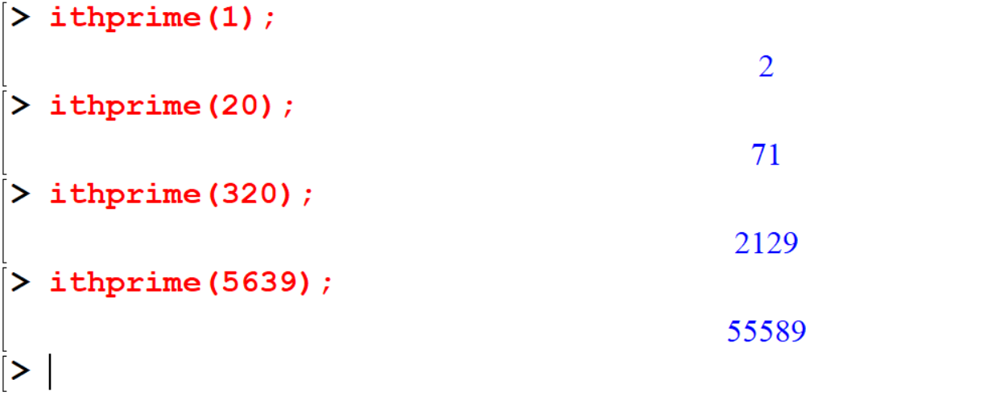

### `isprime(n)`
The `isprime(n)` function check to see if thenumber `n` is most probably a prime

```
[> isprime(8);
[> isprime(17);
[> isprime(45896);
[> isprime(37813);
```

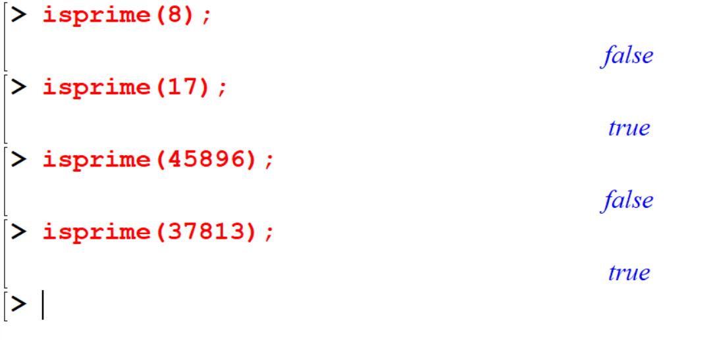


### `nextprime(n)`

`nextprime(n)` command returns the next prime numbers after the given integer.

```
[> nextprime(3);
[> nextprime(27);
[> nextprime(245);
```

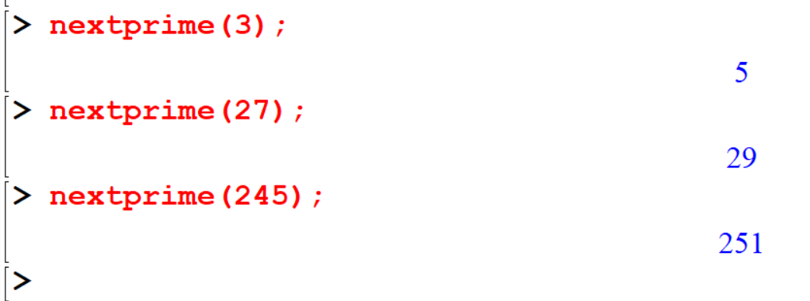


### `prevprime(n)`

`prevprime(n)` command returns the previous prime numbers after the given integer.

```
[> prevprime(3);
[> prevprime(44);
[> prevprime(1587);
```

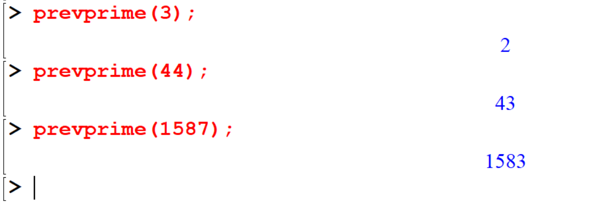


### `ifactor(n)`

The `ifactor(n)` function returns the integer prime factorization of the given number `n`.

```
[> ifactor(15);
[> ifactor(44);
[> ifactor(2019);
[> ifactor(825);
```

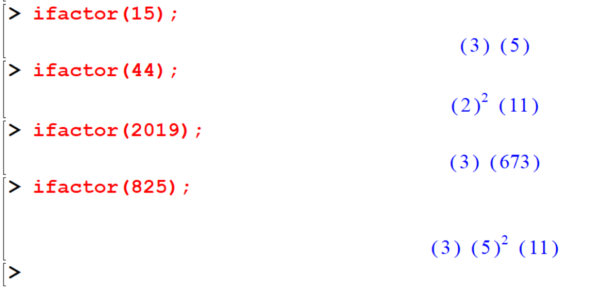

Let's recall the following,


Recall the following theorem

```{theorem,name='The Quotient-Remainder Theorem',label='thm1'}
Given any integer $n$ and positive integer $d$, there exist unique integers $q$ and $r$ such that:
$$n = dq + r$$
,where: $0 \leq r < d$.
```

### `irem(m,n)`
If $m$ and $n$ are both integers the function `irem(m,n)` computes the integer remainder of $m$ divided by $n$.

```
[> irem(152,3);
[> irem(560,4);
[> irem(155,23);
```

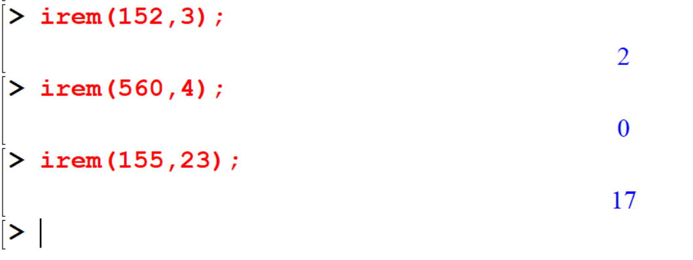

#### `irem(m,n,'q')`

If the third argument is present it will be assigned the quotient.

```
[> irem(162,5,'q');
[> q
```
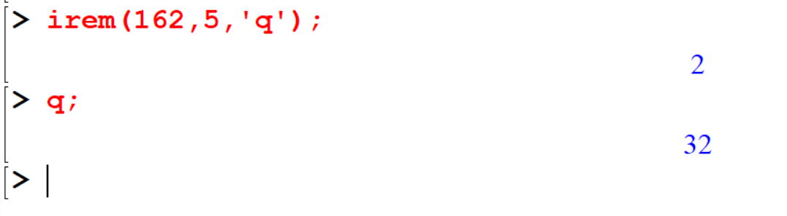


```
[> irem(72,11,'q');
[> q
```

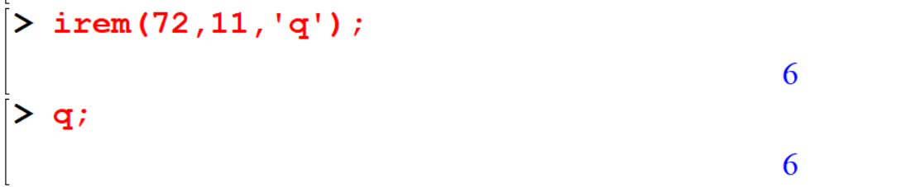

```
[> irem(23,-4,'q');
[> q;
```

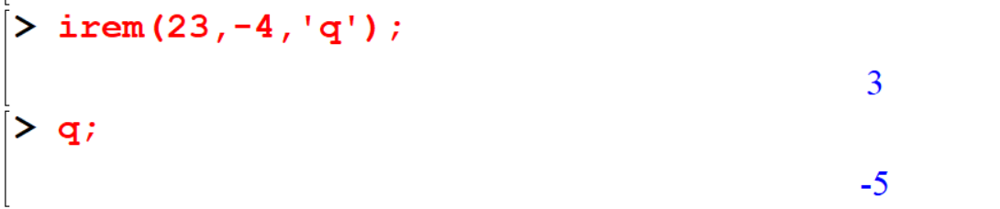

```
[> irem(-23,-4,'q');
[> q;
```

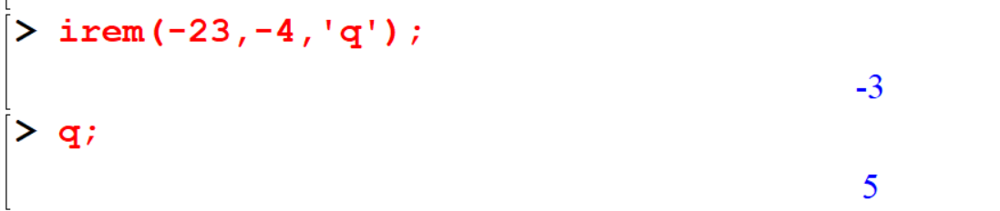

### `iquo(m,n)`
If $m$ and $n$ are both intergers the function `iquo` computes the interger quotient of $m$ divided by $n$

```
[> iquo(210,3);
[> iquo(2019,4);
```
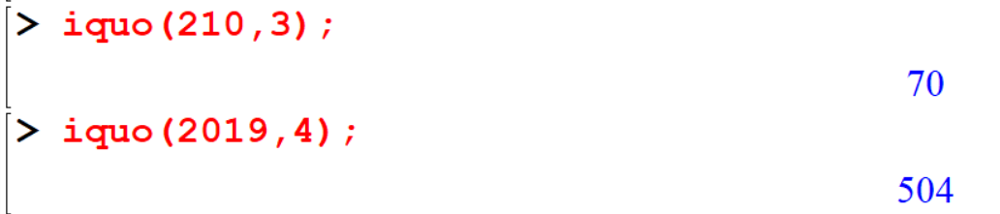

```
[> iquo(2019,4,'r');
[> r;
```


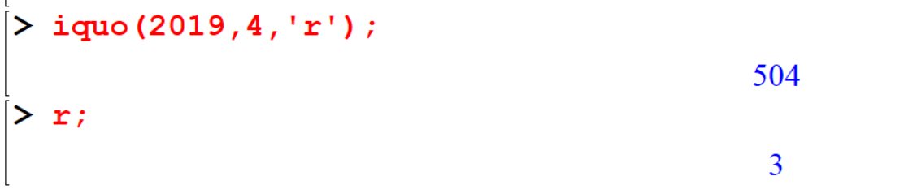

```
[> iquo(1526,7,'r');
[> r;
```


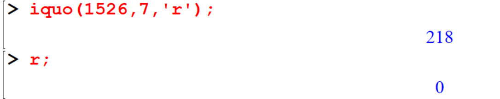

```
[> iquo(23,-4,'r');
[> r
```


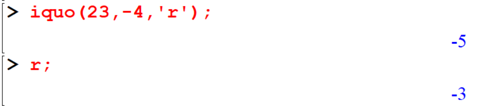


```
[> iquo(-23,-4,'r');
[> r
```


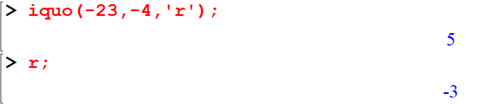

You can use above command for polynomials

```
[> rem(x^3+x+1,x^2+x+1,x,'q')
[> q
```
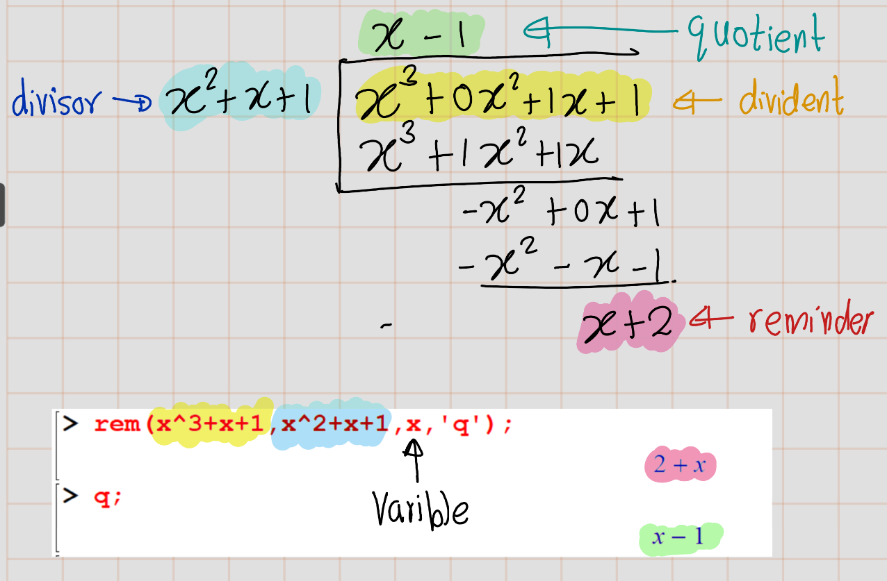
### `factorial(n)`
If $m$ is a positive integer, Maple returns the product of the numbers from $1$ to $m$. If $m$ is $0$ (zero), Maple returns $1$ (one) and $m$ is a negative integer, Maple returns an error.

```
[> factorial(m);
[> factorial(10);
[> factorial(23);
```

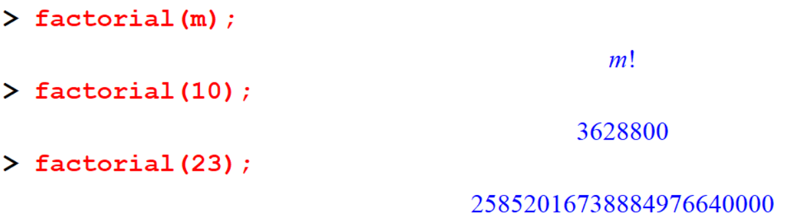

The factorial operator `!` also can be used to evaluate the factorial of a given integer.

```
[> 10!;
[> 23!;
```

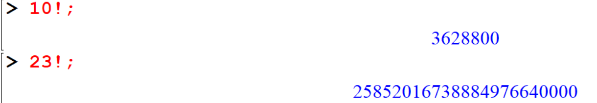

## Multipliers

### `gcd(a,b)`
The `gcd(a,b)` computes the greatest common divisor of and b.

```
[> gcd(45,12);
[> gcd(30,25);
[> gcd(364,88);
[> gcd(66,22);
```

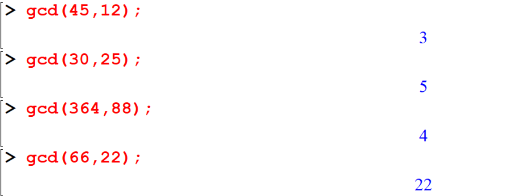
### `lcm(a,b)`

This function returns the least common multiplier of $a$ and $b$.

```
[> lcm(30,24);
[> lcm(56, 92);
[> lcm(5,66);
```

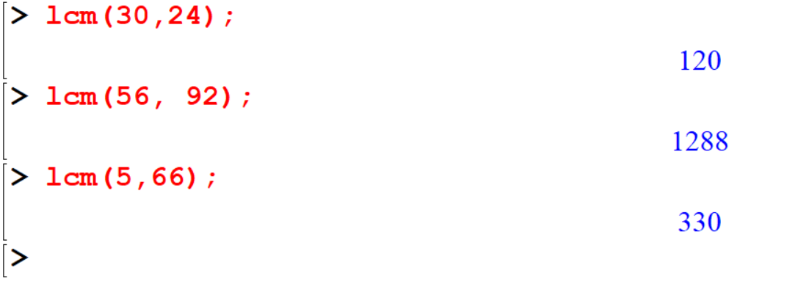

## Divisors

### `divisors(n)`

The function `divisors(n)` will compute the number of positive divisors of the integer $n$.

```
[> divisors(20);
[> divisors(2019);
[> divisors(-256);
```

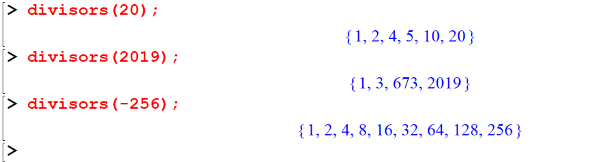

### `tau(n)`
The function `tau(n)` will compute the number of positive divisors of the integer $n$.

```
[> tau(20) ;
[> tau(2019) ;
[> tau(-256) ;
```

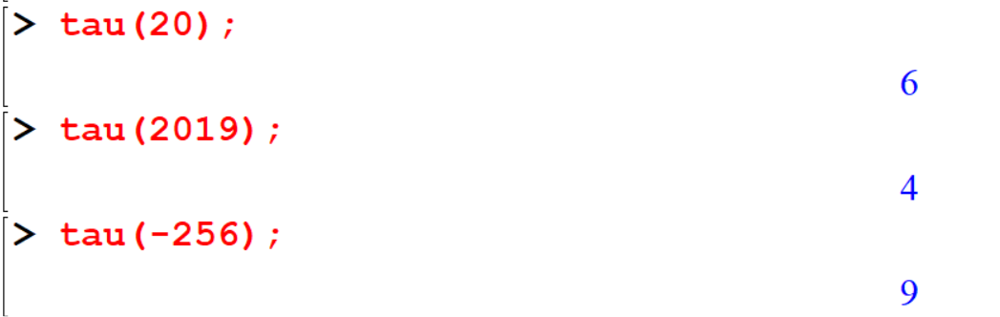


### `sigma[0](n)`
This function also used to calculate number of positive divisors of given number $n$.

```
[> sigma[0](20);
[> sigma[0](2019);
[> sigma[0](-256);
```

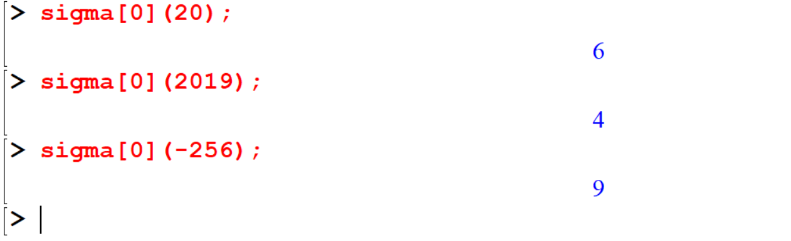

## Sequences
A sequence is a list of numbers written in a specific order. The list may or may not have an infinite number of terms in them.

```
[> seq(i,i=1..10);
[> seq(i^2,i=1..10);
[> seq((n+1)/n^2,n=1..10);
```
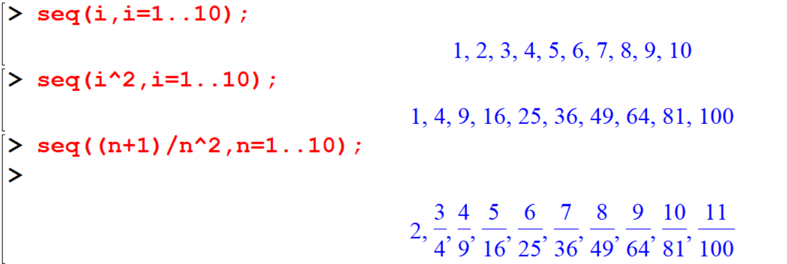
Also we can define the sequence as a function.

```
[>seq1:=i->i;
[> seq1(9);
```

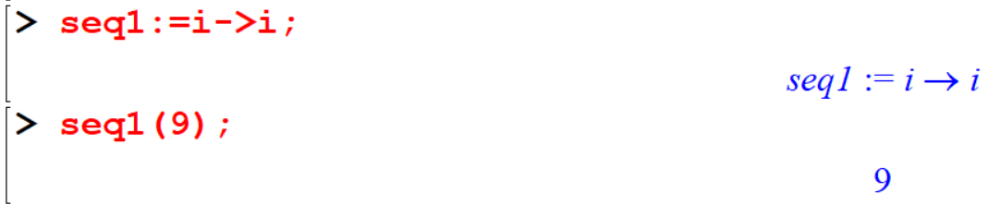

```
[>seq2:=i->i^2;
[> seq2(7);
```

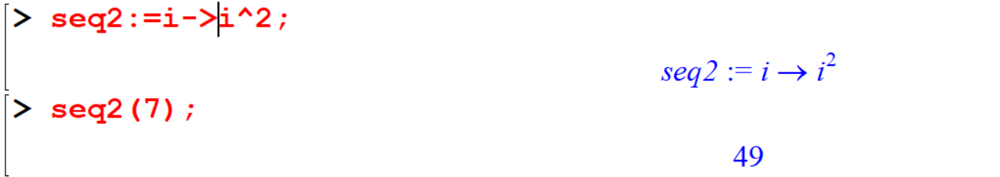

## Exercise 1

1. find the $gcd$ and $lcm$ of the following pair of numbers.
  - 1. gcd(143, 227)
  - 2. gcd(306, 657)
  - 3. gcd(272, 1479)
  - 4. gcd(1109, 4999)
  - 5. lcm(143, 227)
  - 6. lcm(306, 657)
  - 7. lcm(272, 1479)
  - 8. lcm(1109, 4999)

2. Check whether the following integers are prime or not.
  - 1. 509
  - 2. 701
  - 3. 1009
  - 4. 129
  - 5. 1013
  - 6. 5478
  - 7. 256
  - 8. 17460

3. If a number $n$ is divided by $a$, then $n$ can be written as, $$n = aq + r$$. Find the values of $q$ and $r$ for the given $n$ and $a$ in the following. (See therom \ref{thm:thm1})
- 1. $n=7842, =12$
- 2. $n=3S78954, a=55$
- 3. $n=48795345, a=789$

4. Obtain all the primes between 100 and 200.\
Solution:

```
[> seq1:=n->select(isprime,{$100..n});
[> seq1
```

5. If a integers are relatively prime (coprime) if the greatest common divisor of the values is 1. check the following pair of integers are coprime or not.

- 1. 5,8
- 2. 2,8
- 3. 14,87
- 4. 71,91
- 5. 1578,87236
- 6.785,569


## Summation

## Theory of Congrunce
### Integer Modulo n

```{definition}
aa 
```
## Complete Square


