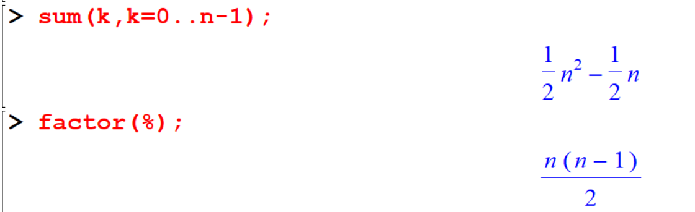

# Basic of Number Theory
Most (but not all) number theory related commands are contained within the package of function called `numtheory`. Before Maple can do any of these functions, this package must loaded into the Maple memory.

```
with(numtheory):
```

## Prime numbers, Factoring and Divisibility

### `ithprime(n)`

The `ithprime`(n)` function returns the n th prime number, where the first prime number is 2.


```
[> ithprime(1);
[> ithprime(20);
[> ithprime(320);
[> ithprime(5639);
```


### `isprime(n)`
The `isprime(n)` function check to see if thenumber `n` is most probably a prime

```
[> isprime(8);
[> isprime(17);
[> isprime(45896);
[> isprime(37813);
```


### `nextprime(n)`

`nextprime(n)` command returns the next prime numbers after the given integer.

```
[> nextprime(3);
[> nextprime(27);
[> nextprime(245);
```


### `prevprime(n)`

`prevprime(n)` command returns the previous prime numbers after the given integer.

```
[> prevprime(3);
[> prevprime(44);
[> prevprime(1587);
```


### `ifactor(n)`

The `ifactor(n)` function returns the integer prime factorization of the given number `n`.

```
[> ifactor(15);
[> ifactor(44);
[> ifactor(2019);
[> ifactor(825);
```


Let's recall the following,


Recall the following theorem

```{theorem,name='The Quotient-Remainder Theorem',label='thm1'}
Given any integer $n$ and positive integer $d$, there exist unique integers $q$ and $r$ such that:
$$n = dq + r$$
,where: $0 \leq r < d$.
```

### `irem(m,n)`
If $m$ and $n$ are both integers the function `irem(m,n)` computes the integer remainder of $m$ divided by $n$.

```
[> irem(152,3);
[> irem(560,4);
[> irem(155,23);
```


#### `irem(m,n,'q')`

If the third argument is present it will be assigned the quotient.

```
[> irem(162,5,'q');
[> q
```


```
[> irem(72,11,'q');
[> q
```


```
[> irem(23,-4,'q');
[> q;
```


```
[> irem(-23,-4,'q');
[> q;
```


### `iquo(m,n)`
If $m$ and $n$ are both intergers the function `iquo` computes the interger quotient of $m$ divided by $n$

```
[> iquo(210,3);
[> iquo(2019,4);
```


```
[> iquo(2019,4,'r');
[> r;
```


```
[> iquo(1526,7,'r');
[> r;
```


```
[> iquo(23,-4,'r');
[> r
```


```
[> iquo(-23,-4,'r');
[> r
```


You can use above command for polynomials

```
[> rem(x^3+x+1,x^2+x+1,x,'q')
[> q
```


### `factorial(n)`
If $m$ is a positive integer, Maple returns the product of the numbers from $1$ to $m$. If $m$ is $0$ (zero), Maple returns $1$ (one) and $m$ is a negative integer, Maple returns an error.

```
[> factorial(m);
[> factorial(10);
[> factorial(23);
```


The factorial operator `!` also can be used to evaluate the factorial of a given integer.

```
[> 10!;
[> 23!;
```


## Multipliers

### `gcd(a,b)`
The `gcd(a,b)` computes the greatest common divisor of and b.

```
[> gcd(45,12);
[> gcd(30,25);
[> gcd(364,88);
[> gcd(66,22);
```


### `lcm(a,b)`

This function returns the least common multiplier of $a$ and $b$.

```
[> lcm(30,24);
[> lcm(56, 92);
[> lcm(5,66);
```


## Divisors

### `divisors(n)`

The function `divisors(n)` will compute the number of positive divisors of the integer $n$.

```
[> divisors(20);
[> divisors(2019);
[> divisors(-256);
```


### `tau(n)`
The function `tau(n)` will compute the number of positive divisors of the integer $n$.

```
[> tau(20) ;
[> tau(2019) ;
[> tau(-256) ;
```


### `sigma[0](n)`
This function also used to calculate number of positive divisors of given number $n$.

```
[> sigma[0](20);
[> sigma[0](2019);
[> sigma[0](-256);
```


## Sequences
A sequence is a list of numbers written in a specific order. The list may or may not have an infinite number of terms in them.

```
[> seq(i,i=1..10);
[> seq(i^2,i=1..10);
[> seq((n+1)/n^2,n=1..10);
```

Also we can define the sequence as a function.

```
[>seq1:=i->i;
[> seq1(9);
```


```
[>seq2:=i->i^2;
[> seq2(7);
```


## Exercise 1

```{exercise}
find the $gcd$ and $lcm$ of the following pair of numbers.

1. $gcd(143, 227)$
2. $gcd(306, 657)$
3. $gcd(272, 1479)$
4. $gcd(1109, 4999)$
5. $lcm(143, 227)$
6. $lcm(306, 657)$
7. $lcm(272, 1479)$
8. $lcm(1109, 4999)$
```

```{exercise}
Check whether the following integers are prime or not.

1. 509
2. 701
3. 1009
4. 129
5. 1013
6. 5478
7. 256
8. 17460
```

```{exercise}
If a number $n$ is divided by $a$, then $n$ can be written as, $$n = aq + r$$. Find the values of $q$ and $r$ for the given $n$ and $a$ in the following. (See therom \ref{thm:thm1})


1. $n=7842, =12$
2. $n=3S78954, a=55$
3. $n=48795345, a=789$
```

```{exercise}
Obtain all the primes between 100 and 200.\
```

Solution:

```
[> seq1:=n->select(isprime,{$100..n});
[> seq1
```

```{exercise}
If a integers are relatively prime (coprime) if the greatest common divisor of the values is 1. check the following pair of integers are coprime or not.

1. 5,8
2. 2,8
3. 14,87
4. 71,91
5. 1578,87236
6. 785,569
```


## Summation

### `sum(f(k),k=m..n)`

The function `sum(f(k,k=m..n))` computes the sum of the function f(k) where k varies from $m$ to $n$ \(\Sum_{k=m}^n f(k)\)


```
[> sum(r,r=1..n);
[> factor(%);
```


```
[> sum(k,k=0..n-1);
[> factor(%);
```


```
[> sum(k+1,k=0..n);
[> factor(%);
```


You can verfy well known follwing results as follows,

$$\sum_{k=O}^\infty \frac{1}{k!}=e^1$$
$$\sum_{k=1}^\infty \frac{1}{(k-1)!}=e^1$$
$$\sum_{k=1}^\infty4\frac{(-1)^{(k+1)}}{(2k-1)}=\pi$$
$$\sum_{r=1}^n r^2 =\frac{1}{6}n(n+1)(2n+1)$$
Then, 
$$\sum_{r=1}^{100} r^2 =\frac{1}{6}100(101)(201)=338350$$
```
[> sum(1/k!,k=0..infinity);
[> sum(1/(k-1)!,k=1..infinity);
[> sum((-1)^(k+1)*4/(2*k-1),k=1..infinity);
[> sum(r^2,r=1..n);
[> sum(r^2,r=1..100);
```


### `add`

To add a finite sequence of values, the `add` command can be used. (only for finite)


```
[> add(i^2,i=1..5);
```


```
[> L:=[seq(i,i=1..5)];
[> add(i,i=L);
[> add( i, i in L);
```


`proc` will help you to  create your own procedure.

```
[> summation:=proc(n) sum(r,r=1..n); end proc;
[> summation(15);
[> summation(100);
```


```{example}
Using `proc()` show that the square of any integer is either of the form $3k$ or $3k+1$
```


```
ans:=proc(x) irem(x^2,3); end;
seq(ans(t),t=1..20);
```


### `sigma(n)`
The function `sigma(n)` will compute the sum of the positive divisors of $n$.

```
[> with(numtheory):
[> divisors(20);
[> sigma(20);
[> sigma[1](20);
```


```
[> divisors(111);
[> sigma(111);
```


```
[> sigma(111);
```


    
## Exercise 2

```{exercise}
Find the remainder upon dividing the sum,\
$1! + 2! +3! ...+ 99! + 100!$ by $12$.
```

```{exercise}
Show the following results.

a) $$ 1+2+3+\cdots n=\frac{n(n+1)}{2}, ~\text{  for all } n\geq 1$$
b) $$1+3+5+\cdots+ (2n— 1) = n^2,  ~\text{  for all } n\geq 1$$
c) $$1\cdot 2+2\cdot 3+\cdots+n(n+1) = \frac{n(n+1)(n+2)}{3},  ~\text{  for all } n\geq 1$$
d) $$1\cdot 3 + 2\cdot 4+ 3\cdot 5+\cdots+n(n+2) = \frac{n(n+1)(2n+7)}{6},  ~\text{  for all } n\geq 1$$
e) $$1\cdot 1!+2\cdot 2!+3\cdot 3!+n\cdot n!=(n+1)!-1,  ~\text{  for all } n\geq 1$$
f) $$\frac{1}{2}+\frac{2}{2^2}+\frac{3}{2^3}+\cdots+\frac{n}{2^n}=(n+1)!-1,  ~\text{  for all } n\geq 1$$
g) $$a^n-1=(a-1)(a^{n-1}+a^{n-2}+\cdots +a+1)$$
h) $$1^3+2^3+3^3+\cdots+n^3=\left(\frac{n(n+1)}{2}\right)^2$$
```

```{exercise}
Using `proc()` show that ;

1) The cube of any integer has the one of the forms $9k, 9k+1$ or $9k+8$.
2) The fourth power of any integer is either of the form $5k$ or $5k+1$.
3) For $n\geq 1$, $\frac{n(n+1)(2n+1)}{6}$ is an integer.
```

```{exercise}
For $n\geq 1$, establish that thc integer $n(7n^2+5)$ is of the form $6k$.
```

```{exercise}
Perfect number is a positive integer that is equal to the sum of its positive divisors: excluding the number itself. Check whether the following numbers are perfect or not.

1) 6
2) 879
3) 496
4) 789879
5) 8128
6) 28
7) 556231
8) 123423
```

## Theory of congruence

### Integer Modulo n

Calculate the value of an integer modulo n. Specify the integer and the modulus, and then calculate the value of the integer in terms of the modulus.

## Complete Squares 
This function completes the sequences of polynomials of degree 2 in $x$ by re-writing such  polynomials as perfect squares plus a remainder. If more than one variables appears in f, then $x$ must be specified. $x$ can be name, list or a set.

```
[> with(student) :
[> completesquare(9*x^2+24*x+16);
```


```
[> completesquare(3*x^2+2*x,x);
```


```
[> completesquare(1/(sin(t)^2+2*sin(t)+1),sin(t));
```


```
[> completesquare(x^2-2*x*a+a^2+y^2-2*y*b+b^2=23,x);
[> completesquare(%,y);
```


## Number Systems

To begin, we will review the manual conversion process between Decimal and Binary, as well as Binary to Decimal, through illustrative examples.


### `convert(n,binary)`


The function `convert(n,binary)` converts a decimal number $n$ to a binary number. number may be either positive or negative, and may be either an integer or a floating-point number. 
In the case of a floating-point number, an optional third argument determines the total number of digits of precision in the answer (the default being Digits). The binary number is returned as a base 10 number consisting of the digits 1 and 0 only.


```
[> convert(123,binary);
```


```
[> convert(-5,binary);
```


```
[> convert(0.375,binary);
[> convert(0.375,binary,2);
```


```
[> convert(54.6875,binary);
[> convert(12.34,binary);
[> convert(1964,binary);
```


### `convert(n,decimal,binary)`
This command can be used to convert a decimal number into a binary number. Also we can write 2 as a third argument instead of binary.


```
[> convert(101,decimal,binary);
[> convert(101,decimal,2);
````


```
[> convert(11110101100,decimal,binary);
```


```
[> convert(11111111, decimal,2);
[> convert(0.1101,decimal,2);
[> convert (1101.0111,decimal,2);
[> convert (10101011101.01111,decimal,2);
```


## Exercise 3

```{exercise}
Express the following numbers in binary number system

a. 57
b. 126
c. 201
d. 487956
e. 7879564789
f. 987.14562 
g. -456
i. 8795.2356 
j. -1213.78

```

```{exercise}
Express the following binary numbers in the decimal system

a. $(1010101010)_2$
b. $(1010101)_2$
c. $(1100110)_2$
d. $(1010101010)_2$
e. $(101010.1010)_2$
f. $(1111.1111)_2$
g. $(11001100.0011)_2$
```