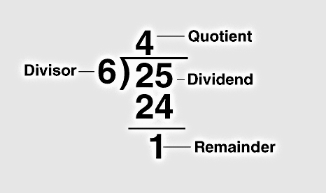

# Basic of Number Theory
Most (but not all) number theory related commands are contained within the package of function called `numtheory`. Before Maple can do any of these functions, this package must loaded into the Maple memory.

```
with (numtheory) :
```

## Prime numbers, Factoring and Divisibility

### `ithprime(n)`
The `ithprime`(n)` function returns the n th prime number, where the first prime number is 2.


```
[> ithprime(1);
[> ithprime(20);
[> ithprime(320);
[> ithprime(5639);
```


### `isprime(n)`
The `isprime(n)` function check to see if thenumber `n` is most probably a prime

```
[> isprime(8);
[> isprime(17);
[> isprime(45896);
[> isprime(37813);
```


### `nextprime(n)`

`nextprime(n)` command returns the next prime numbers after the given integer.

```
[> nextprime(3);
[> nextprime(27);
[> nextprime(245);
```


### `prevprime(n)`

`prevprime(n)` command returns the previous prime numbers after the given integer.

```
[> prevprime(3);
[> prevprime(44);
[> prevprime(1587);
```


### `ifactor(n)`

The `ifactor(n)` function returns the integer prime factorization of the given number `n`.

```
[> ifactor(15);
[> ifactor(44);
[> ifactor(2019);
[> ifactor(825);
```


Let's recall the following,



### `irem(m,n)`
If $m$ and $n$ are both integers the function `irem(m,n)` computes the integer remainder of $m$ divided by $n$.

```
[> irem(152,3);
[> irem(560,4);
[> irem(155,23);
```

 #### `irem(m,n,'q')`
If the third argument is present it will be assigned the quotient.

```
[> irem(162,5,'q');
[> q
```


```
[> irem(72,11,'q');
[> q
```


### `iquo(m,n)`
If $m$ and $n$ are both intergers the function `iquo` computes the interger quotient of $m$ divided by $n$

```
[> iquo (210,3);
```


## Summation

## Theory of Congrunce
### Integer Modulo n

```{definition}
aa 
```
## Complete Square

## Prime Numbers

```
> ithprime(20);
```

```
> ithprime(320);
```

```
> ithprime(55589);
```

- `isprime(n);`
The `isprime(n)` function check to see if the,number n is most probably a prime.

```
> isprime (8) ;
```

```
> isprime (17) ;
```

```
> isprime (45896) ;
```

```
> isprime (37813) ;
```
