# Basic Programming 


## Simple Procedures


A Maple procedure (a type of program) is a group of statements  that are processed together. The easiest way to create a Maple procedure is to enclose a sequence of commands, which can be used to perform a computation interactively, between the `proc(...)` and `end proc` statements.

A Maple procedure has the following syntax:

```
proc(seqvar)
statseq ;
end;
```
where

- `seqvar` is a sequence of symbols of inputs separated by commas, and 
- `statseq` is a sequence of statements separated by semicolons.

The following procedure generates the string "Hello World". Enter this procedure in a Maple session by entering its definition on one line. If **no input is required to run a procedure**, that is, no formal parameters are required; **enter empty parentheses in the heading of the procedure** definition and in procedure calls.


### Procedures with no inputs (parameters)

```
[> hello:= proc() "Hello , This is my first Programm " ;end proc;
[> hello ( ) ;
```

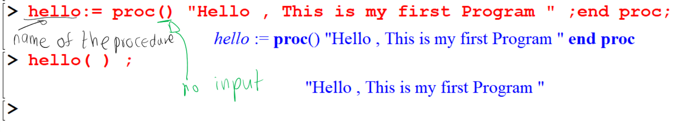
> Remark: You can also enter a procedure or any Maple statement on multiple lines. To move the cursor to the next line as you are entering a multi line statement, hold the `Shift` key and press `Enter` at the end of each line.

```
[> hello:=proc()
"Hello , This is my first Programm ;
end proc;
[> hello();
````

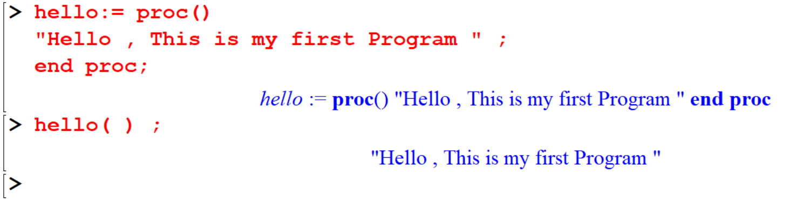
You can also use the `return` command to return the evaluated statement or a value
```
[> hello:=proc()
return "Hello , This is my first Programm ;
end proc;
[> hello();
````

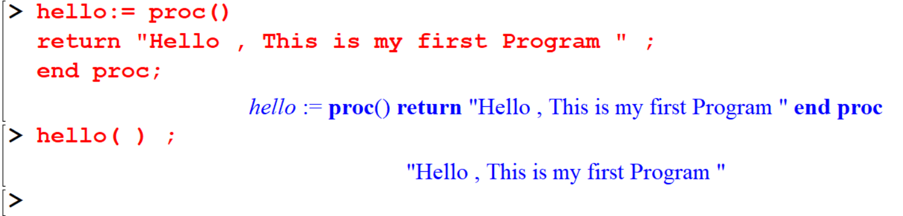

### Procedures with inputs (parameters)
Procedures can also accept arguments. Consider following exmpale


```{example}
Compute the half of the value of a given value.
```

```
[> half:=proc(x)
evlaf(x/2);
end proc;

[> half(5);
```

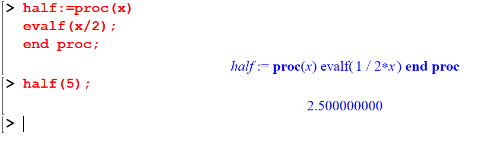
This procedure requires one input, $x$. The procedure computes the approximation of the value of $x$ divided by $2$. When a return statement is not specified, a Maple procedure returns the result of the last statement that was run.

```
[> half(7)+half(8);
```

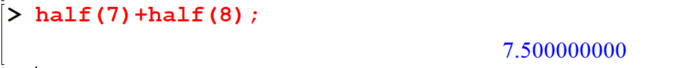

```{example}
Compute the average of two given numbers
```

```
[> Average:=proc(x,y)
(x+y) / 2
end proc;

[> Average(7,12) ;
[> evalf(%) ;
[> evalf(Average(254,789));
```

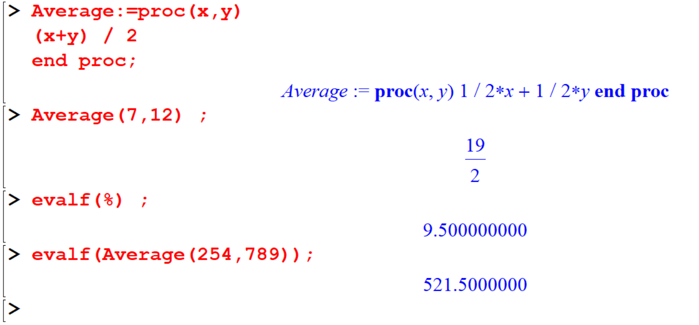


```{example}
Compute the area of a cylinder
```
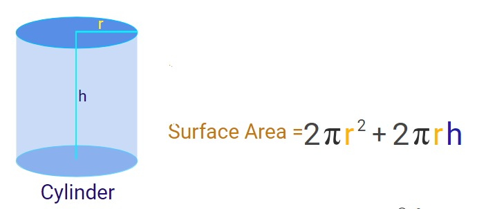


```
[> area_of_cylinder:=proc(r,h)
2*Pi*r*h+2*Pi*r^2;
end proc ;

[> area_of_cylinder(4,15);
[> evalf(%)
```
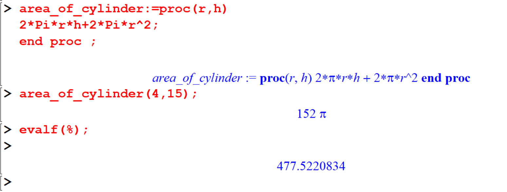


```{example}
Solve the quadric equations when the coefficients are given.
```

```
[> s:=proc(a,b,c)
solve(a*x^2+b*x+c,x)
end proc;

[> s(1,-4,3); # Roots of x^2-4x+3=0
[> s(1,0,1); # Roots of x^2+1=0
```

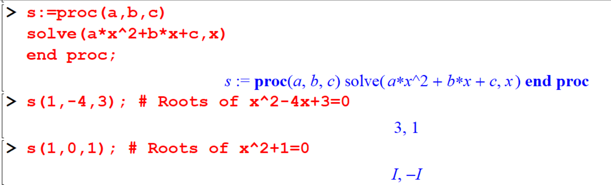


```{example}
The follovving procedure will solve $x^n-1=0$ for specific value of $n$.
```

```
[> solution:=proc (n)
solve(x^n—1,x);
end proc;


[> solution(1);
[> solution(2);
[> solution(4);
[> seq(solution(i),i=1..5);
```

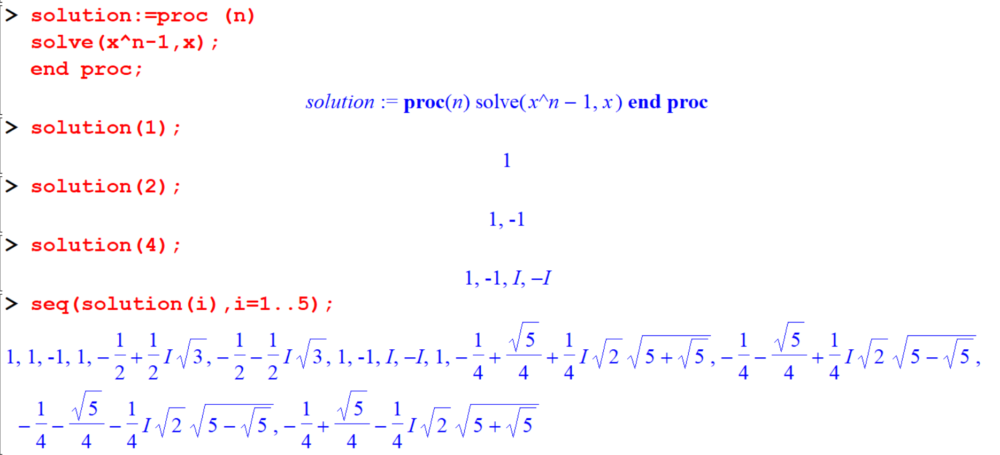

## Procedures with local variables
```{example} 
Finding the volume of a right rectangular pyramid.
```


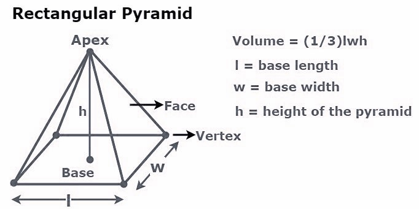


```
[> Volume_of_Right_rectangular_pyramid:=proc(l,w,h)
local V;
V:=evalf((l*w*h)/3) ;
end;

[> Volume_of_Right_rectangular_pyramid(21,8,7);
```

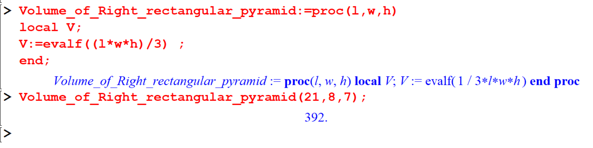


```{example}
The following procedure definition contains two input parameters for the length of sides of a right triangle. It calculates the theta value in degree form.
```

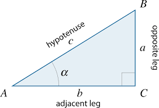


```
[> GetAng1e:= proc(opposite,hypotenuse)
local theta;
theta:=arcsin(opposite/hypotenuse);
evalf(180/Pi*theta) ;
end proc ;


[> GetAng1e(4,5);
```

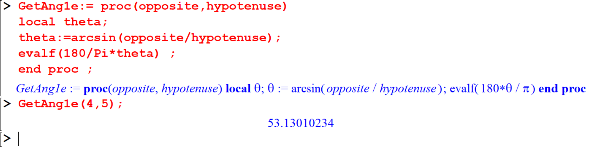

The local variables can be thought as "scratch pad variables", or "temporary variable?' Local variables are used to hold temporary results that might come up while we are trying to compute our main result in the procedure. As we will see. the local variables only "live" inside the procedure call. They do not exist outside the procedure, and they do not survive from one procedure call to the next (this is why they get their name "local"). The global variable is just that. it is global to the whole Maple worksheet. As we will see, global variables inside procedure bodies are really the same as the variables we use in commands at our worksheet prompts.

```{exmaple}
.
```

```
[> plus:proc(x,y)
local a,b;
global c;
a:=x-y;
b:=x*y;
c:=x^y;
end;


[> plus(2,5);
[> a;
[> b;
[> c;
```
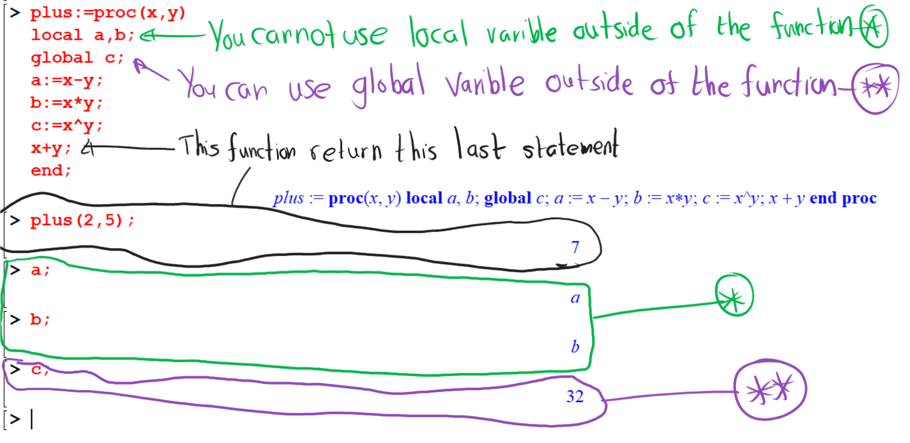

The following example contains three local variables. You should define all the variable that you used as the local within your procedure.


```{example}
This example shows how calculate the average value for a given list.
```
```
[> avg1:= proc(L)
local i,N,S; # Local variables.
N := nops(L); # How many numbers we are averaging.
S := add(L[i],i=1..N); # Add up the nurnbers in the list.
S/N; # This is the return value .
end ;


[> avg([2,3,4,5,6,7]);
[> evalf(%);
```
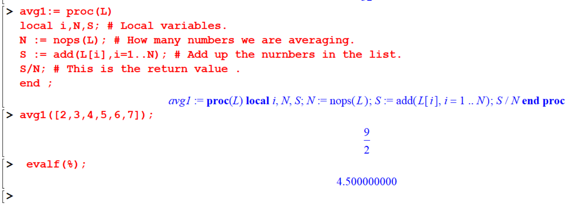


## Exercise 01

```{exercise}
Write Maple procedures to calculate the sum of the squares of two numbers you entered. Hence calculate the sum of the squares of 629 and 1 1 1 1.
```

```{exercise}
Use Maple to show that the sum of first n positive integers is given by,$\frac{n(n+l)}{2}$
```

```{exercise}
Write a maple procedure to check whether a product of two given integers is prime or not. Verify your procedure.
```

```{exercise}
Find the area of a triangle with 3 sides given. $(\text{Area} =\sqrt{s(s-a)(s-b)(s-c)}$ where $s=\frac{a+b+c}{2}$ and $a, b, c$ are the length of the each side of triangle). Find the area of the triangle with each side of $5,7,9$.
```

```{exercise}
Write a procedure to convert two binary numbers into decimal and return their summation. (try out your procedure with $110010, 11001100$)
```


## Conditional Statements

Suppose that you want a sequence of commands to be carried out if and only if a certain condition is satisfied.  This often happens when you are writing the definition ofa procedure.  You can achieve the desired effect with an `if... then` construction. but first you need to know how you can express conditions in Maple.


```
then
[> if conditional_statement1 then
     statemnet_sequnce1
   elif conditional_statement2 then
     statemnet_sequnce2
   elif conditional_statement3 then
     statemnet_sequnce3
   ...
   else
    statemnet_sequnceN
  end if;
```

The elif conditional expression then construct can appear zero, one, or many times. The else construct can be excluded.

The conditional expression (expr) in the if clause is evaluated. The conditional expression can be any Boolean expression, which evaluates to true, false, or FAIL, formed by using:

- relational operators: `<` (less than), `<=` (less than or equal), `=` (equal), and `<>` (not equal)
- logical operators: `and`, `or`, and `not`
- logical names: `true`, `false`, and `FAIL`


If the result of the if clause is the Boolean value true, Maple executes the statement sequence in the then clause. If the result of the if clause is the Boolean value false or FAIL, Maple executes the statement sequence in the else clause (if there is one).

```
[> x:=-2;
[> if x<0 then
0
else
1
end if;
```
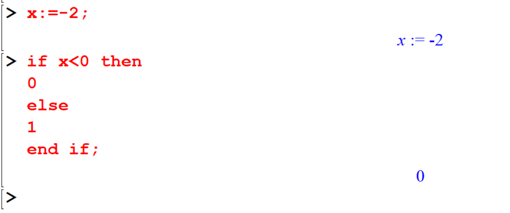

You can omit the else clause if you do not want to specify an action if the condition is false.

```
[> if x>0 then
  x:=x-1;
  end if;
```

### Nested Selection Statements

A selection statement can be nested that is, the statement sequence in the then clause or else clause can be any statement (or sequence of statements); including an if statement.

```
[> if x>0 then
print("Positive")
else
  if x=0 then
  print("Zero")
  else
  print("Negative")
  end if
end if;
```

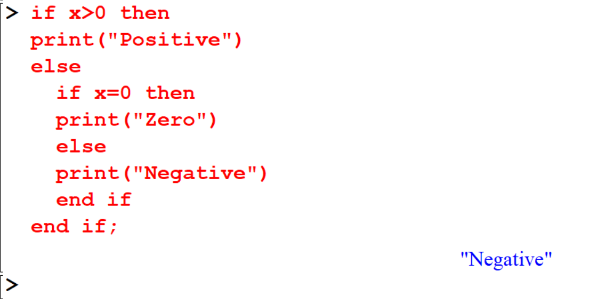


General Forms of the if Statement For more complicated scenarios, use one of the following two forms of the if statement.


```
if expr1 then
  statseq1
elif expr2 then
  statseq2
end if
```

```
if expr1 then
  statseq1
elif expr2 then
  statseq2
else
  statseq3
end if
```

The elif expr then statseq construct can appear more than once. The following example implements the mathematical sign function by using an `elif` clause.

```
[> x:=2;
[> if x<0 then
    -1
elif x=0 then
     0
else
     1
end if;
```
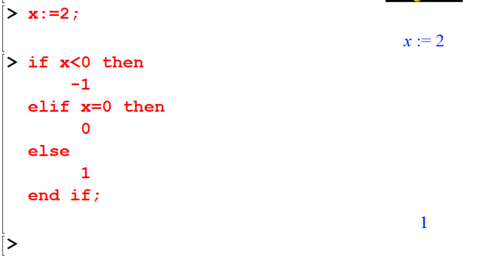

We can also include those `if—else` commnands into a maple procedure.

```{example}
The following procedure is to display the grade obtained by the mark.
```

```
[> Grade:=proc (M)
if M>=50 then "pass"
else "fail"
end if;
end proc;

[> Grade(49);
[> Grade(51);
```


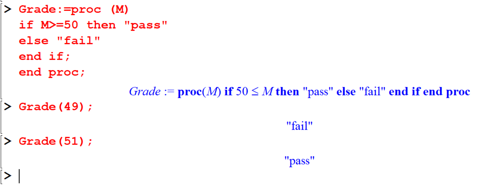


More than one "if" 


```{example}
.
```

```
[> Grade:=proc(M)
if   M>=75 then A
elif M>=50 then B
elif M>35  then C
else D
end if;
end proc;

[> Grade(75);
[> Grade(42);
[> Grade(60);
```
> You can use `fi` intstead of `end if`
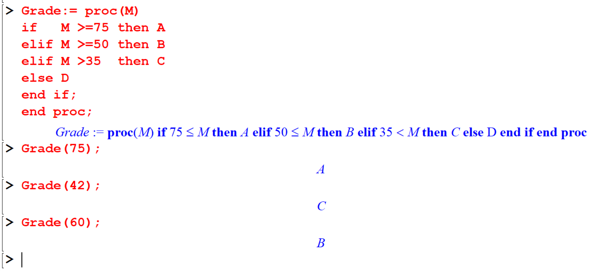

```{example}
This procedure can be used to check whether a given number is a perfect or not.
```

```{definition}
A *perfect number* is a positive integer that is equal to the sum of its positive proper divisors.
```

```
[> with (numtheory):
[> is_perfect :=proc(n)
if sigma(n)=2*n then
return true ;
else
return false;
end if;
end proc;

[> is_perfect(6);
```

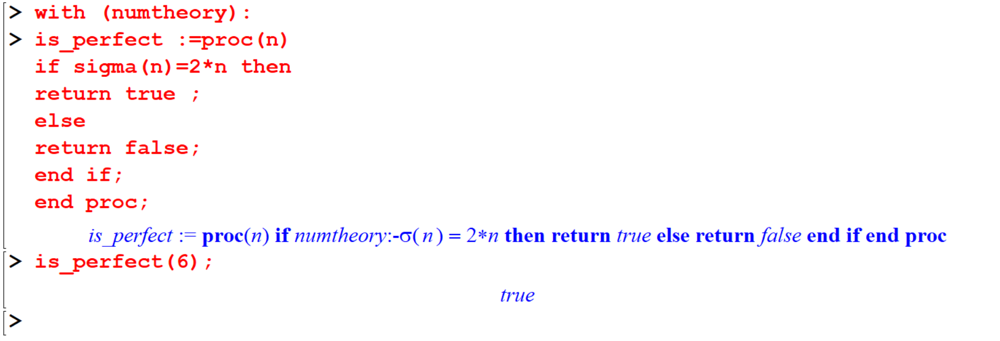


 

### The ``if` Operator


The operator form 'if' requires three arguments and it returns the evaluation of the second or third argument, depending on the truth value of the first.


```
`if` (conditional expr, true expr, false expr)
```

The first argument must evaluate to true, false, or FAIL. If the first argument evaluates to true, the second argument is evaluated and returned. If the first arguments evaluates to false or FAIL, the third argument is evaluated and returned. When the operator form is used, the name of this function must be enclosed in right single quotes (```) because
if is a Maple reserved word.

```
[> b:=4;
[> `if` (b>5,10,11);
```

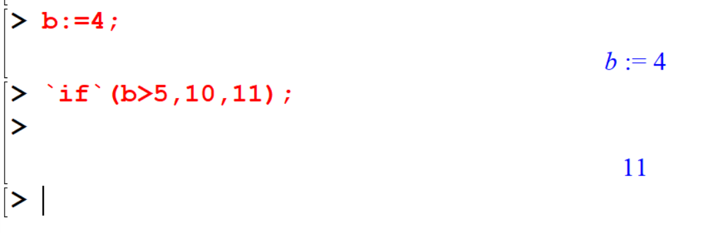
This 'if operator statement is equivalent to the following if statement.

```
if b>5 then
  10
else
  11
end if;
```
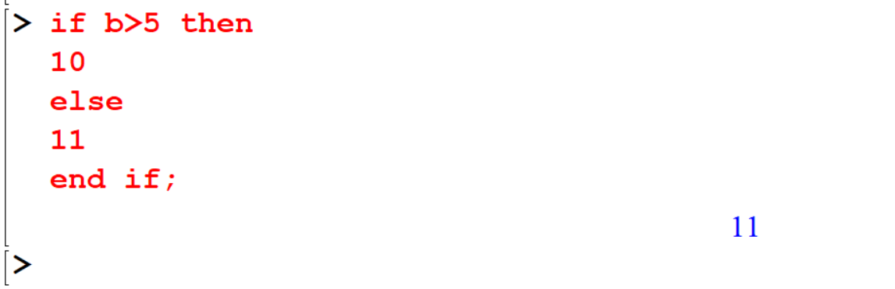

## Repetition statement

A loop (repetition statement) executes a section of code multiple times. Maple has two general forms of repetition, statements that you can use to perform looping in procedures. There are several ways to get Maple to perform what is called a "loop".

### For Loops

There are two types of for loops.
- Until a counter variable value exceeds a limit (for/from loop)
- For each operand of an expression (for/in loop)

#### For/from loop 

The for/from loop statement repeats a statement sequence until a counter variable value exceeds a limit.

Syntax

```
[> for counter from intial by increment to final do
  statement sequence
end do;
```

```{example}
This example shows how we can display numbers using a for loop. If you do want it to print something about what is going on, you can ask for it with a print cornrnand.
```

```
[> for i from 1 to 5 do
     x:=i;
     print(x);
end do:
```


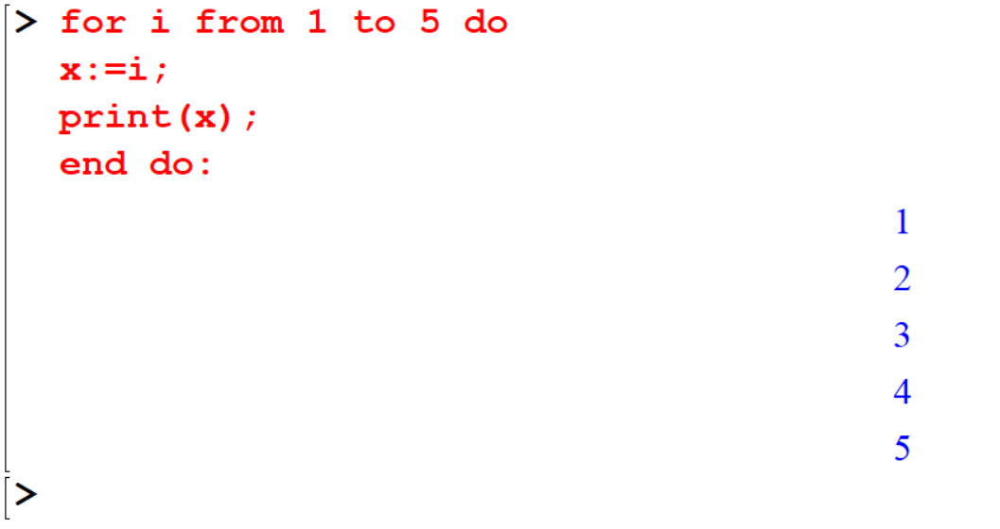
> You can use `od` instead of `end do`.

If you use `end do;` instead of `end do:` you will get like a out put as follows.

```
[> for i from 1 to 5 do
    x:=i;
    print(x);
end do;
```

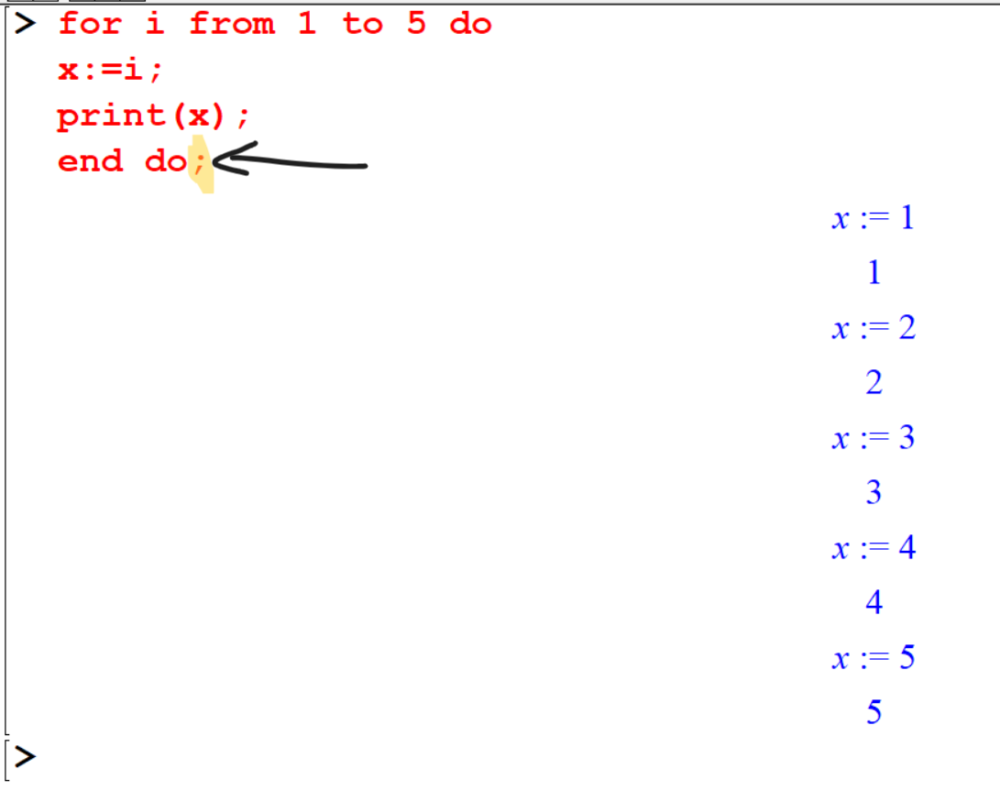

```{example}
The following procedure can be used to return a factorial value of a given value.
```

```
[> fact:=proc(n)
  local i, p;
  p:=1;
    for i from 1 to n do
      p:=p*i;
    end do ;
end proc;

[> fact(5);
```

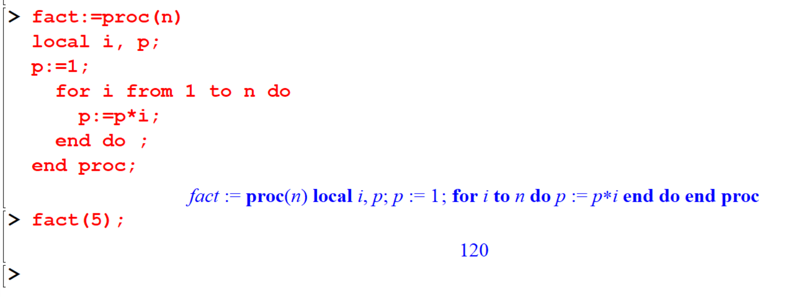

```{example}
The following loop returns the square root of the integers 1 to 5 (inclusive).
When the value of the counter variable n is strictly greater than 5, Maple exits the loop.
```

```
[> for n from 1 to 5 do
     evalf(sqrt(n)) ;
end do;


[> n;
```

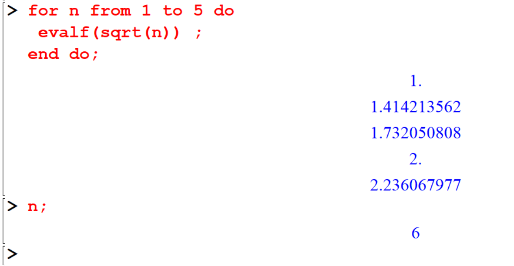

The previous loop is equivalent to the following for/from statement.

```
[> for n from 1 by 1 to 5 do
     evalf(sqrt(n));
end do;
```

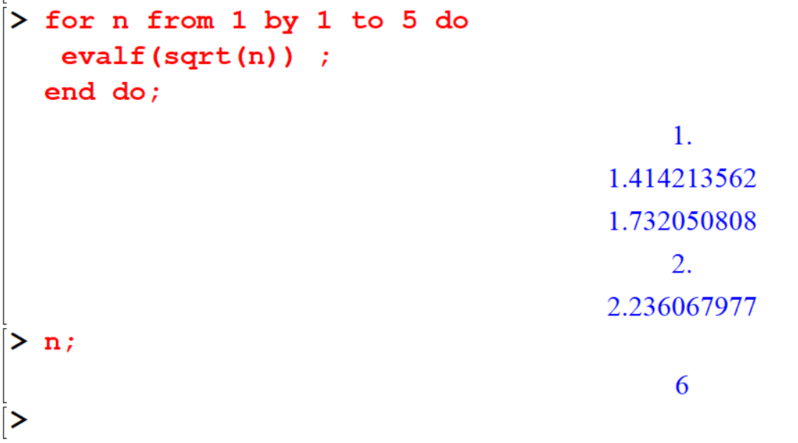


The by value can be negative. The loop repeats until the value of the counter variable is strictly value.

```
[> for n from 10 by -1 to 3 do
    if isprime(n) then
        print(n)
    end if;
end do;

[> n;
```

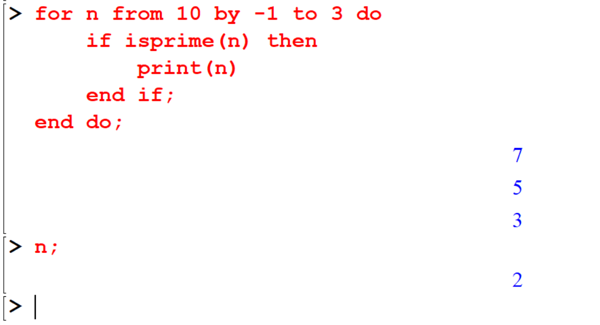


#### For/in loop

for/in loop statement repeats a statement sequence for each component (operand) of an expression, for example, thc elements of a list.


Syntax

```
[> for variable in expression do
      statemnent sequence
end do;
```

```{example}
The following loop returns a floating-point approximation to the `sin` function at the angles (measured in degree) in the list `L`
```

```
[> L:=[23.4, 87.2, 43.0,99.7];
[> for i in L do
    evalf(sin(i*Pi/180));
end do;
```

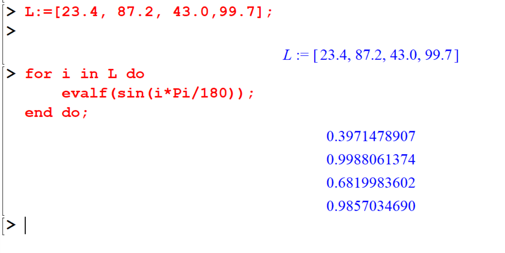


### While Loop

The while loop repeats a statement sequence until a boolean expression does not hold. (ie. A while loops repeats until its boolean expression conditional expression evaluates to false or FAIL)


Syntax

```
[> while conditional_expression do
    statment_sequnce
end do;
```


```{example}
.
```

```
[> x:= 256;
[> while x>1 do
x:=x/4
end do;
```


```{example}
The followings loop shows you how convert number 35 in basc 1O to base2 (binary).
```

```
[> x:=35:
[> while x > O do
    irem(x,2);
    x:=iquo(x,2);
end do:
[> convert(35,binary);
```

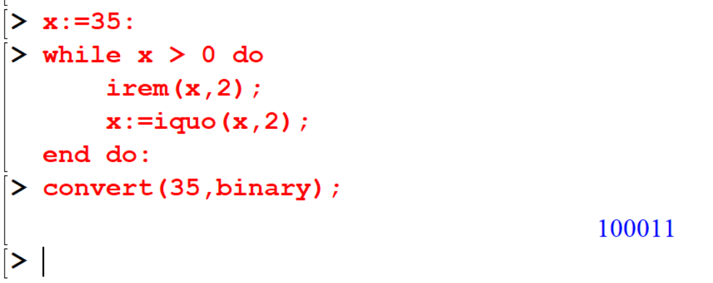

## Exercise 2

```{exercise}
The ABC super market gives discount for their customers as follows:lf the total amount of the bill is in between 2500 and 5000 they give 10% discount, if the amount of the bill is in between 5000 and 10000 give 15% and bills exceeding 10000 30% discount is given. Write a Maple procedure to calculate the net amount of the bill after entering the total bill.
```

```{exercise}
Write a maple program to check a given number is even or odd
```


```{exercise}
Write a maple program to display Pascal triangle.(Hint: use for loops, runs goes to 8th row of the Pascal triangle)
```