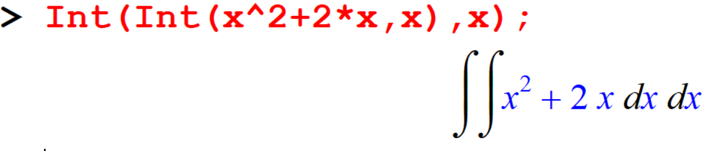

# Intergration

The `int` command is used to compute both definite and indefinite integrals of Maple expressions as shown by the following examples.

## Indefinite Integration

```
[> int(x^2,x);
```


```
[> int(sin(2*t),t);
```


```
[> f:=x->(3*x-6)/(x^2-4);
[> int(f(x),x);
```


```
[> Int(sin(x),x);
```


```
[> Int(3*x^2+2)^(5/3),x);
```


```
[> Int(x*(3*x^2+2)^(5/3),x)=int(x*(3*x^2+2)^(5/3),x);
````


Notice that Maple doesn't include a constant of integration for indefinite integrals. 
Where there are constants, Parameters other variable around, Maple assume that you mean to take the integral as the variable you specify changes, and that all other letters in the expression represent constants.

## Definite Integration

```
[> Int(g(x),x=a..b);
```

```
[> Int(x^2*exp(x),x=0..2)=int(x^2*exp(x),x=0..2);
```


```
[> f := x -> x*sin(x);
[> int(f(x),x=0..Pi);
```


Some functions can not be integrated analytically, but the definite integrals of such functions still have meaning and MAPLE can determine them.

```
[> int(exp(-x^2)*ln(x),x);
```

```
[> int(exp(-x^2)*ln(x),x=0..infinity);
[> evalf(%);
```


## Integration by Parts

The `intparts` command is used to integrate by parts, and the command exist in `student` package.

The `intparts` command has two arguments: the first is the expression to be anti-differentiated, and the second is the choice for, the piece which is to be differentiated.
\[ \int u D(v) dx = uv - \int v D(u) dx \]

```{example}
Method of integration by parts to compute \(\int x \cos(x)\)
```
```
[> restart;
[> with(student):
[> p1:= Int(x*cos(x),x);
[> p2:= intparts(p1,x);
[> p3:= value(p2);
[> p1 = p3 + C;
```


```
[> restart;
[> with(student):
[> Int(sqrt(x)*ln(x),x)=intparts(Int(sqrt(x)*ln(x),x),ln(x));
```


```
[> Int(sqrt(x)*ln(x),x)=value(intparts(Int(sqrt(x)*ln(x),x),ln(x)));
```


## Substitutions

These are done using the `changevar` command. Look at the following example.


```{example}
Evaluate \(\int 4 \cos(\sin(x))  dx \) using the substitution, \(u=\cos(x)\) .
```

```
[> Int(cos(x)^4*sin(x),x)=changevar(u=cos(x),Int(cos(x)^4*sin(x),x),u);
```


```
[> v1:=value(changevar(u=cos(x),Int(cos(x)^4*sin(x),x),u));
```

To back-substitute, we use the subs command,

```
[> subs(u=cos(x),v1);
```


## Multiple Integration 

### Double integration (Area calculation)

```
[> Int(Int(x^2+2*x,x),x);
```

```
[> int(int(x^2+2*x,x),x);
```

```
[> Int(Int(x+y^2,y=0..x),x=1..2);
```


```
[> a:=Int(x+y^2,y=0..x);
```

```
[> b:=Int(a,x=1..2);
```


```
[> Int(Int(x+y^2,y=0..x),x=1..2)=int(int(x+y^2,y=0..x),x=1..2);
```

```
[> A:=Doubleint(x+y^2,y=0..x,x=1..2);
[> value(A);
```


### Triple integration (Volume Calculation)


```
[> Int(Int(Int(x^3*exp(y)*sin(z),x=0..2),z=-Pi..2*Pi),y=0..1)=int(int(int(x^3*exp(y)*sin(z),x=0..2),z=-Pi..2*Pi),y=0..1);
```


```
[> V:=Tripleint(x^3*exp(y)*sin(z),x=0..2,z=-Pi..2*Pi,y=0..1);
[> value(V);
```

**Note**: Since there is often more than one way to find an indefinite integral, it may happen that the answer you obtain by doing the techniques seen in class is different than the one obtained with Maple.


## Exercise

```{exercise}
Integrate the following expressions,

i. \(2x^2 + \frac{x}{2}\)
ii. \(x^3(3x^2 + 2)^{\frac{5}{3}}\)
iii. \(e^{-x^2}\)
```


```{exercise}
Find the definite integral of the following over the given intervals,

i. \(\int_{2}^{10} x^3(3x^2 + 2)^{\frac{5}{3}} \, dx\)
ii. \(\int_{0}^{\frac{\pi}{2}} \cos(x) \sin(x^2) \, dx\)
iii. \(\int_{0}^{\pi} e^x \cos(x) \, dx\)
iv. \(\int_{0}^{\pi} e^{2\sin(x)}\cos(x) \, dx\)

```

```{exercise}
Use of the method of integration by parts to compute,

i. \(\int x e^{-2x} \, dx\)
ii. \(\int x \ln(x) \, dx\)
```

```{exercise}
Evaluate the following expressions

i. \(\int_{-3}^3 \int_{-3}^3 3x^2 + 5y^2 +4 \, dxdy\) 
ii. \(\int_{-3}^3 \int_{-3}^3 9 \ln(x) - 5y^2 \, dxdy\)
```


**Note**: Since there is often more than one way to find an indefinite integral, it may happen that the answer 
you obtain by doing the techniques seen in class is different than the one obtained with Maple.
Compare the answers obtained by Maple and the answer you obtained manually for the integral, \(\int \cos(3x)\,dx\)


There are two main ways to use the definite integral. 
- The easiest one to understand is as a means for computing areas (and volumes). 
- The second way the definite integral is used is as a sum. That is, we use the 
definite integral to ``add things up''.

## Computing the area from the integral

```{example}
Find the area under the curve \(x^2\sin(x)\)
```

```
[> int(x^2*sin(x),x=-Pi..Pi);
```
```
[> plot(x^2*sin(x),x=-Pi..Pi);
```
```
[> a1:=int(x^2*sin(x),x=-Pi..0);
```
````
[> a2:=int(x^2*sin(x),x=0..Pi);
```
```
[> abs(a1)+a2;
```


```{example}
Find the area bounded by the curves \(−x^2 +4x + 6\) and  \(\frac{x}{3}+2\)
```

```
[> f := x-> -x^2+4*x+6; 
[> g := x-> x/3+2;
[> plot({f(x),g(x)},x=-2..6);
```


```
[> a := fsolve(f(x)=g(x),x=-2..0);
[> b := fsolve(f(x)=g(x),x=4..6);
[> Area:=int(f(x)-g(x),x=a..b);
```


```
[> evalf(solve(-x^2+4*x+6-x/3-2,x));
```
```
[> Area:=int(f(x)-g(x),x=-.8798034327..0)+int(f(x)-g(x),x=0..4.546470099);
```

```{example}
Find the area of the region enclosed between the two curves \(f(x)=2x+5\) and \(g(x)=x^2+2\) from \(x=0\) to \(x=6\).

```

```
[> g:=x->x^2+2;f:=x->2*x+5;
[> plot({f(x),g(x)},x=-2..7,color=[red,blue]);
```


```
[> solve(x^2+2-2*x-5,x);
```
```
[> Area:=int(f(x)-g(x),x=0..3)+int(g(x)-f(x),x=3..6);
```


## Exercise

```{exercise}
Area under the curve \(10 - x^2\) in the interval [0, 4].
```

```{exercise}
Area bounded by the curves \(f(x) = \cos(x)\) and \(y = \frac{1}{2}\) in the interval 0 to 8.
```

```{exercise}
Area bounded by the curves \(f(x) = \frac{1}{4}x^2 - 4\) and \(g(x) = \frac{1}{4}x + 1\).
```


