# Vector Space and Vector Calculus


## Vector Spaces
A vector space $V$ is a set that is closed under finite vector addition and scalar multiplication. The basic example is $n$-dimensional Euclidean space $\mathbb{R}^n$ , where every element is represented by a list of $n$ real
numbers, scalars are real numbers, addition is component wise, and scalar multiplication is multiplication on each term separately. Here we discuss some features of the vector spaces and how they can operate via maple software.

To create a *column vector*, specify a comma-delimited sequence, `<a, b, c>`. The number of elements is inferred from the number of expressions.

```
<a,b,c>
```

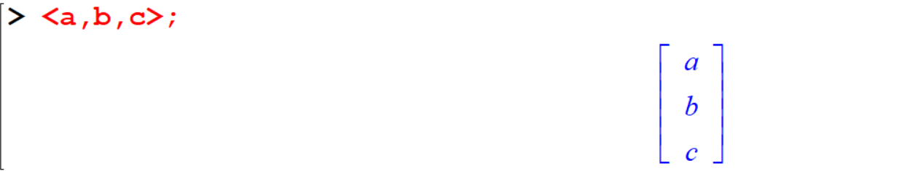

To create a *row vector*, specify a vertical-bar-delimited (`|`) sequence, `<a | b | c>`. The number of elements is inferred from the number of expressions.

```
<a|b|c>
```

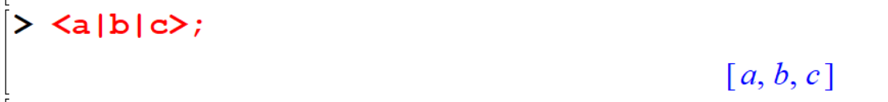

## Basis

```{definition}
 A basis of $V$ is a list of vectors in $V$ that is 

- linearly independent and,
- spans $V$.
```


The $\text{Basis}(V)$ function returns a list or set of Vectors that forms a basis for the vector space spanned by the original Vectors in terms of the original Vectors. A basis for the $0$-dimensional space is an empty list or set. If $V$ is a list of Vectors, the $\text{Basis}(V)$ function returns a list of Vectors. If $V$ is a single Vector or a set of Vectors, a set of Vectors is returned.

```
[> with(Student[LinearAlgebra]):
[> vl := <1|0|0>;
[> v2 := <0|1|0>;
[> v3 := <0|0|1>;
[> v4 := <0|1|1>;
[> v5 := <1|1|1>;
[> v6 := <4|2|0>;
[> v7 := <3|0|-1>;
[> Basis([vl,v2,v2]);
```

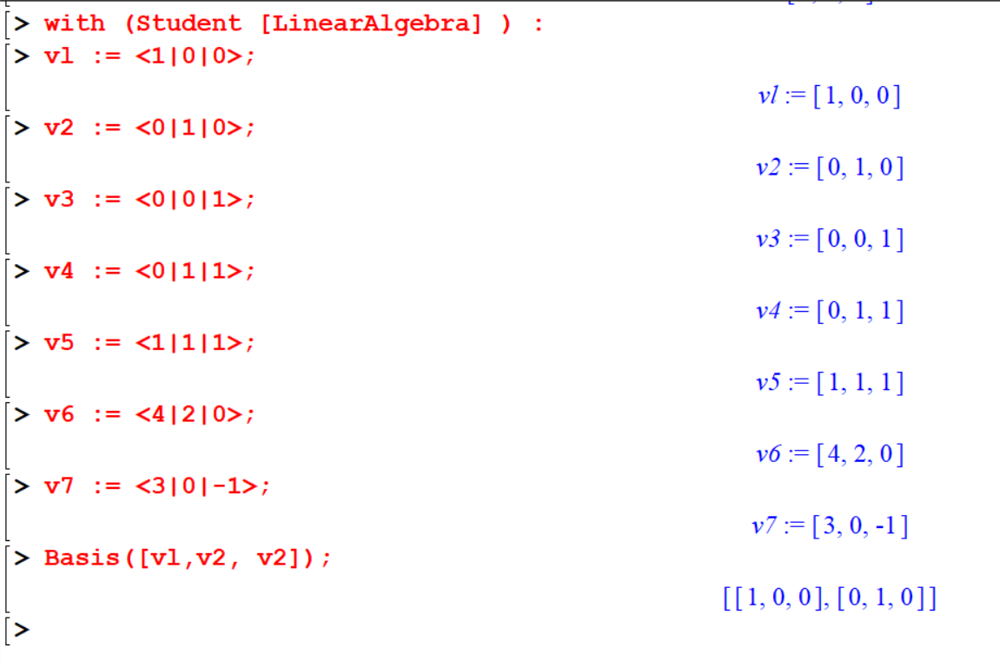

```{example}
Determine a basis for the space spanned by the set of vectors {(2,13,-15),(7,-2,13),(5,-4,9)}.
Express the vector (25, -4, 9) with respect to this basis.
```


```
[> v1:= <2,13,-15>;
[> v2:= <7,-2,13>;
[> v3:= <5,-4,9>;
[> basis:=Matrix(Basis([v1,v2,v3]));
[> LinearSolve(basis,<25,-4,9>);
```

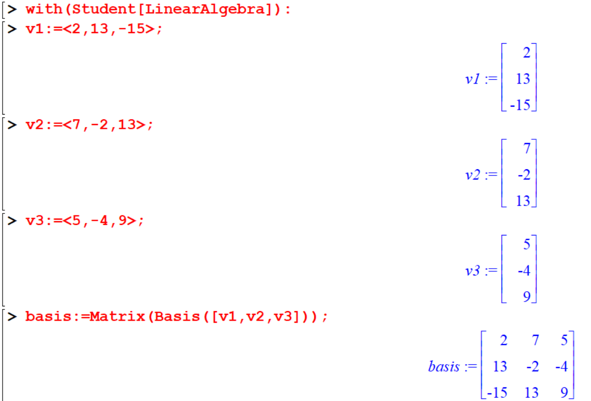
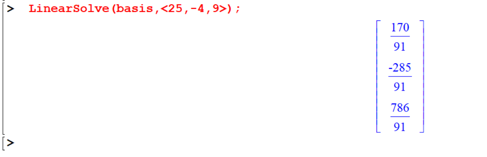


```{example}
Determine a basis for the space spanned by the set of vectors {(1,2,2,-1),(1,3,1,1),(1,5,-1,5),(1,1,4,-1),(2,7,0,2)}.
```

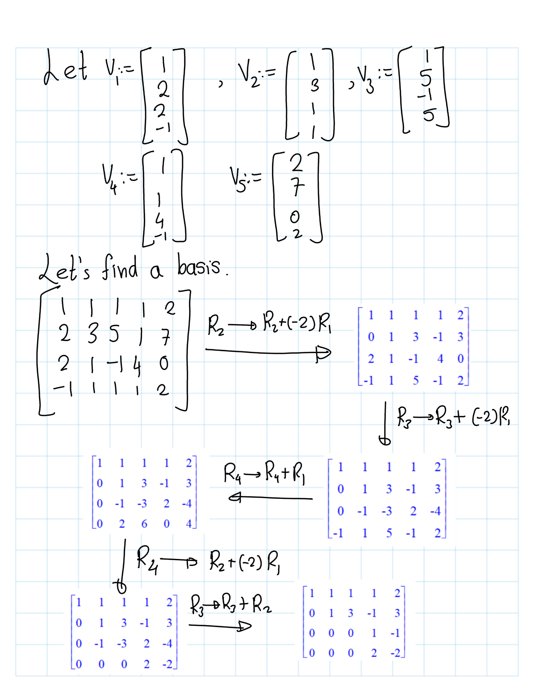
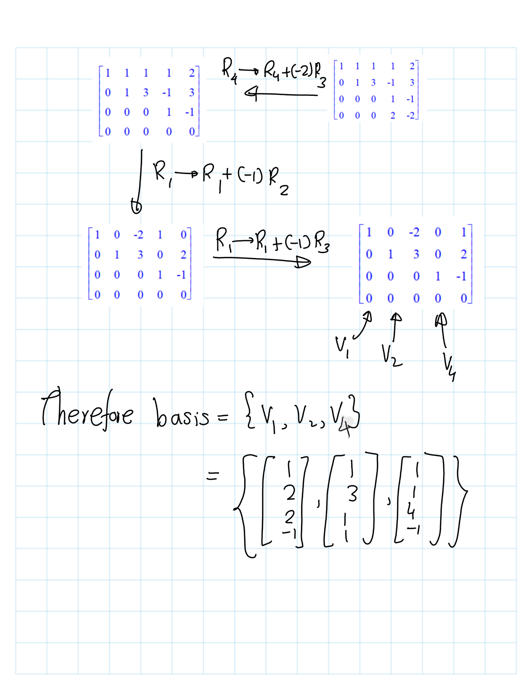

```
[> Basis({<1,2,2,-1>,<1,3,1,1>,<1,5,-1,5>,<1,1,4,-1>,<2,7,0,2>});
```
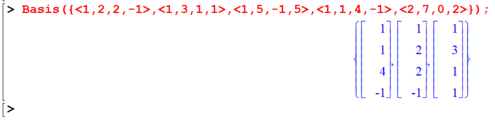
## Row Space and Column Space
The `RowSpace(A)` (`ColumnSpacc(A)`) function returns a list of row (column) Vectors that form a *basis*  the Vector space spanned by the rows (columns) of Matrix $A$. The Vectors are returned in canonical form with leading entries 1.

The row space(column space) of a zero Matrix is the empty list.

```
[> A:=<<1,2,0>|<0,2,6>|<0,0,4>|<0,0,0>>;
[> RowSpace(A);
[> ColumnSpace(A);
```

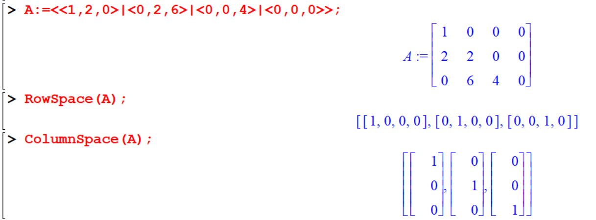

```
[> RowSpace(<<0,0>|<0,0>>);
```

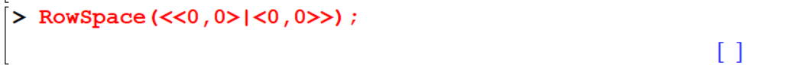


```
[> B:=<<x,0>|<y,1>>;
[> ColumnSpace(B);
```
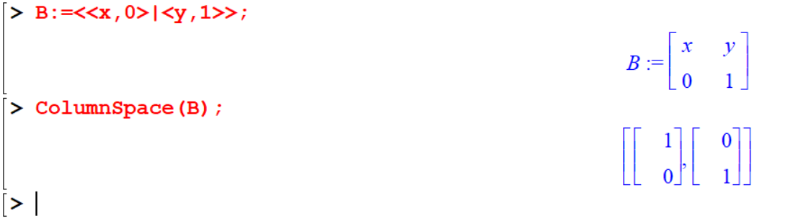


## Dimension

- `Dimension(A)` function. where $A$ is a Vector, returns a non-negative integer that represents the number of elements in A. If $A$ is a Matrix. two non-negative integers representing the row dimension and the column
dimension of A. respectively. are returned.
- The `RowDimension(A)` function, where $A$ is a Matrix, returns a non-negative integer that represents the number of rows in $A$.
- The `ColumnDimension` function. where $A$ is a Matrix, returns a non-negative integer that represents the number of columns in $A$.


```
[> v:=<x,y,z,w>;
[> Dimension(v);
```


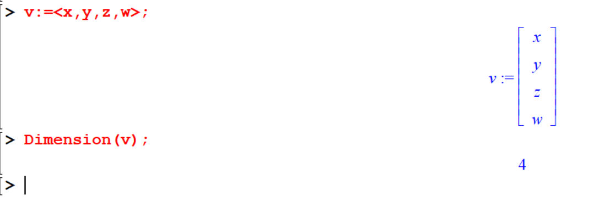

```
[> A:=IdentityMatrix(3,5);
[> row_dim:=RowDimension(A);
[> col_dim:=ColumnDimension(A);
[> m,n:=Dimension(A);
```

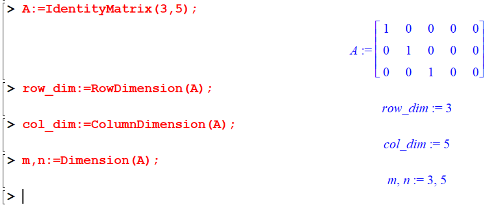

## Rank
If $A$ does not have a floating-point data type, then the `Rank(A)` function computes the rank of $A$ by performing Gaussian elimination on the rows of $A$. The rank of Matrix $A$ is the number of non-zero rows in the resulting Matrix.

```
[> restart;
[> with (LinearAlgebra) :
[> A := ScalarMatrix(n,3);
[> Rank(A);
```

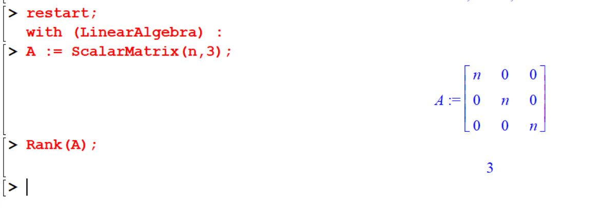


```
[> B:=<<-7,1,2>|<2,1,-1>|<3,0,-1>|<2,7,-3>>;
[> Rank(B);
[> nops(RowSpace(B));
```

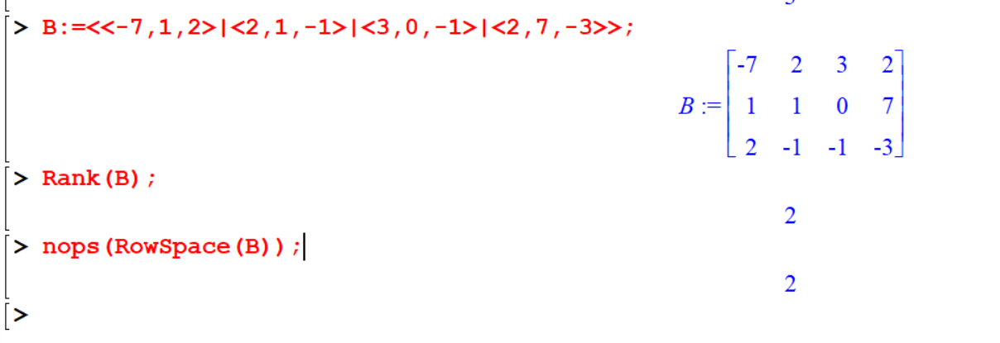


## Vector Fields

A vector field is be a function where the domain is $\mathbb{R}^n$ and the range is $n$-dimensional vectors. Here we discuss some important mathematical concepts on a vector field. 


## `Directional derivative(f,var=pts,dir)`
The `DirectionalDerivative(f,var=pts,dir)` command returns the directional derivative of $f$, evaluated at $pt$ if it is specified in the direction given by $dir$ that is the product of the Jacobian matrix of the function $f$, evaluated at $pt$ if is specified, and the normalized direction sector $dir$.


```
[> with(Student[MultivariateCalculus]);
[> DirectionalDerivative(3+x*y+2*x*y^2,[x,y]=[-1,3],[2,1]);
```
I will add more details and example on this topic later. 

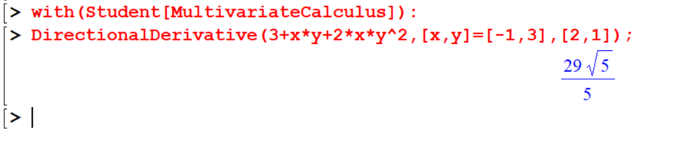

## $\text{Curl}(A), \text{Divergence}(A)$ and  $\text{Gradient}(A)$


```
[> with(Student[VectorCalculus]);
```
### Cartesian system


```{definition}

a. The *gradient* of a scalar-valued function \( f(x, y, z) \) is the vector field:

\[ \text{grad}(f)=\nabla f = \left( \frac{\partial f}{\partial x}, \frac{\partial f}{\partial y}, \frac{\partial f}{\partial z} \right) \]

Note that the input, \( f \), for the gradient is a scalar-valued function, while the output, \( \nabla f \), is a vector-valued function.

b. The *divergence* of a vector field \( \mathbf{F}(x, y, z)=(F_1,F_2,F_3)=F_1 i +F_2 j+ F_3 k \) is the scalar-valued function:

\[ \text{div} \, \mathbf{F} = \nabla \cdot \mathbf{F} = \left( \frac{\partial F_1}{\partial x} + \frac{\partial F_2}{\partial y} + \frac{\partial F_3}{\partial z} \right) \]

Note that the input, \( \mathbf{F} \), for the divergence is a vector-valued function, while the output, \( \nabla \cdot \mathbf{F} \), is a scalar-valued function.

c. The *curl* of a vector field \( \mathbf{F}(x, y, z) \) is the vector field:

\[ 
\begin{align}
\text{curl } \mathbf{F} &= \left( \frac{\partial F_3}{\partial y} - \frac{\partial F_2}{\partial z}, \frac{\partial F_1}{\partial z} - \frac{\partial F_3}{\partial x}, \frac{\partial F_2}{\partial x} - \frac{\partial F_1}{\partial y} \right)\\
&= \nabla \times \mathbf{F}
\end{align}
\]

Note that the input, \( \mathbf{F} \), for the curl is a vector-valued function, and the output, \( \nabla \times \mathbf{F} \), is again a vector-valued function.

```

```
[> SetCoordinates('cartesian'[x,y,z]);
[> Curl();
[> Divergence();
[> Gradient();
```

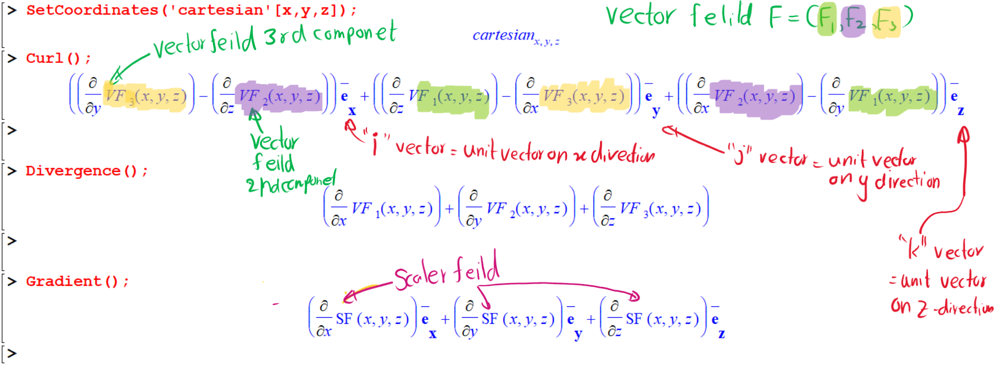

Let's see some examples.


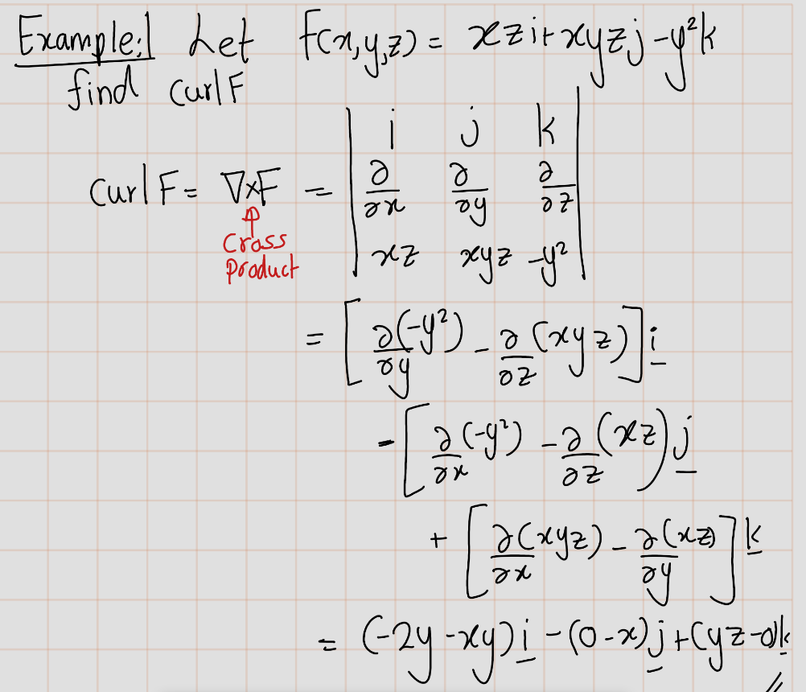
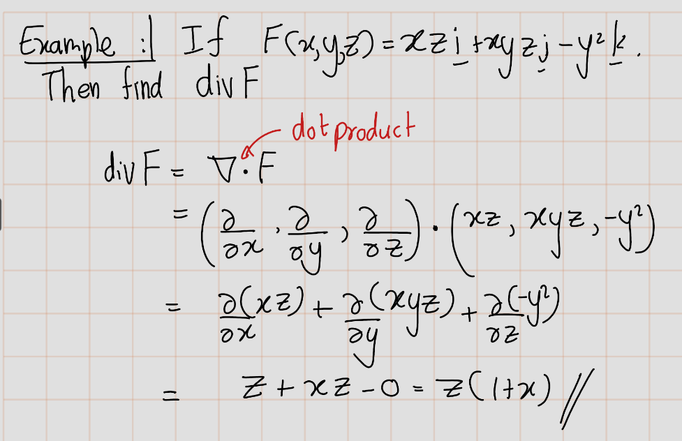


### Cylindrical system

When we expanded the traditional Cartesian coordinate system from two dimensions to three, we simply added a new axis to model the third dimension. Starting with polar coordinates, we can follow this same process to create a new three-dimensional coordinate system, called the cylindrical coordinate system. In this way, cylindrical coordinates provide a natural extension of polar coordinates to three dimensions.

```{definition}
In the cylindrical coordinate system, a point in space is represented by the ordered triple \((r,\theta,z)\), where:
  
- \((r,\theta)\) are the polar coordinates of the point’s projection in the \(xy\)-plane.
- \(z\) is the usual \(z\)-coordinate in the Cartesian coordinate system.
```


```
[> SetCoordinates('cylindrical');
[> Curl();
[> Divergence();
[> Gradient();
```


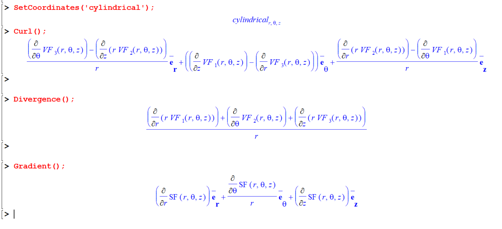

### Spherical system

In the Cartesian coordinate system, the location of a point in space is described using an ordered triple in which each coordinate represents a distance. In the cylindrical coordinate system, the location of a point in space is described using two distances (\(r\) and \(z\)) and an angle measure (\(\theta\)). In the spherical coordinate system, we again use an ordered triple to describe the location of a point in space. In this case, the triple describes one distance and two angles. Spherical coordinates make it simple to describe a sphere, just as cylindrical coordinates make it easy to describe a cylinder. Grid lines for spherical coordinates are based on angle measures, like those for polar coordinates.

```{definition,name= 'Spherical Coordinate System'}

In the spherical coordinate system, a point \(P\) in space is represented by the ordered triple \((\rho, \theta, \phi)\) where

- \(\rho\) is the distance between \(P\) and the origin (\(\rho \neq 0\));
- \(\theta\) is the same angle used to describe the location in cylindrical coordinates;
- \(\phi\) is the angle formed by the positive \(z\)-axis and line segment \(\overline{OP}\), where \(O\) is the origin and \(0 \leq \phi \leq \pi\).
```
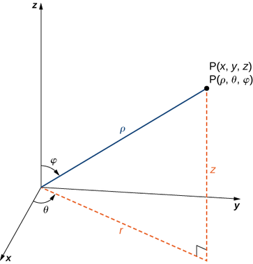


```
[> SetCoordinates('spherical');
[> Curl();
[> Divergence();
[> Gradient();
```

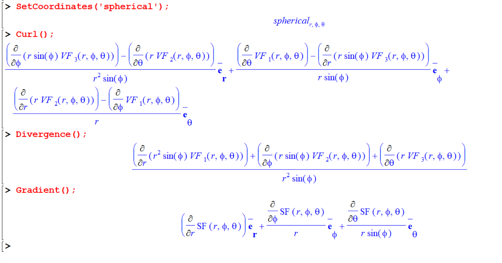

```{example}
Find the Curl, Divergence of vector feild $\mathbf{F}=yi+-x j+0 k$. can you find the Gradinet?
```


```
[> F:=VectorField(<y,-x,0>);
[> Curl(F);
[> Divergence(F);
[> Gradient(F);
```

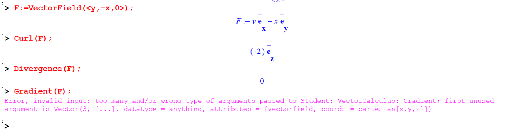

If $A$ is a vector then `Gradient(A)` will interrupt the computation with an error, as well as `Divergence(A)` and `Gradient(A)` when $A$ is scaler (not a vector). 

```{example}
Find Gradinet of $f(x,y)=x^2+y^2$
```

```
Gradient(x^2+y^2);
```


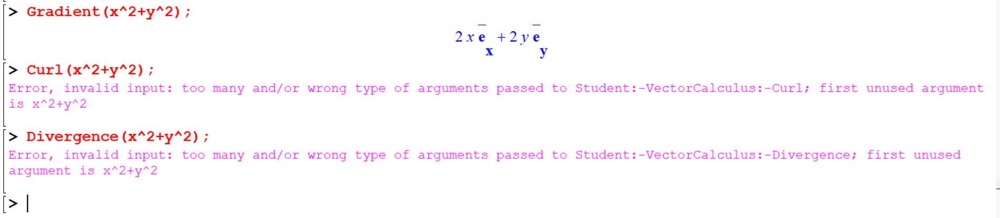


## `Tangent(f,Var)`
The Tangent(f, Var)` command computes the object tangent to the parametrized curve or surface $f$ at the point specified in the other arguments $var$.


```
> Tangent(<x,y,x^2+y^2>,x=a,y=b);
```

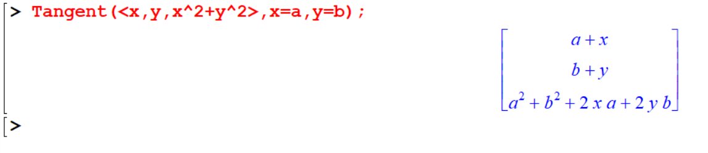

```
[> Tangent(<sin(phi)*cos(theta),sin(phi)*sin(theta),cos(phi)>,phi=Pi/4,theta=Pi/2);
```


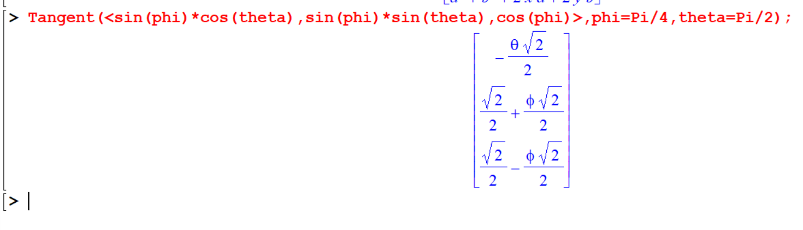


## `TangentLine(f,var)`
The `TangcntLine(f, var)` command computes the tangent line to the curve f at the point specified in $var$.


```
[> restart :
[> with(Student [VectorCalculus] ) ;
[> TangentLine (<t^2,t^3>,t=a);
```

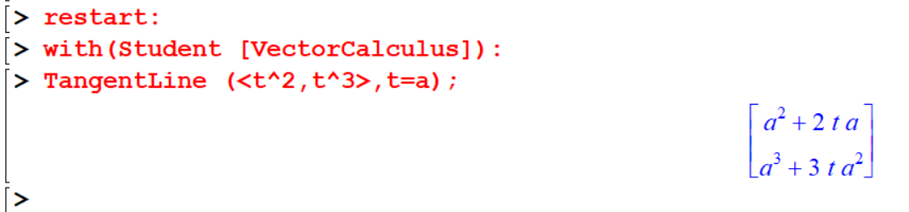

```
[> SetCoordinates(cartesian'[x, y]');
[> TangentLine(x^2,x=a);
```

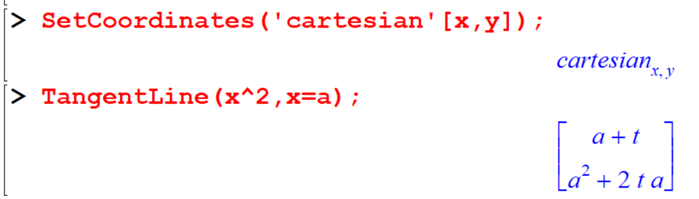

```
[> TangentLine(<cos(t),sin(t)>,0);
```
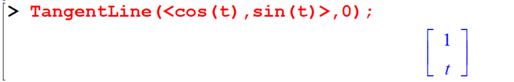


### `TangentPlane(f, varl, var2)`
The `TangentPlanc(f, varl, var2)` command computes the plane tangent to the surface $f$ at the point specified by $var1$ and $var2$.

```
[> restart:
[> with(Student[VectorCalculus]):
[> TangentPlane(<s,t,s^2+t^2>,s=a,t=b);
```

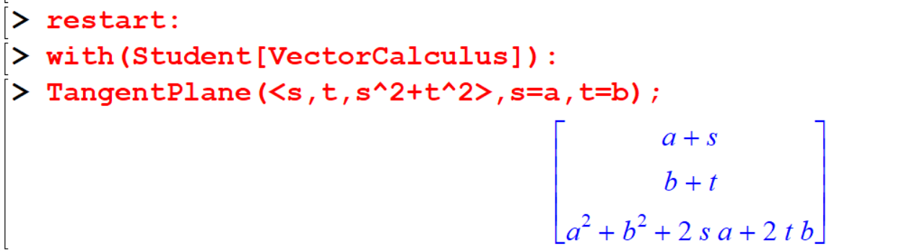


```
[> SetCoordinates('spherical');
[> TangentPlane( <1,s,t>,s=Pi/4,t=Pi/2);
```

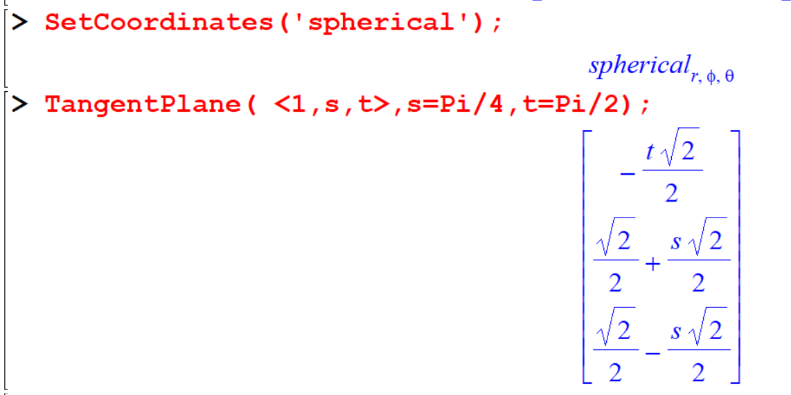

## `TangentVcctor(C,t)`
`Tangent Vector(C,t)` command computes the tangent sector to the curve $C$ that is parametrized by $t$. Note that this vector is not normalized by default. so It is a scalar multiple of the unit tangent vector to the
curve $C$.

```
[> restart :
[> with (Student [VectorCalculus]) :
[> T1:=TangentVector(t-> <t,t^2,t^3>):
[> T1(t);
```

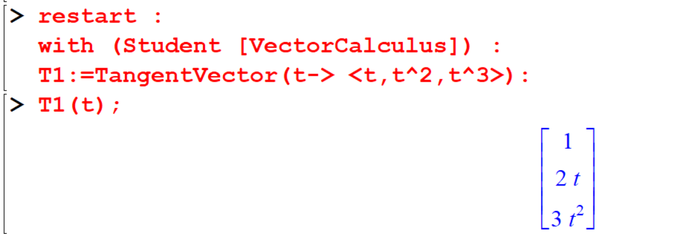


```
[> T2:=TangentVector(t-><t,t^2,t^3>,normalized ) :
[> T2(t);
```

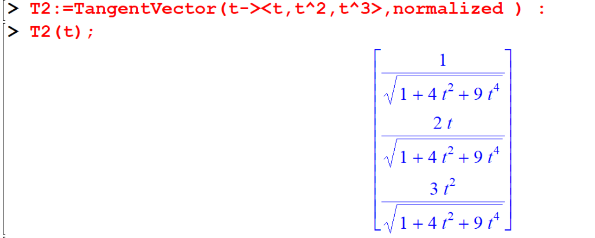

## `Linelnt(F,dom)`
The `Linelnt(F,dom)` command computes the line integral of the vector field $F$ over the path specified by $dom$.


```
[> restart :
[> with (Student[VectorCalculus]):
[> SetCoordinates(cartesian[x,y]);
[> LineInt(VectorField(<x,y>), Line(<1,2>,<3,-4>));
[> LineInt(VectorField(<x,y>), LineSegments(<0,0>,<1,1>,<1,-1>)); 
[> LineInt(VectorField(<x^2,y^2>), Path(<t,t^2>,t=0..2));
[> LineInt(VectorField(<y,-x>), Circle(<0,0>,r));
```


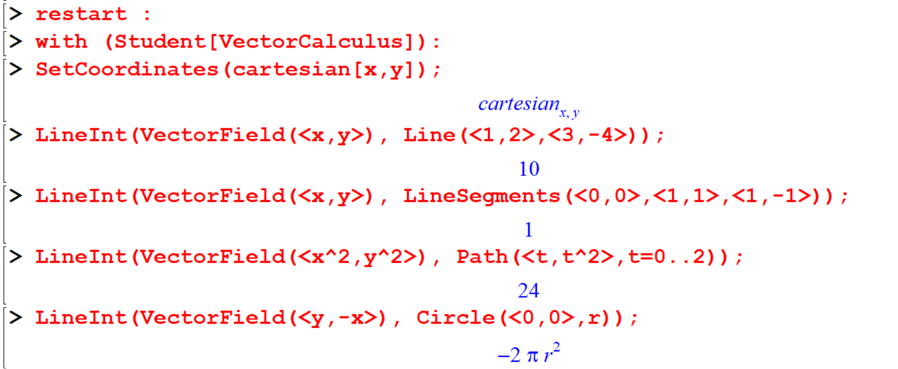

## `Flux (f,dom)`
The `Flux(f, dom)`, command computes the flux of the vector field $f$ through the surface or curve specified by $dom$.

```
[> restart;
[> with (VectorCalculus):
[> Flux(VectorField(<x,y,z>,cartesian[x, y, z]), Surface( <r,s,t> ,s=0..Pi,t=0..2*Pi, coords=spherical));
[> Flux(VectorField(<y,-x,0>, cartesian[x,y,z]), Surface( <s,t,s^2+t^2> , [s,t] = Rectangle(0..1,2..3)));
[> Flux(VectorField(<x,y,z>,cartesian[x,y,z]), Sphere(<0,0,0>,r) ) ;
```

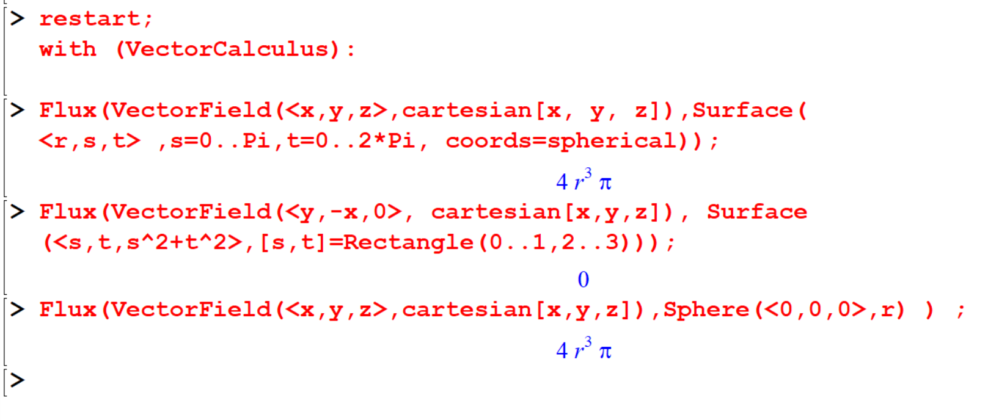


## Exercises

```{exercise}
Find the gradient of the follovying scalar fileds

i)   $$f (x,y,z) = xy^2 —yz $$
ii)  $$f (x,y,z) = \frac{xy^2z}{e^x}$$
iii) $$f (x,y,z) = x^3y^3 — xyz$$

```

```{exercise}
Calculate the Divergence of the following vector fields $F(x,y)$ and $G(x,y,z)$
  
i)   $$F=xi+yj$$
ii)  $$F=y^3i+xyj$$
iii) $$F=3x^2i-6xyj$$
iv)  $$F=x^2i+2zj-yk$$
v)   $$G=\frac{4y}{x^2}i+\sin(y)j+3k$$
vi)  $$G=e^x+\ln(xy)j+e^{xyz}k$$
```

```{exercise}
Calculate the curl of the following vector fields $F(x,y,z)$.

i)   $$F(x,y,z) = xi-yj+zk$$
ii)  $$F(x,y,z) = y^3i+xyj-zk$$
iii) $$F(x,y,z) = \frac{xi+yj+zk}{\sqrt{x^3}+y^2+z^2}$$
```