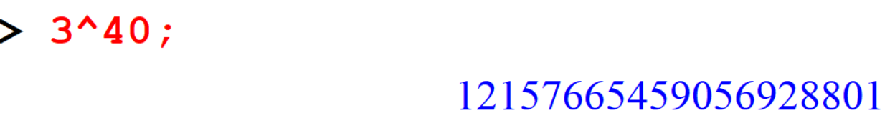
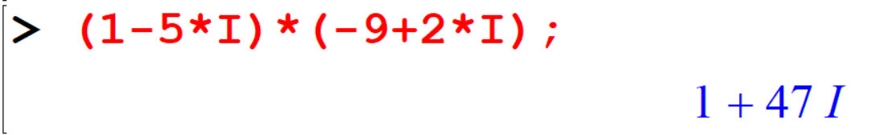

--- 
title: "Maple"
author: "Ashan J"
date: "`r Sys.Date()`"
site: bookdown::bookdown_site
documentclass: book
bibliography: [book.bib, packages.bib]
favicon: favicon.ico
url: https://ashanjayamal.github.io/maple/
description: |
  This is for sharing notes with every one.
link-citations: yes
github-repo: rstudio/bookdown-demo
---


# Introduction to Maple

## What is Maple?

- Maple is a Symbolic Computation System or Computer Algebra System which can be used to obtain exact analytical solutions to many mathematical problems, including integrals, systems of equations, differential equations, and problems in linear algebra.
- It also has the capability of plotting functions in 2D and 3D and displaying animations.
- Maple can perform calculations in binding speed, but one has to be responsible for making these calculations meaningfully and mathematically correct.

## Using a Maple Worksheet

The following figure shows the Maple window with a blank Maple worksheet and this window contains:

- a menu bar across the top with menus:
- a tool bar immediately below the menu bar, with button-based short cuts to common operations;
- a context bar directly below the tool bar, with controls specific to the task being performed;


- a window, containing a Maple prompt [>, called a worksheet;
- a status bar at the bottom, with boxes marked Ready, Time and Memory


From the File menu, select the options **Save** or **Save As** to save the active Maple classic worksheet.
Maple classic worksheets are saved with the extension “.mws”, but in the standard interface, Maple worksheets are saved with the extension “.mw”

## Entering Maple Commands

- The “ > ” is the command prompt in Maple. That is where you type your commands or statements.
- Every command in Maple should end with a semicolon(;) or a colon(:).\
(If you use a semicolon then the result of the command will be displayed. If you use a colon then the result will not be displayed.)

- If you want to make any comments you can use the text format by clicking on the box `T` in the tool bar or use the symbol `#`.

{width=100%}

<!-- {width=100%} -->


## Arithmetic operations

Arithmetic operators follow the same precedence rules as in Mathematics, and these are brackets, of, division, multiplication, addition and subtraction (BODMAS). Usual arithmetic operations can perform easily with Maple.

```
[> 312+121;
```


```
> 125-45;
```


The `* `  key is used for multiplication, `/` for division and `^` for the power.


```
[> 13*267;
```


```
[> 565/5;
```


```
[> 561/5;
```


```
[> 125-45; 13*267; 12345/5; #Three arithmetic operations
```


```
[> 2^5;
```

```
[> 2^(-5);
```

```
[> 3^40;
```



```{remark}
***Don’t use commas when you type large numbers in Maple.
- For example: Compute the product 102,136,543 & 20,077,410 .***
```

```
[> 102136543*20077410;
```


## Operations

Maple adheres to the same order of operations that we use in Mathematics. By inserting parentheses, we can change this order.


```
[> 2+3*4-5*6;
[> 2+(3*4-5)*6;
[> (2+3)*4-5*6;
```


```
[> 29/(100-11*3^2);
```


```
[> (3^4-2^6)/(3^2-2^3);
```


### Exercises

```{exercise}
01. Calculate the followings

i.   \(1428 + 456 − 41 \)
ii.  \(421 × 240 ÷ 55 \)
iii. \((128 − 691 + 458) × 8\)
iv.  \(2214875(201 × 11 − 55)\)
v. \(201 ÷ (2012 − 1) \)
vi. \(21^{4^{2^3}}\) 
```

```{exercise}
i. Compute \(3^{400}\).
ii. Find the command to find the length (number of digits) of a number.
ii. How many digits are there in the number \(3^{400}\) ?
iii. Does the above command give correct answer to the fractional numbers?
```


## Shortcut to retyping

One shortcut that we use often in Maple to retype is the `%`  key. This refers to most recently executed result.


```
[> 13*23+1;
[> %/5;
[> %%/5;
[> %%%/5;
```

```
[> 12540*4;
[> %/4;
[> %/4;
```


## Fractions and Decimals 
By simply entering a fraction Maple automatically reduce it.

```
[> 45/4;
```

```
[> 148/24;
```

```
[> 25/15;
```

```
[> 2/3+3/7;
```

```
[> 3/2+4/5-1/3;
```

You can do calculations with decimal numbers also.

```
[> 25.361+124.6;
```

```
[> 2.138*0.013;
```

```
[> 56.101/0.102;
```


## Roots

```
[> sqrt(16);
```

```
[> sqrt(30);
```

```
[> evalf(sqrt(30));
```


> The `evalf` command numerically evaluates expressions (or sub-expressions) involving constants (for example, `Pi`, `exp(1)`) and mathematical functions (for example, `exp`, `ln`, `sin`).

```
[> 30^(1/2);
[> evalf(%);
```


### Exercise 


```{exercise}
Compute the following:
  
i.  \(11 + \sqrt{31} \)
ii. \(\sqrt[3]{64}\)
iii. \(\sqrt{2}^{\sqrt{3}}\)
```

```{exercise}
Calculate \(120^8\)

i. Divide the answer by \(10^8\)
ii. Divide the answer in part i. by \(2048 \times 8\)
```

## Pi Vs pi

\(\pi\) is a constant in Mathematics and is recognized by maple and typed as `Pi` **(Note the capitalization of “p” but not “i’)**.

```
[> Pi;
[> evalf(%);
```


```
[> evalf(2*Pi);
```

If you use `pi` then `evalf` command does not return \(\pi\) numerically.

```
[> pi;
[> evalf(%);
```


## Rational Numbers


Maple usually leaves fractions in fraction form. However, we can force it to express fractions in decimal form using the `evalf` command.

```
[> 1/7;
[> evalf(1/7);
```


```
[> 25/35;
[> evalf(%);
```


Maple displays 10 decimal places as a default. If this is not enough and for better precision you can specify the exact number of decimal places as a second parameter to the `evalf` command.


Note that the second parameter normally represents the number of non-zero digits in the answer. 


```
[> evalf(1/7,100);
```

```
[> evalf(29/3,5);
```


Here, if you want to calculate the answer for 4 decimal places the command should be `evalf(29/3,5)` and if you want the answer to be 5 decimal places the command should be `evalf(29/3,6)`.

```
[> evalf(1/15,5);
```

```
[> evalf(11/19,5);
```

Fractions are also rational numbers because their decimal expansions always have repeating blocks of digits. By looking at the decimal representation of a rational number you can see the repeating cycle.


```
[> evalf(1/35);
```

Here we can not see the repeat cycle. But if we calculate \(\frac{1}{35}\) for more decimal places we can see the repeating cycle.

```
[> evalf(1/35, 100);
```


### Exercises

```{exercise}
Evaluate the value of π correct up to 5 decimal places.
```

```{exercise}
Find the area of a circle with radius 10cms
```

```{exercise}
Check whether the followings are rational numbers or not

i. \(\frac{1}{49}\)
ii. \(\pi\) 
iii. \(\sqrt{2}\)
```

```{exercise}
How many digits are repeating in \(\frac{1}{212}\)
```


## Complex Numbers

In Maple, complex arithmetic is normally done automatically with `I` standing for \(\sqrt{−1}\) (for example, if you square `I` you will get `-1`, not `I^2`)


```
[> (-4+7*I)+(5-10*I);
```

```
[> 5*I-(-9+I);
```

```
[> (1-5*I)*(-9+2*I);
```

```
[> (3-I)/(2+7*I);
```

But Maple does not always automatically evaluate an expression involving complex numbers. 
For example, it may leave an expression as the product of some complex numbers or as an expression involving a root of a complex number.

```
[> (-2*I)^(1/2);
```

The function `evalc` to force Maple to evaluate as a complex number.

```
[> evalc((-2*I)^(1/2));
```

Note that `evalc` does not give you both the square roots of `-2*I` it only gives the *principal value* of the root. 

If you want to find the roots, use solve command as follows.

```
[> solve(z^2=-2*I);
```


### Exercise


```{exercise}
Simplify the following:

1. \( (−3 + 3i) + (7 – 2i) \)
2. \( (5 + 3i) − (3 − i)\)
3. \( (1 + 2i)(1 − 2i) 4. (56 − 8i) ÷ (14 + 10i)\)
```

```{exercise}
2. Simplify \((2i)^\frac{1}{2}\) by using `evalc` and solve commands.
```


```{exercise}
3. Multiply the following and obtain the answer in standard form:
\[(2 − \sqrt{−100})(1 + \sqrt{−36})\]
```

## MAPLE Help

Maple contains a complete online help system you can use to find information about specific topic easily and to explore the wide range of commands available. To get the information about commands, which you learn in MAPLE, you can use either one of the following.
 
 - Topic search function
 - F1 key
 - `?` In front of the command

